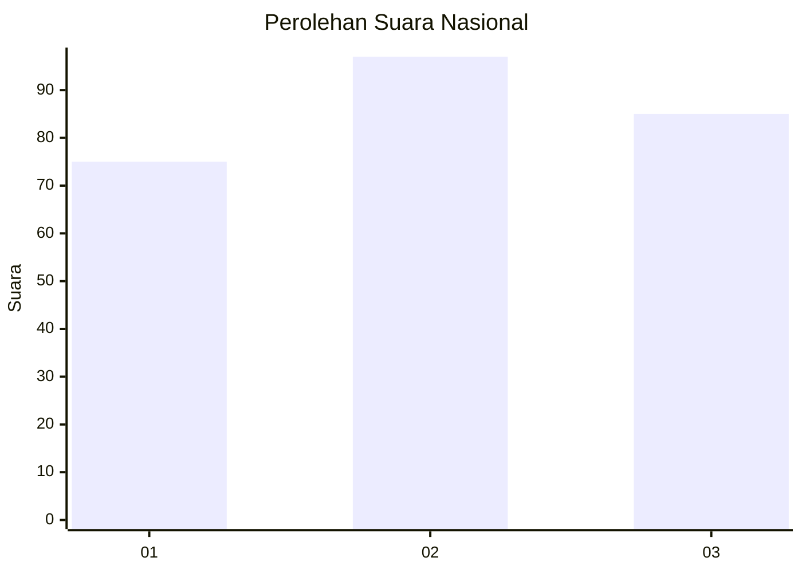
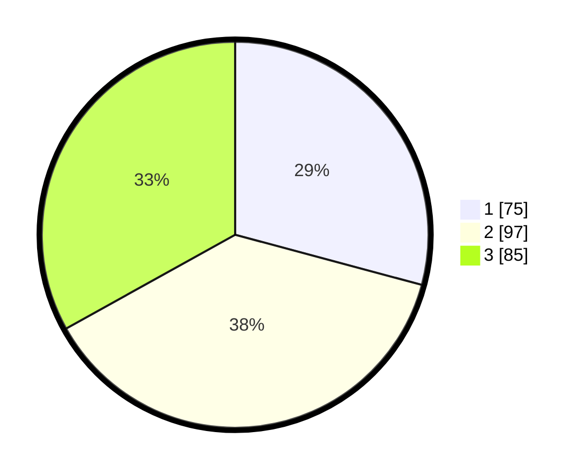

# Hasil

## Grafik

## Tabel

| No. | Nama Paslon    | Suara | Suara (raw) | Persentase |
|:--- |:-------------- | -----:| -----------:| ----------:|
| 1   | ANIES MUHAIMIN | 75    | [75][p-1]   | 29,18      |
| 2   | PRABOWO GIBRAN | 97    | [97][p-2]   | 37,74      |
| 3   | GANJAR MAHFUD  | 85    | [85][p-3]   | 33,07      |

[p-1]: https://github.com/gigit-pemilu/pemilu-2024/blob/main/pilpres/hitung-suara/sub/34-di-yogyakarta/sub/04-sleman/sub/11-ngemplak/sub/2004-wedomartani/sub/063-tps/sub/paslon-1.txt
[p-2]: https://github.com/gigit-pemilu/pemilu-2024/blob/main/pilpres/hitung-suara/sub/34-di-yogyakarta/sub/04-sleman/sub/11-ngemplak/sub/2004-wedomartani/sub/063-tps/sub/paslon-2.txt
[p-3]: https://github.com/gigit-pemilu/pemilu-2024/blob/main/pilpres/hitung-suara/sub/34-di-yogyakarta/sub/04-sleman/sub/11-ngemplak/sub/2004-wedomartani/sub/063-tps/sub/paslon-3.txt

## Foto C Plano

https://sirekap-obj-formc.kpu.go.id/9fbf/pemilu/ppwp/34/04/11/20/04/3404112004063-20240215-013932--44a27f0d-97e3-43f3-ba4b-5b1502b7dbb7.jpg

https://sirekap-obj-formc.kpu.go.id/9fbf/pemilu/ppwp/34/04/11/20/04/3404112004063-20240215-014008--8409288f-9368-49ba-970f-35d5e3bbe1d9.jpg

https://sirekap-obj-formc.kpu.go.id/9fbf/pemilu/ppwp/34/04/11/20/04/3404112004063-20240215-014030--6796ee23-215d-4215-93ef-4dc95281e764.jpg

## Metadata

| Key        | Value               |
| ---------- | ------------------- |
| Time Stamp | 2024-02-15 19:00:26 |

