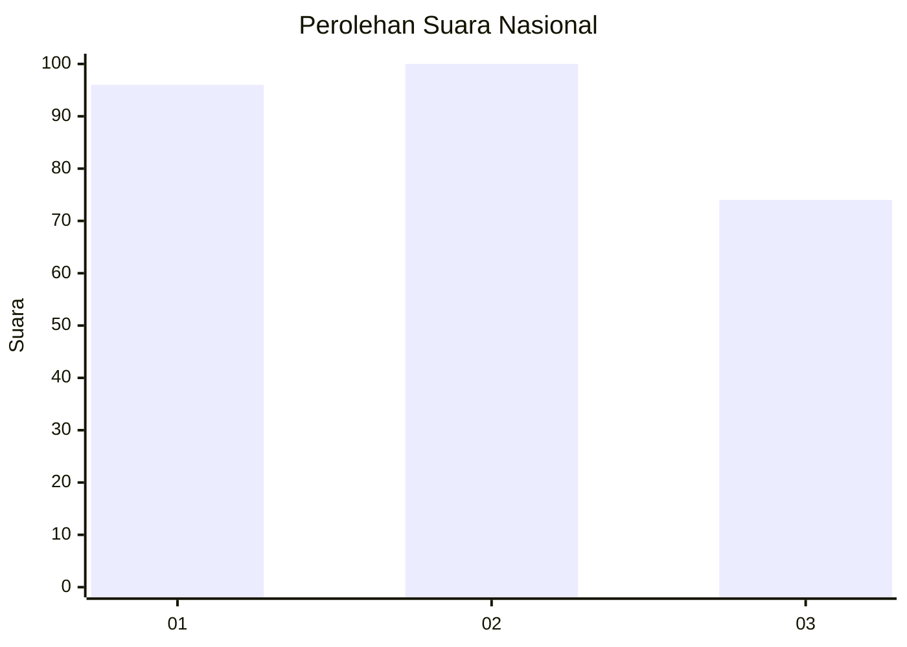
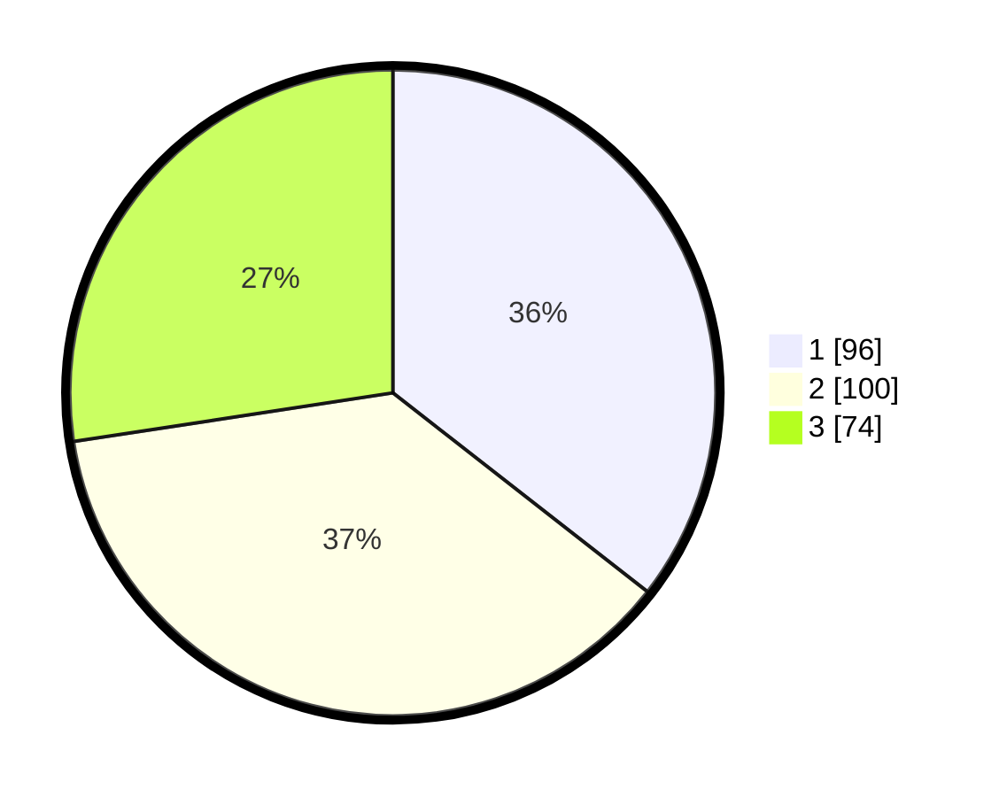

# Hasil

## Grafik

## Tabel

| No. | Nama Paslon    | Suara | Suara (raw) | Persentase |
|:--- |:-------------- | -----:| -----------:| ----------:|
| 1   | ANIES MUHAIMIN | 96    | [96][p-1]   | 35,56      |
| 2   | PRABOWO GIBRAN | 100   | [100][p-2]  | 37,04      |
| 3   | GANJAR MAHFUD  | 74    | [74][p-3]   | 27,41      |

[p-1]: https://github.com/gigit-pemilu/pemilu-2024/blob/main/pilpres/hitung-suara/sub/34-di-yogyakarta/sub/04-sleman/sub/11-ngemplak/sub/2004-wedomartani/sub/076-tps/sub/paslon-1.txt
[p-2]: https://github.com/gigit-pemilu/pemilu-2024/blob/main/pilpres/hitung-suara/sub/34-di-yogyakarta/sub/04-sleman/sub/11-ngemplak/sub/2004-wedomartani/sub/076-tps/sub/paslon-2.txt
[p-3]: https://github.com/gigit-pemilu/pemilu-2024/blob/main/pilpres/hitung-suara/sub/34-di-yogyakarta/sub/04-sleman/sub/11-ngemplak/sub/2004-wedomartani/sub/076-tps/sub/paslon-3.txt

## Foto C Plano

https://sirekap-obj-formc.kpu.go.id/7408/pemilu/ppwp/34/04/11/20/04/3404112004076-20240214-221107--09d8b6b4-bece-495e-bffb-66d396160506.jpg

https://sirekap-obj-formc.kpu.go.id/7408/pemilu/ppwp/34/04/11/20/04/3404112004076-20240214-221216--cd5b2aac-2f2f-4d84-a641-2c2ce7511ac2.jpg

https://sirekap-obj-formc.kpu.go.id/7408/pemilu/ppwp/34/04/11/20/04/3404112004076-20240214-221645--a6d3caa9-22df-4d51-861a-d6ee5f25518c.jpg

## Metadata

| Key        | Value               |
| ---------- | ------------------- |
| Time Stamp | 2024-02-15 19:00:26 |

