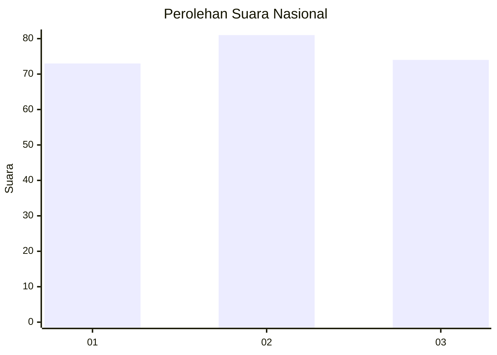
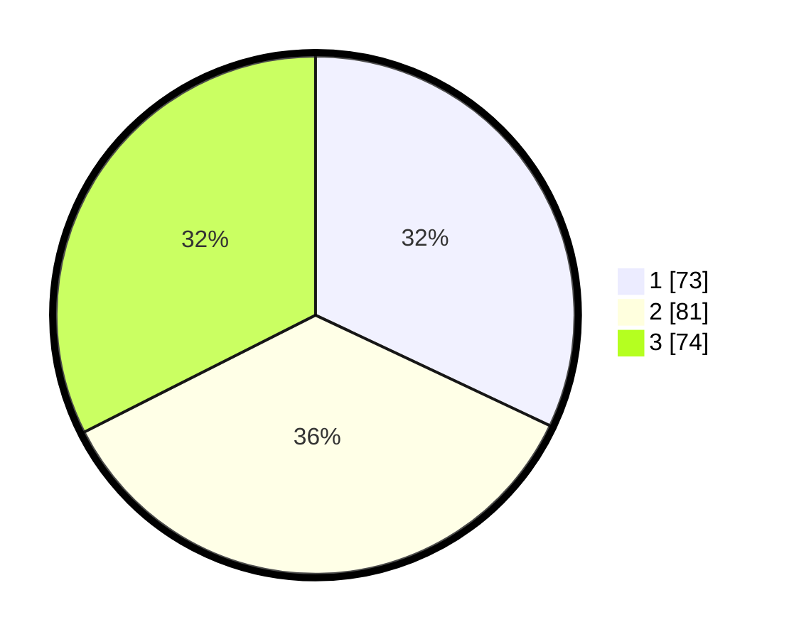

# Hasil

## Grafik

## Tabel

| No. | Nama Paslon    | Suara | Suara (raw) | Persentase |
|:--- |:-------------- | -----:| -----------:| ----------:|
| 1   | ANIES MUHAIMIN | 73    | [73][p-1]   | 32,02      |
| 2   | PRABOWO GIBRAN | 81    | [81][p-2]   | 35,53      |
| 3   | GANJAR MAHFUD  | 74    | [74][p-3]   | 32,46      |

[p-1]: https://github.com/gigit-pemilu/pemilu-2024/blob/main/pilpres/hitung-suara/sub/34-di-yogyakarta/sub/04-sleman/sub/11-ngemplak/sub/2004-wedomartani/sub/082-tps/sub/paslon-1.txt
[p-2]: https://github.com/gigit-pemilu/pemilu-2024/blob/main/pilpres/hitung-suara/sub/34-di-yogyakarta/sub/04-sleman/sub/11-ngemplak/sub/2004-wedomartani/sub/082-tps/sub/paslon-2.txt
[p-3]: https://github.com/gigit-pemilu/pemilu-2024/blob/main/pilpres/hitung-suara/sub/34-di-yogyakarta/sub/04-sleman/sub/11-ngemplak/sub/2004-wedomartani/sub/082-tps/sub/paslon-3.txt

## Foto C Plano

https://sirekap-obj-formc.kpu.go.id/040e/pemilu/ppwp/34/04/11/20/04/3404112004082-20240216-132116--0cafe2fb-6ad1-49e3-9168-c7b999dda62b.jpg

https://sirekap-obj-formc.kpu.go.id/040e/pemilu/ppwp/34/04/11/20/04/3404112004082-20240216-132118--5e53565d-3b61-4127-b117-e7fb2aefecb5.jpg

https://sirekap-obj-formc.kpu.go.id/040e/pemilu/ppwp/34/04/11/20/04/3404112004082-20240216-132117--1d8215d5-1226-431f-8096-65350a405027.jpg

## Metadata

| Key        | Value               |
| ---------- | ------------------- |
| Time Stamp | 2024-02-16 22:01:00 |

## DATA PEMILIH TETAP

Jumlah pemilih dalam DPT: **285**.
 * L: **146**.
 * P: **139**.

## DATA PENGGUNA HAK PILIH

Jumlah pengguna hak pilih dalam DPT: **207**.
 * L: **107**.
 * P: **100**.

Jumlah pengguna hak pilih dalam DPTb: **20**.
 * L: **11**.
 * P: **9**.

Jumlah pengguna hak pilih dalam DPK: **5**.
 * L: **1**.
 * P: **4**.

Jumlah pengguna hak pilih: **232**.
 * L: **119**.
 * P: **113**.

## JUMLAH SUARA SAH DAN TIDAK SAH

JUMLAH SELURUH SUARA SAH: **228**.

JUMLAH SUARA TIDAK SAH: **5**.

JUMLAH SELURUH SUARA SAH DAN SUARA TIDAK SAH: **233**.

