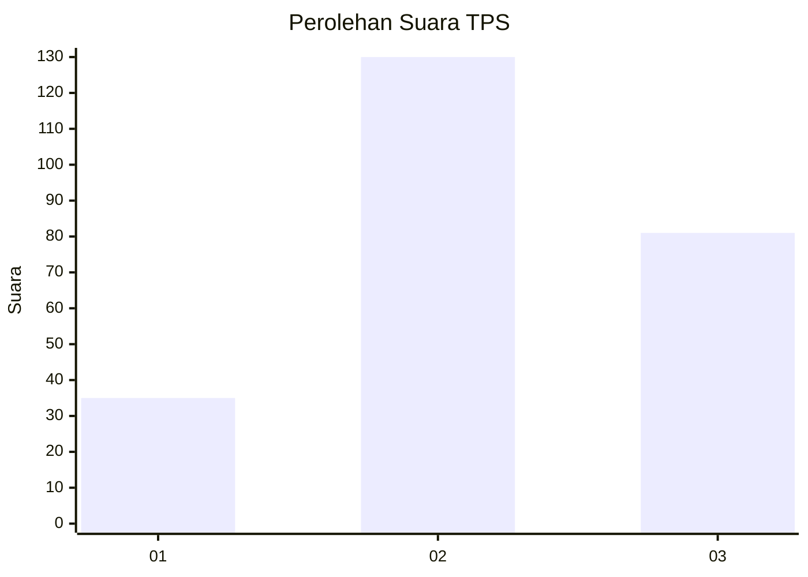
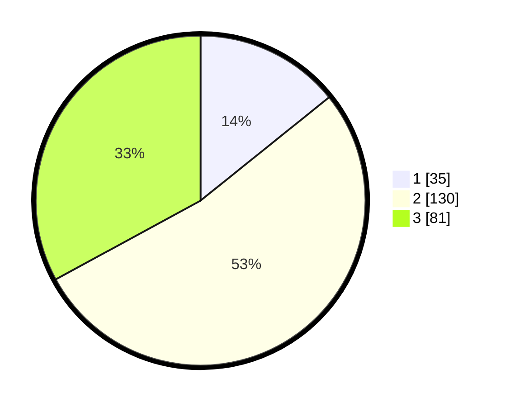

# Hasil

## Grafik

## Tabel

| No. | Nama Paslon    | Suara | Suara (raw) | Persentase |
|:--- |:-------------- | -----:| -----------:| ----------:|
| 1   | ANIES MUHAIMIN | 35    | [35][p-1]   | 14,23      |
| 2   | PRABOWO GIBRAN | 130   | [130][p-2]  | 52,85      |
| 3   | GANJAR MAHFUD  | 81    | [81][p-3]   | 32,93      |

[p-1]: https://github.com/gigit-pemilu/pemilu-2024-34-di-yogyakarta/blob/main/pilpres/hitung-suara/sub/34-di-yogyakarta/sub/04-sleman/sub/11-ngemplak/sub/2005-umbulmartani/sub/002-tps/sub/paslon-1.txt
[p-2]: https://github.com/gigit-pemilu/pemilu-2024-34-di-yogyakarta/blob/main/pilpres/hitung-suara/sub/34-di-yogyakarta/sub/04-sleman/sub/11-ngemplak/sub/2005-umbulmartani/sub/002-tps/sub/paslon-2.txt
[p-3]: https://github.com/gigit-pemilu/pemilu-2024-34-di-yogyakarta/blob/main/pilpres/hitung-suara/sub/34-di-yogyakarta/sub/04-sleman/sub/11-ngemplak/sub/2005-umbulmartani/sub/002-tps/sub/paslon-3.txt

## Foto C Plano

https://sirekap-obj-formc.kpu.go.id/f142/pemilu/ppwp/34/04/11/20/05/3404112005002-20240215-034413--ede7114f-eb56-4158-96ea-a1a51fd673b5.jpg

https://sirekap-obj-formc.kpu.go.id/f142/pemilu/ppwp/34/04/11/20/05/3404112005002-20240215-034818--3178239d-8ca3-4bcf-8cad-2b0eaebda21b.jpg

https://sirekap-obj-formc.kpu.go.id/f142/pemilu/ppwp/34/04/11/20/05/3404112005002-20240215-035331--b4781c42-d631-4e9b-ba04-7105b410e1fb.jpg

## Metadata

| Key        | Value               |
| ---------- | ------------------- |
| Time Stamp | 2024-02-16 22:30:00 |

