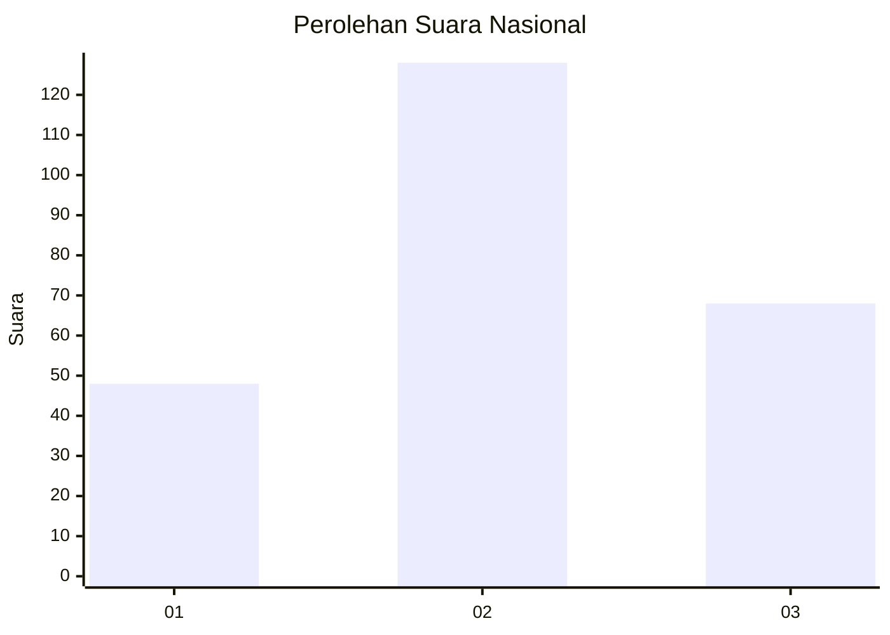
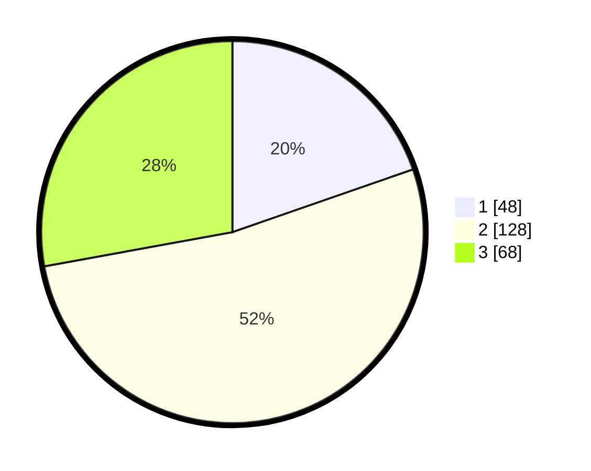

# Hasil

## Grafik

## Tabel

| No. | Nama Paslon    | Suara | Suara (raw) | Persentase |
|:--- |:-------------- | -----:| -----------:| ----------:|
| 1   | ANIES MUHAIMIN | 48    | [48][p-1]   | 19,67      |
| 2   | PRABOWO GIBRAN | 128   | [128][p-2]  | 52,46      |
| 3   | GANJAR MAHFUD  | 68    | [68][p-3]   | 27,87      |

[p-1]: https://github.com/gigit-pemilu/pemilu-2024/blob/main/pilpres/hitung-suara/sub/34-di-yogyakarta/sub/04-sleman/sub/11-ngemplak/sub/2005-umbulmartani/sub/007-tps/sub/paslon-1.txt
[p-2]: https://github.com/gigit-pemilu/pemilu-2024/blob/main/pilpres/hitung-suara/sub/34-di-yogyakarta/sub/04-sleman/sub/11-ngemplak/sub/2005-umbulmartani/sub/007-tps/sub/paslon-2.txt
[p-3]: https://github.com/gigit-pemilu/pemilu-2024/blob/main/pilpres/hitung-suara/sub/34-di-yogyakarta/sub/04-sleman/sub/11-ngemplak/sub/2005-umbulmartani/sub/007-tps/sub/paslon-3.txt

## Foto C Plano

https://sirekap-obj-formc.kpu.go.id/98b5/pemilu/ppwp/34/04/11/20/05/3404112005007-20240214-210728--9a079207-8ddb-4f53-b965-4af505acf416.jpg

https://sirekap-obj-formc.kpu.go.id/98b5/pemilu/ppwp/34/04/11/20/05/3404112005007-20240214-210816--cfa329de-45fd-47bc-b0eb-e4fc3f4250b5.jpg

https://sirekap-obj-formc.kpu.go.id/98b5/pemilu/ppwp/34/04/11/20/05/3404112005007-20240214-210941--ee64481a-aec3-4848-a2d8-c99202b6e5db.jpg

## Metadata

| Key        | Value               |
| ---------- | ------------------- |
| Time Stamp | 2024-02-15 19:00:26 |

