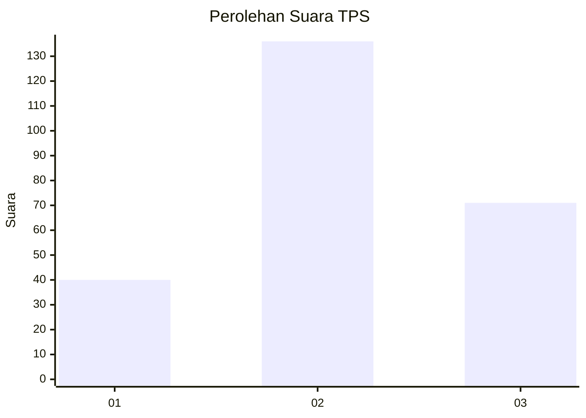
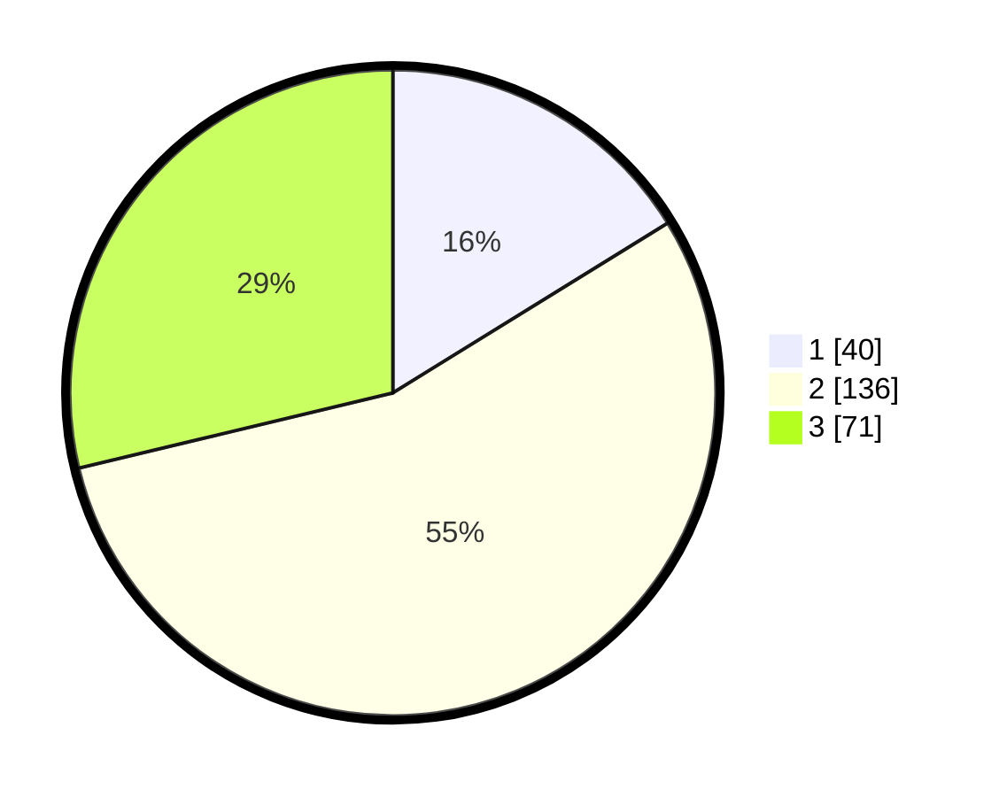

# Hasil

## Grafik

## Tabel

| No. | Nama Paslon    | Suara | Suara (raw) | Persentase |
|:--- |:-------------- | -----:| -----------:| ----------:|
| 1   | ANIES MUHAIMIN | 40    | [40][p-1]   | 16,19      |
| 2   | PRABOWO GIBRAN | 136   | [136][p-2]  | 55,06      |
| 3   | GANJAR MAHFUD  | 71    | [71][p-3]   | 28,74      |

[p-1]: https://github.com/gigit-pemilu/pemilu-2024-34-di-yogyakarta/blob/main/pilpres/hitung-suara/sub/34-di-yogyakarta/sub/04-sleman/sub/11-ngemplak/sub/2005-umbulmartani/sub/014-tps/sub/paslon-1.txt
[p-2]: https://github.com/gigit-pemilu/pemilu-2024-34-di-yogyakarta/blob/main/pilpres/hitung-suara/sub/34-di-yogyakarta/sub/04-sleman/sub/11-ngemplak/sub/2005-umbulmartani/sub/014-tps/sub/paslon-2.txt
[p-3]: https://github.com/gigit-pemilu/pemilu-2024-34-di-yogyakarta/blob/main/pilpres/hitung-suara/sub/34-di-yogyakarta/sub/04-sleman/sub/11-ngemplak/sub/2005-umbulmartani/sub/014-tps/sub/paslon-3.txt

## Foto C Plano

https://sirekap-obj-formc.kpu.go.id/86c0/pemilu/ppwp/34/04/11/20/05/3404112005014-20240214-202820--306eea90-e4a1-4ae6-9fb5-130b477c378b.jpg

https://sirekap-obj-formc.kpu.go.id/86c0/pemilu/ppwp/34/04/11/20/05/3404112005014-20240214-202357--d81a6084-d926-44a8-8bf1-3e8cb93a8b2a.jpg

https://sirekap-obj-formc.kpu.go.id/86c0/pemilu/ppwp/34/04/11/20/05/3404112005014-20240214-202626--9d8f1d5c-d361-45df-9697-3f8e8a012734.jpg

## Metadata

| Key        | Value               |
| ---------- | ------------------- |
| Time Stamp | 2024-02-15 19:00:26 |

