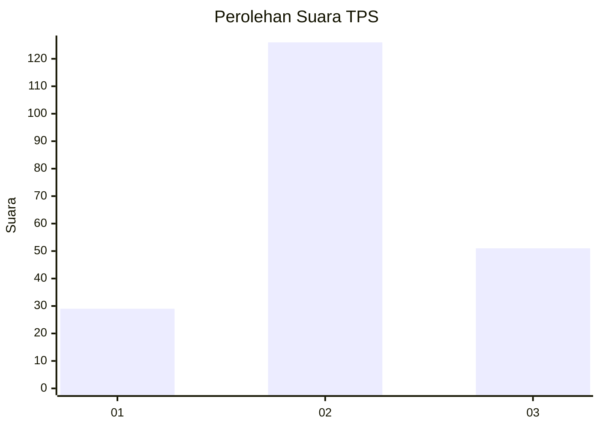
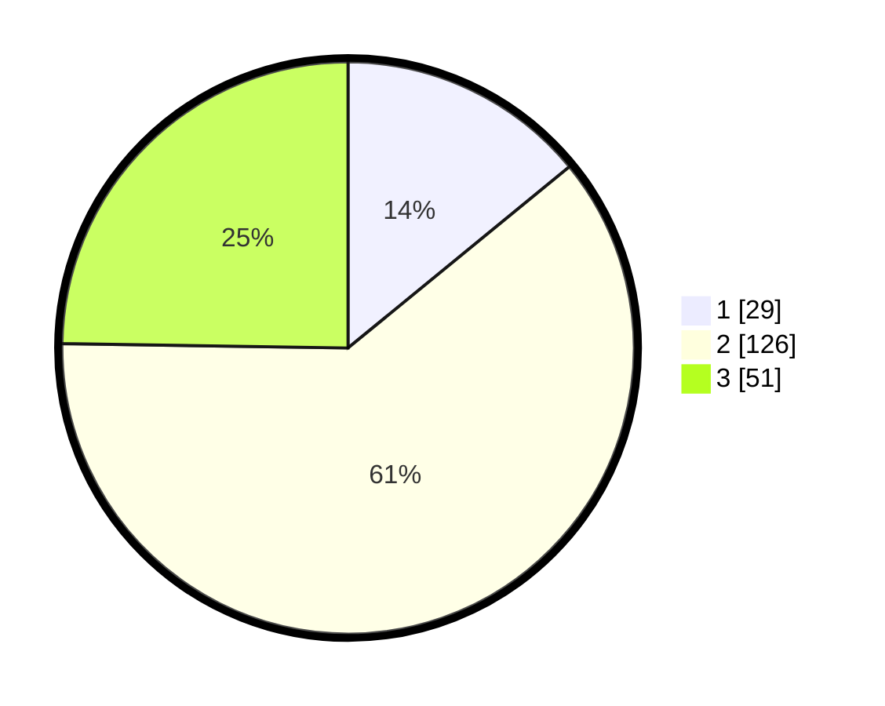

# Hasil

## Grafik

## Tabel

| No. | Nama Paslon    | Suara | Suara (raw) | Persentase |
|:--- |:-------------- | -----:| -----------:| ----------:|
| 1   | ANIES MUHAIMIN | 29    | [29][p-1]   | 14,08      |
| 2   | PRABOWO GIBRAN | 126   | [126][p-2]  | 61,17      |
| 3   | GANJAR MAHFUD  | 51    | [51][p-3]   | 24,76      |

[p-1]: https://github.com/gigit-pemilu/pemilu-2024-34-di-yogyakarta/blob/main/pilpres/hitung-suara/sub/34-di-yogyakarta/sub/04-sleman/sub/11-ngemplak/sub/2005-umbulmartani/sub/017-tps/sub/paslon-1.txt
[p-2]: https://github.com/gigit-pemilu/pemilu-2024-34-di-yogyakarta/blob/main/pilpres/hitung-suara/sub/34-di-yogyakarta/sub/04-sleman/sub/11-ngemplak/sub/2005-umbulmartani/sub/017-tps/sub/paslon-2.txt
[p-3]: https://github.com/gigit-pemilu/pemilu-2024-34-di-yogyakarta/blob/main/pilpres/hitung-suara/sub/34-di-yogyakarta/sub/04-sleman/sub/11-ngemplak/sub/2005-umbulmartani/sub/017-tps/sub/paslon-3.txt

## Foto C Plano

https://sirekap-obj-formc.kpu.go.id/56a0/pemilu/ppwp/34/04/11/20/05/3404112005017-20240214-210331--2b93af51-c509-401d-92fe-1b50323974df.jpg

https://sirekap-obj-formc.kpu.go.id/56a0/pemilu/ppwp/34/04/11/20/05/3404112005017-20240214-210343--fcfa060e-6156-40d6-a2a4-b8a8ff12ac0d.jpg

https://sirekap-obj-formc.kpu.go.id/56a0/pemilu/ppwp/34/04/11/20/05/3404112005017-20240214-210349--dcc951e7-044c-413a-8ad4-9528c99b24d3.jpg

## Metadata

| Key        | Value               |
| ---------- | ------------------- |
| Time Stamp | 2024-02-15 19:00:26 |

