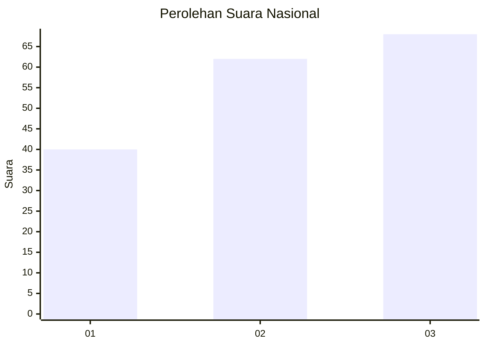
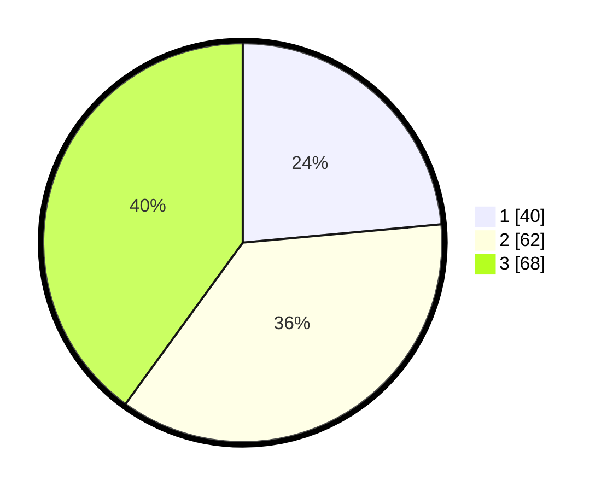

# Hasil

## Grafik

## Tabel

| No. | Nama Paslon    | Suara | Suara (raw) | Persentase |
|:--- |:-------------- | -----:| -----------:| ----------:|
| 1   | ANIES MUHAIMIN | 40    | [40][p-1]   | 23,53      |
| 2   | PRABOWO GIBRAN | 62    | [62][p-2]   | 36,47      |
| 3   | GANJAR MAHFUD  | 68    | [68][p-3]   | 40,00      |

[p-1]: https://github.com/gigit-pemilu/pemilu-2024/blob/main/pilpres/hitung-suara/sub/34-di-yogyakarta/sub/04-sleman/sub/11-ngemplak/sub/2005-umbulmartani/sub/021-tps/sub/paslon-1.txt
[p-2]: https://github.com/gigit-pemilu/pemilu-2024/blob/main/pilpres/hitung-suara/sub/34-di-yogyakarta/sub/04-sleman/sub/11-ngemplak/sub/2005-umbulmartani/sub/021-tps/sub/paslon-2.txt
[p-3]: https://github.com/gigit-pemilu/pemilu-2024/blob/main/pilpres/hitung-suara/sub/34-di-yogyakarta/sub/04-sleman/sub/11-ngemplak/sub/2005-umbulmartani/sub/021-tps/sub/paslon-3.txt

## Foto C Plano

https://sirekap-obj-formc.kpu.go.id/fcf9/pemilu/ppwp/34/04/11/20/05/3404112005021-20240214-232548--5795c708-f829-42b8-a4ae-38862a325e52.jpg

https://sirekap-obj-formc.kpu.go.id/fcf9/pemilu/ppwp/34/04/11/20/05/3404112005021-20240214-232636--d5b6ff07-4882-4412-ba36-97d9c3c19dc5.jpg

https://sirekap-obj-formc.kpu.go.id/fcf9/pemilu/ppwp/34/04/11/20/05/3404112005021-20240214-232720--4447b18a-16c1-4f5c-809a-f6ea2c4523a1.jpg

## Metadata

| Key        | Value               |
| ---------- | ------------------- |
| Time Stamp | 2024-02-15 15:00:29 |

