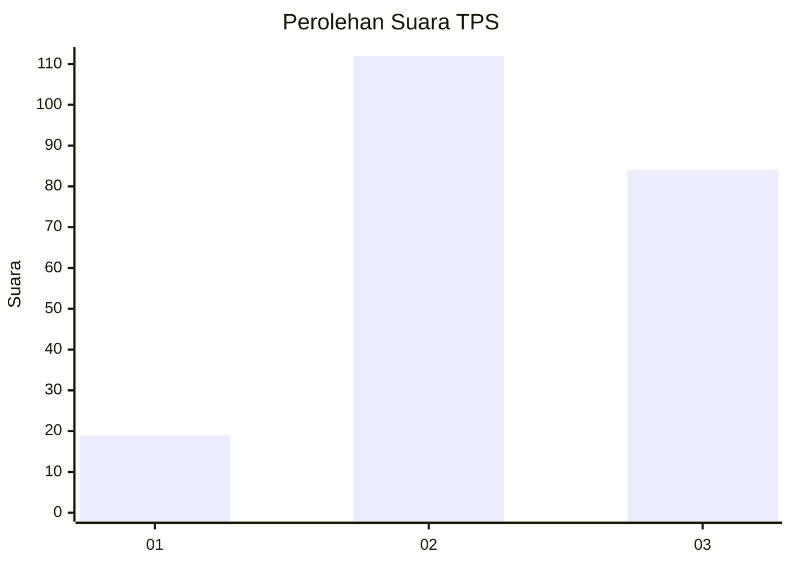
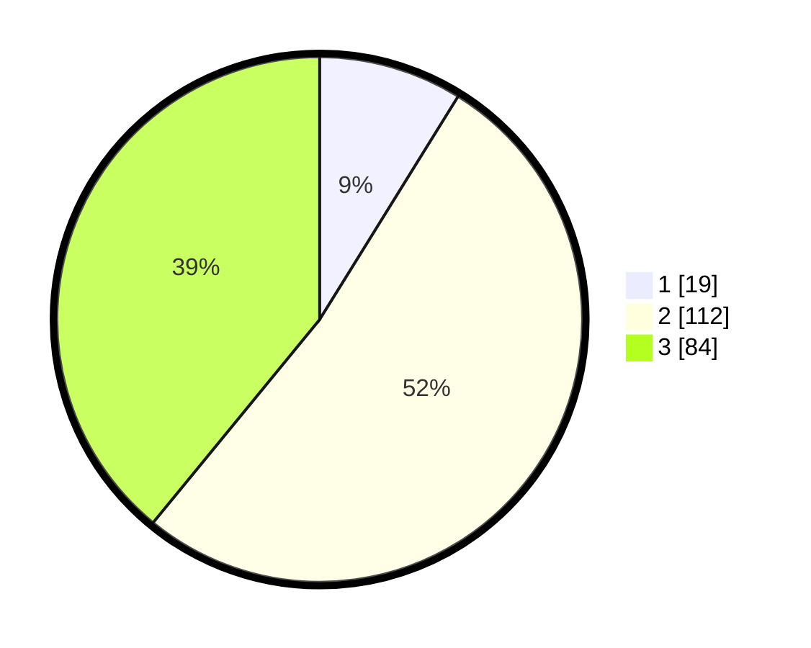

# Hasil

## Grafik

## Tabel

| No. | Nama Paslon    | Suara | Suara (raw) | Persentase |
|:--- |:-------------- | -----:| -----------:| ----------:|
| 1   | ANIES MUHAIMIN | 19    | [19][p-1]   | 8,84       |
| 2   | PRABOWO GIBRAN | 112   | [112][p-2]  | 52,09      |
| 3   | GANJAR MAHFUD  | 84    | [84][p-3]   | 39,07      |

[p-1]: https://github.com/gigit-pemilu/pemilu-2024-34-di-yogyakarta/blob/main/pilpres/hitung-suara/sub/34-di-yogyakarta/sub/04-sleman/sub/11-ngemplak/sub/2005-umbulmartani/sub/022-tps/sub/paslon-1.txt
[p-2]: https://github.com/gigit-pemilu/pemilu-2024-34-di-yogyakarta/blob/main/pilpres/hitung-suara/sub/34-di-yogyakarta/sub/04-sleman/sub/11-ngemplak/sub/2005-umbulmartani/sub/022-tps/sub/paslon-2.txt
[p-3]: https://github.com/gigit-pemilu/pemilu-2024-34-di-yogyakarta/blob/main/pilpres/hitung-suara/sub/34-di-yogyakarta/sub/04-sleman/sub/11-ngemplak/sub/2005-umbulmartani/sub/022-tps/sub/paslon-3.txt

## Foto C Plano

https://sirekap-obj-formc.kpu.go.id/b2eb/pemilu/ppwp/34/04/11/20/05/3404112005022-20240215-005123--2f1306b8-3b51-4137-9b42-85310e3fb403.jpg

https://sirekap-obj-formc.kpu.go.id/b2eb/pemilu/ppwp/34/04/11/20/05/3404112005022-20240215-005218--a646bfc9-729d-449a-b1b1-857cb3000422.jpg

https://sirekap-obj-formc.kpu.go.id/b2eb/pemilu/ppwp/34/04/11/20/05/3404112005022-20240215-005327--0213ee01-ba49-4c2b-a0a3-82253a42f122.jpg

## Metadata

| Key        | Value               |
| ---------- | ------------------- |
| Time Stamp | 2024-02-16 22:30:00 |

