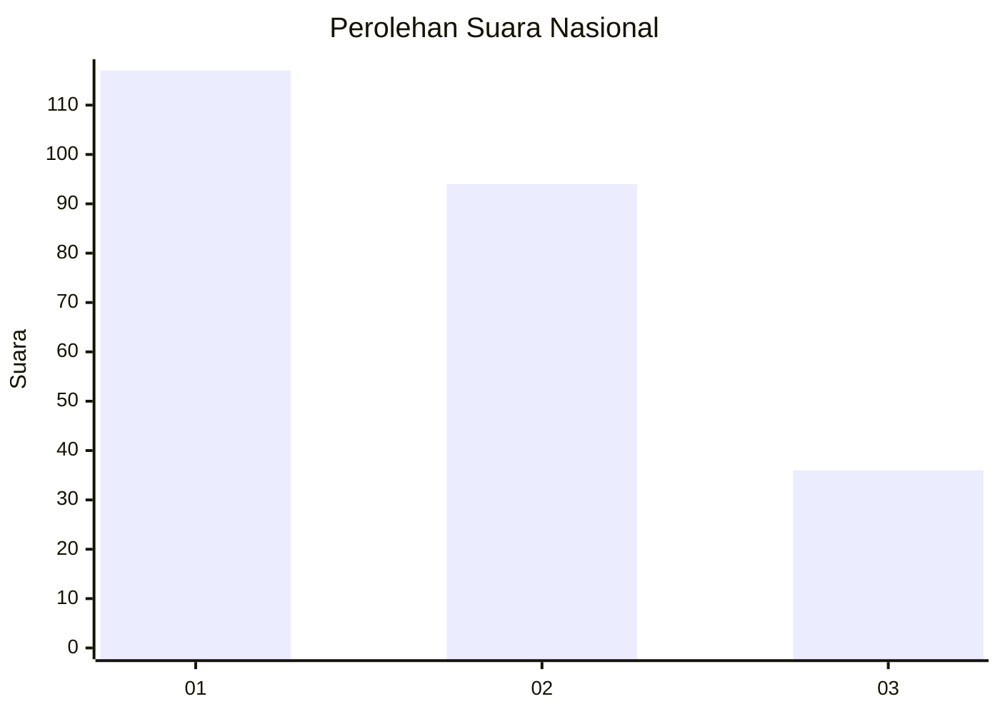
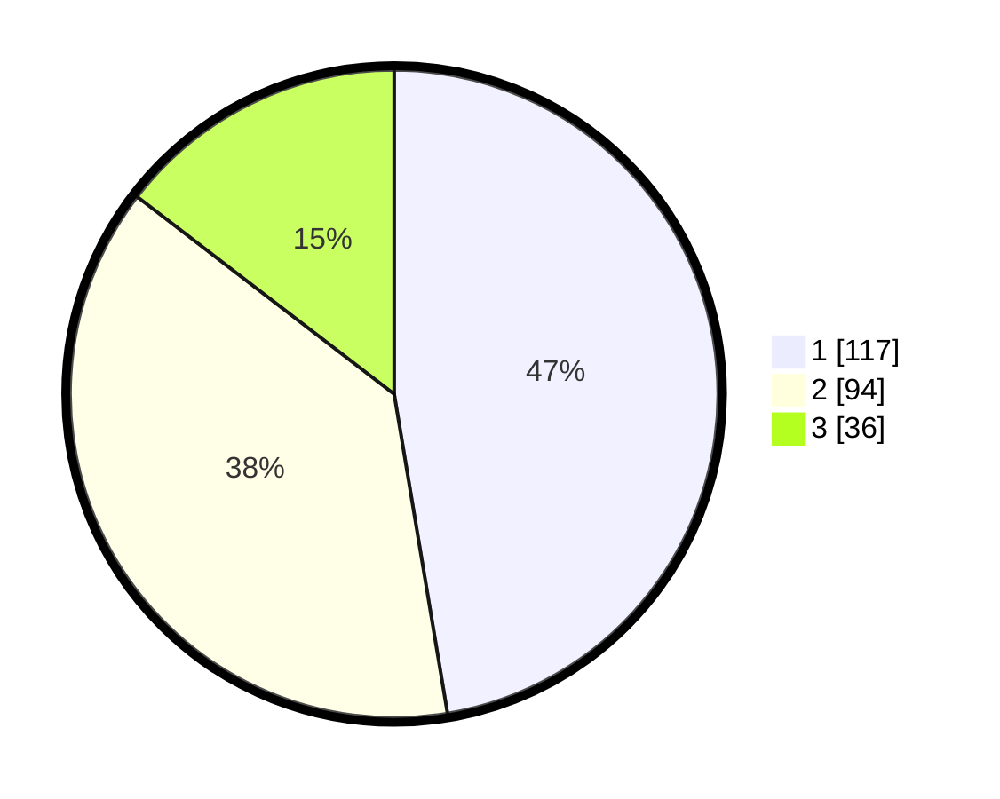

# Hasil

## Grafik

## Tabel

| No. | Nama Paslon    | Suara | Suara (raw) | Persentase |
|:--- |:-------------- | -----:| -----------:| ----------:|
| 1   | ANIES MUHAIMIN | 117   | [117][p-1]  | 47,37      |
| 2   | PRABOWO GIBRAN | 94    | [94][p-2]   | 38,06      |
| 3   | GANJAR MAHFUD  | 36    | [36][p-3]   | 14,57      |

[p-1]: https://github.com/gigit-pemilu/pemilu-2024/blob/main/pilpres/hitung-suara/sub/34-di-yogyakarta/sub/04-sleman/sub/12-ngaglik/sub/2001-sariharjo/sub/003-tps/sub/paslon-1.txt
[p-2]: https://github.com/gigit-pemilu/pemilu-2024/blob/main/pilpres/hitung-suara/sub/34-di-yogyakarta/sub/04-sleman/sub/12-ngaglik/sub/2001-sariharjo/sub/003-tps/sub/paslon-2.txt
[p-3]: https://github.com/gigit-pemilu/pemilu-2024/blob/main/pilpres/hitung-suara/sub/34-di-yogyakarta/sub/04-sleman/sub/12-ngaglik/sub/2001-sariharjo/sub/003-tps/sub/paslon-3.txt

## Foto C Plano

https://sirekap-obj-formc.kpu.go.id/a66d/pemilu/ppwp/34/04/12/20/01/3404122001003-20240215-002928--79866143-5603-482d-b2a6-28ba1a1a454a.jpg

https://sirekap-obj-formc.kpu.go.id/a66d/pemilu/ppwp/34/04/12/20/01/3404122001003-20240215-002931--7a9bde0e-5324-4daf-86b1-17bba5bc9d5b.jpg

https://sirekap-obj-formc.kpu.go.id/a66d/pemilu/ppwp/34/04/12/20/01/3404122001003-20240215-002934--47beeea6-921f-4387-8e1e-3aa8d9b11e30.jpg

## Metadata

| Key        | Value               |
| ---------- | ------------------- |
| Time Stamp | 2024-02-15 12:00:28 |

## DATA PEMILIH TETAP

Jumlah pemilih dalam DPT: **273**.
 * L: **131**.
 * P: **142**.

## DATA PENGGUNA HAK PILIH

Jumlah pengguna hak pilih dalam DPT: **230**.
 * L: **108**.
 * P: **122**.

Jumlah pengguna hak pilih dalam DPTb: **11**.
 * L: **5**.
 * P: **6**.

Jumlah pengguna hak pilih dalam DPK: **11**.
 * L: **6**.
 * P: **5**.

Jumlah pengguna hak pilih: **252**.
 * L: **119**.
 * P: **133**.

## JUMLAH SUARA SAH DAN TIDAK SAH

JUMLAH SELURUH SUARA SAH: **247**.

JUMLAH SUARA TIDAK SAH: **5**.

JUMLAH SELURUH SUARA SAH DAN SUARA TIDAK SAH: **252**.

