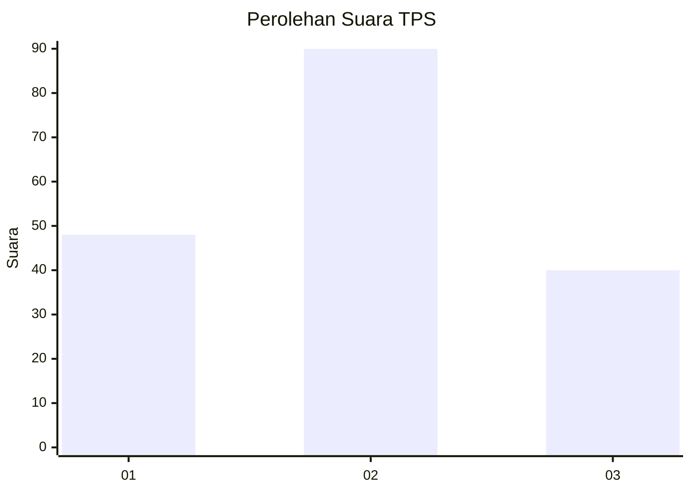
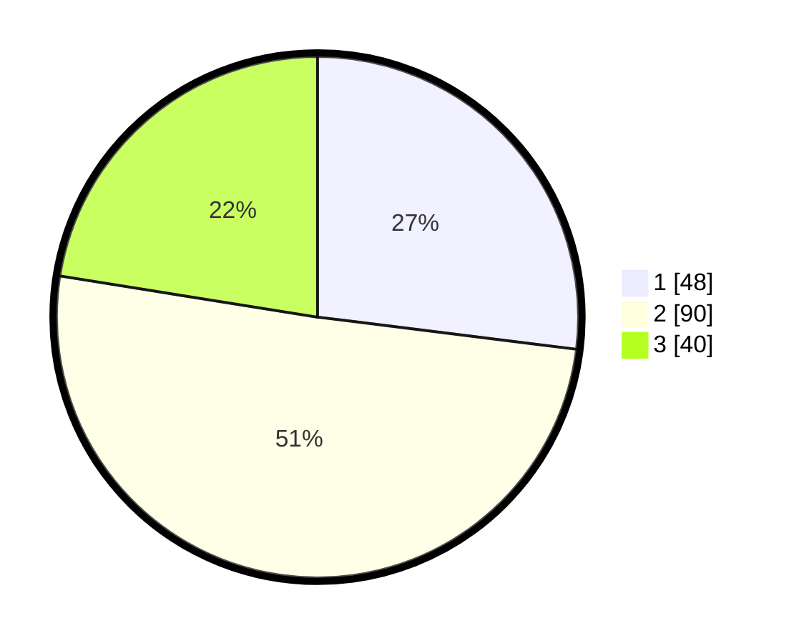

# Hasil

## Grafik

## Tabel

| No. | Nama Paslon    | Suara | Suara (raw) | Persentase |
|:--- |:-------------- | -----:| -----------:| ----------:|
| 1   | ANIES MUHAIMIN | 48    | [48][p-1]   | 26,97      |
| 2   | PRABOWO GIBRAN | 90    | [90][p-2]   | 50,56      |
| 3   | GANJAR MAHFUD  | 40    | [40][p-3]   | 22,47      |

[p-1]: https://github.com/gigit-pemilu/pemilu-2024-34-di-yogyakarta/blob/main/pilpres/hitung-suara/sub/34-di-yogyakarta/sub/04-sleman/sub/12-ngaglik/sub/2001-sariharjo/sub/007-tps/sub/paslon-1.txt
[p-2]: https://github.com/gigit-pemilu/pemilu-2024-34-di-yogyakarta/blob/main/pilpres/hitung-suara/sub/34-di-yogyakarta/sub/04-sleman/sub/12-ngaglik/sub/2001-sariharjo/sub/007-tps/sub/paslon-2.txt
[p-3]: https://github.com/gigit-pemilu/pemilu-2024-34-di-yogyakarta/blob/main/pilpres/hitung-suara/sub/34-di-yogyakarta/sub/04-sleman/sub/12-ngaglik/sub/2001-sariharjo/sub/007-tps/sub/paslon-3.txt

## Foto C Plano

https://sirekap-obj-formc.kpu.go.id/cf09/pemilu/ppwp/34/04/12/20/01/3404122001007-20240215-180323--8df8d4f0-aaad-4862-b3fb-7c32579ceda9.jpg

https://sirekap-obj-formc.kpu.go.id/cf09/pemilu/ppwp/34/04/12/20/01/3404122001007-20240215-180328--5e60ab6e-cd4b-4cf5-88d6-f9fec763bdc9.jpg

https://sirekap-obj-formc.kpu.go.id/cf09/pemilu/ppwp/34/04/12/20/01/3404122001007-20240215-180332--22076463-86c4-498b-af86-a03f388e53e4.jpg

## Metadata

| Key        | Value               |
| ---------- | ------------------- |
| Time Stamp | 2024-02-15 21:30:27 |

