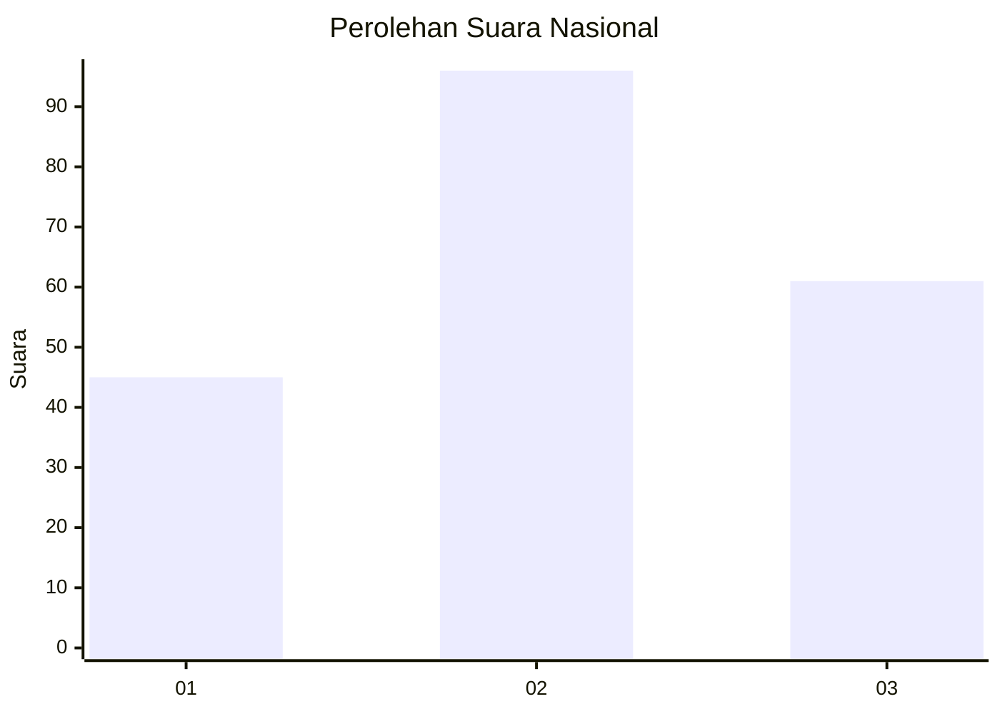
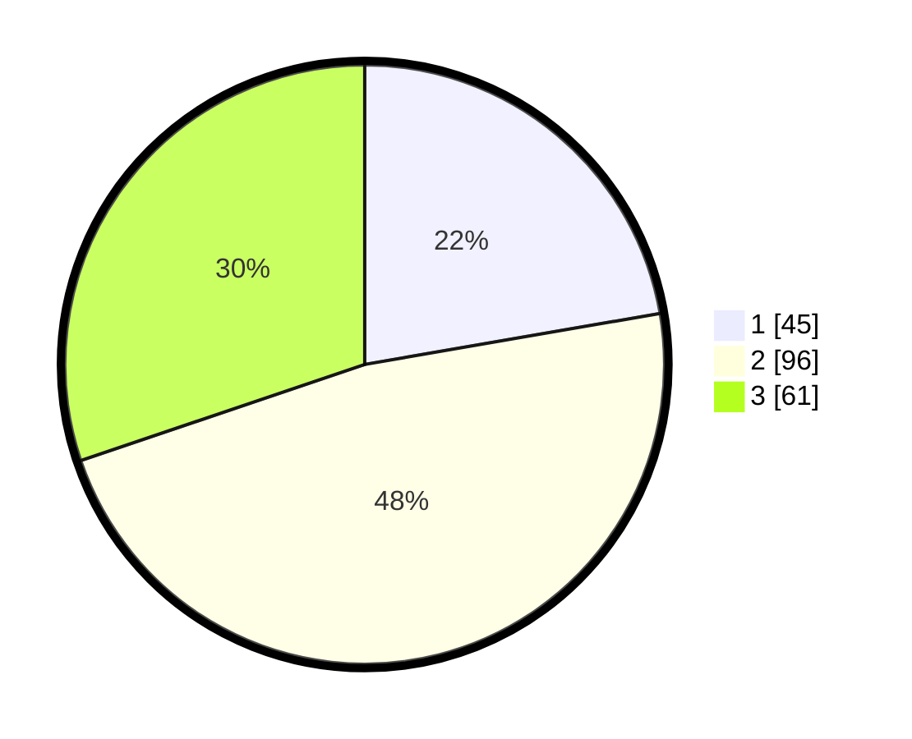

# Hasil

## Grafik

## Tabel

| No. | Nama Paslon    | Suara | Suara (raw) | Persentase |
|:--- |:-------------- | -----:| -----------:| ----------:|
| 1   | ANIES MUHAIMIN | 45    | [45][p-1]   | 22,28      |
| 2   | PRABOWO GIBRAN | 96    | [96][p-2]   | 47,52      |
| 3   | GANJAR MAHFUD  | 61    | [61][p-3]   | 30,20      |

[p-1]: https://github.com/gigit-pemilu/pemilu-2024/blob/main/pilpres/hitung-suara/sub/34-di-yogyakarta/sub/04-sleman/sub/12-ngaglik/sub/2001-sariharjo/sub/009-tps/sub/paslon-1.txt
[p-2]: https://github.com/gigit-pemilu/pemilu-2024/blob/main/pilpres/hitung-suara/sub/34-di-yogyakarta/sub/04-sleman/sub/12-ngaglik/sub/2001-sariharjo/sub/009-tps/sub/paslon-2.txt
[p-3]: https://github.com/gigit-pemilu/pemilu-2024/blob/main/pilpres/hitung-suara/sub/34-di-yogyakarta/sub/04-sleman/sub/12-ngaglik/sub/2001-sariharjo/sub/009-tps/sub/paslon-3.txt

## Foto C Plano

https://sirekap-obj-formc.kpu.go.id/8b12/pemilu/ppwp/34/04/12/20/01/3404122001009-20240214-184859--77dd3518-536a-47b4-8dbb-3fa88c0e151f.jpg

https://sirekap-obj-formc.kpu.go.id/8b12/pemilu/ppwp/34/04/12/20/01/3404122001009-20240214-184955--95e6ee12-d5ba-4fec-b6ad-6038fdc13aca.jpg

https://sirekap-obj-formc.kpu.go.id/8b12/pemilu/ppwp/34/04/12/20/01/3404122001009-20240214-185114--fa684d5b-7e5e-4c47-b6cd-11f80fdb099c.jpg

## Metadata

| Key        | Value               |
| ---------- | ------------------- |
| Time Stamp | 2024-02-14 21:46:01 |

## DATA PEMILIH TETAP

Jumlah pemilih dalam DPT: **238**.
 * L: **111**.
 * P: **127**.

## DATA PENGGUNA HAK PILIH

Jumlah pengguna hak pilih dalam DPT: **197**.
 * L: **90**.
 * P: **107**.

Jumlah pengguna hak pilih dalam DPTb: **7**.
 * L: **2**.
 * P: **5**.

Jumlah pengguna hak pilih dalam DPK: **5**.
 * L: **3**.
 * P: **2**.

Jumlah pengguna hak pilih: **209**.
 * L: **95**.
 * P: **114**.

## JUMLAH SUARA SAH DAN TIDAK SAH

JUMLAH SELURUH SUARA SAH: **202**.

JUMLAH SUARA TIDAK SAH: **7**.

JUMLAH SELURUH SUARA SAH DAN SUARA TIDAK SAH: **209**.

