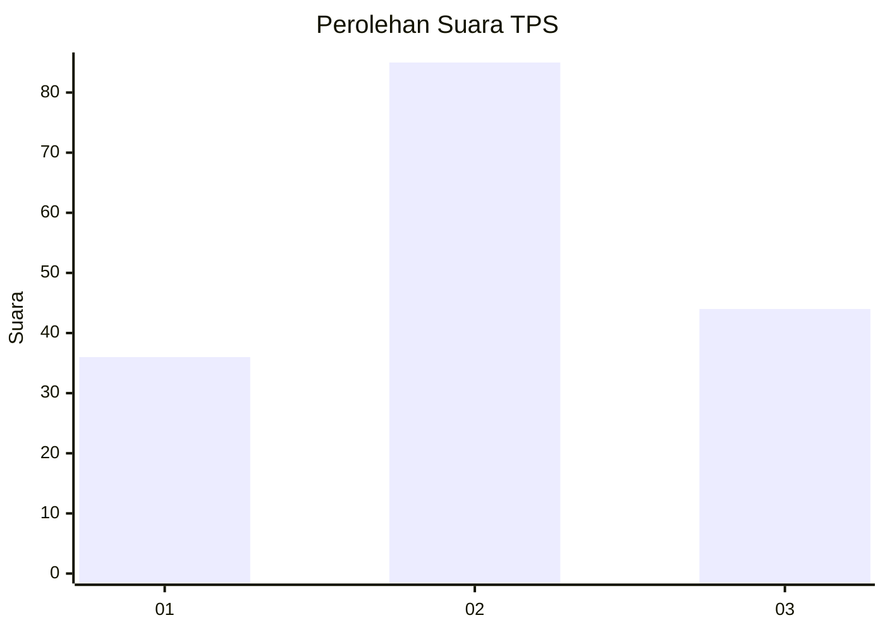
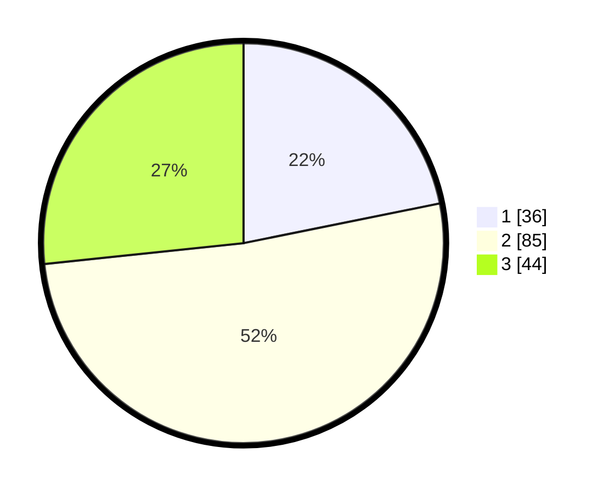

# Hasil

## Grafik

## Tabel

| No. | Nama Paslon    | Suara | Suara (raw) | Persentase |
|:--- |:-------------- | -----:| -----------:| ----------:|
| 1   | ANIES MUHAIMIN | 36    | [36][p-1]   | 21,82      |
| 2   | PRABOWO GIBRAN | 85    | [85][p-2]   | 51,52      |
| 3   | GANJAR MAHFUD  | 44    | [44][p-3]   | 26,67      |

[p-1]: https://github.com/gigit-pemilu/pemilu-2024-34-di-yogyakarta/blob/main/pilpres/hitung-suara/sub/34-di-yogyakarta/sub/04-sleman/sub/12-ngaglik/sub/2001-sariharjo/sub/029-tps/sub/paslon-1.txt
[p-2]: https://github.com/gigit-pemilu/pemilu-2024-34-di-yogyakarta/blob/main/pilpres/hitung-suara/sub/34-di-yogyakarta/sub/04-sleman/sub/12-ngaglik/sub/2001-sariharjo/sub/029-tps/sub/paslon-2.txt
[p-3]: https://github.com/gigit-pemilu/pemilu-2024-34-di-yogyakarta/blob/main/pilpres/hitung-suara/sub/34-di-yogyakarta/sub/04-sleman/sub/12-ngaglik/sub/2001-sariharjo/sub/029-tps/sub/paslon-3.txt

## Foto C Plano

https://sirekap-obj-formc.kpu.go.id/183e/pemilu/ppwp/34/04/12/20/01/3404122001029-20240214-193644--aa69614b-95a7-406e-80e5-a661595685e8.jpg

https://sirekap-obj-formc.kpu.go.id/183e/pemilu/ppwp/34/04/12/20/01/3404122001029-20240214-193649--1e659fa1-6f43-449d-8cef-fd8619cd8777.jpg

https://sirekap-obj-formc.kpu.go.id/183e/pemilu/ppwp/34/04/12/20/01/3404122001029-20240214-193653--e499e2f0-7485-436c-9063-31b9f3e73e9a.jpg

## Metadata

| Key        | Value               |
| ---------- | ------------------- |
| Time Stamp | 2024-02-16 21:01:00 |

