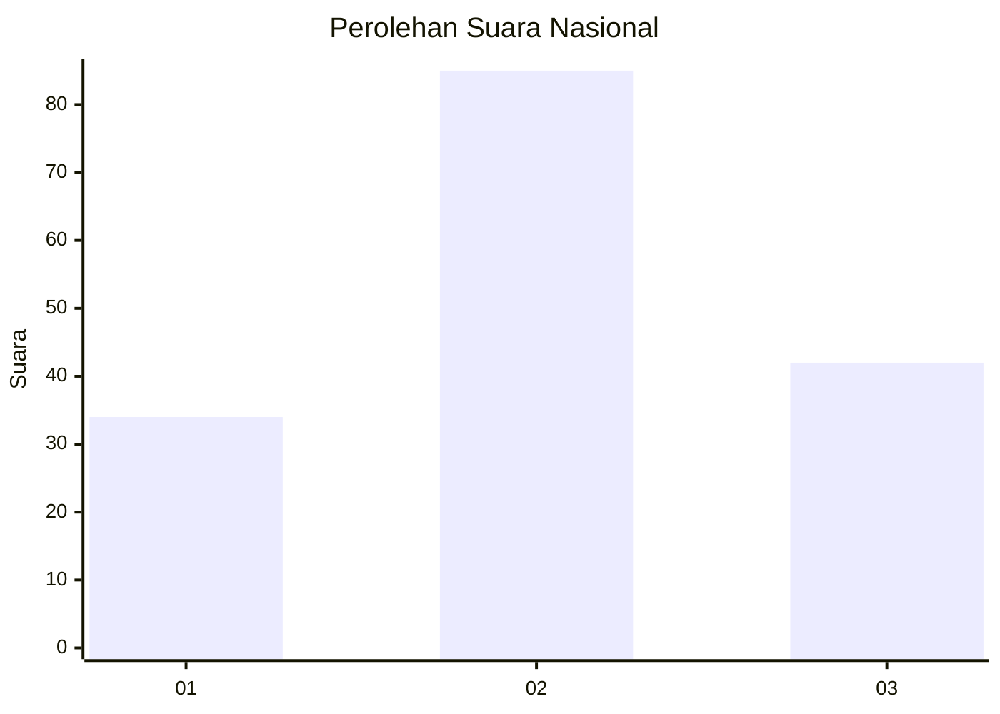
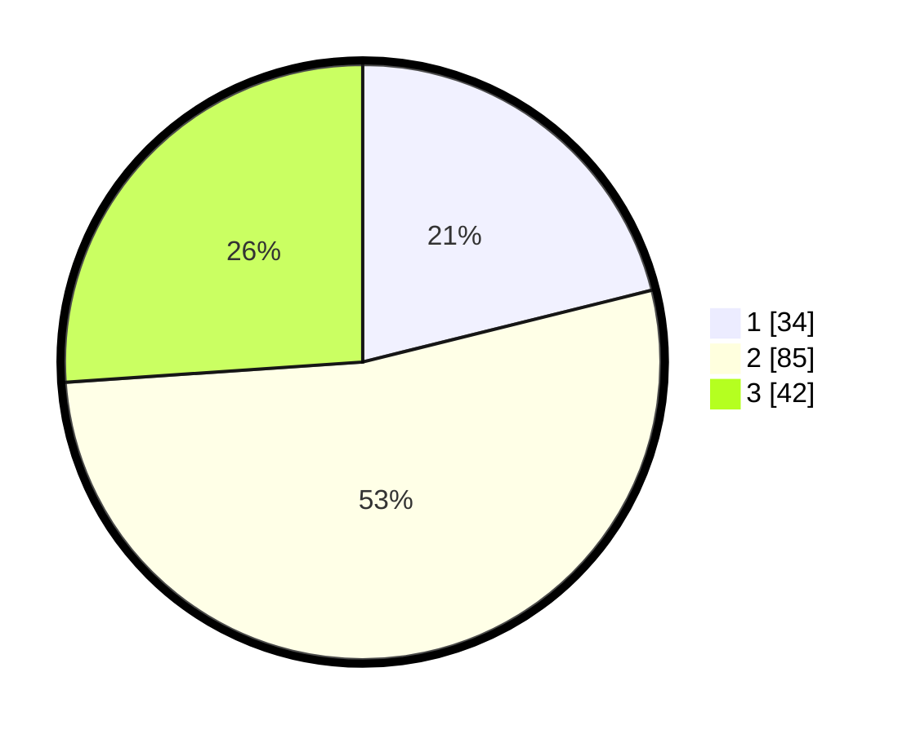

# Hasil

## Grafik

## Tabel

| No. | Nama Paslon    | Suara | Suara (raw) | Persentase |
|:--- |:-------------- | -----:| -----------:| ----------:|
| 1   | ANIES MUHAIMIN | 34    | [34][p-1]   | 21,12      |
| 2   | PRABOWO GIBRAN | 85    | [85][p-2]   | 52,80      |
| 3   | GANJAR MAHFUD  | 42    | [42][p-3]   | 26,09      |

[p-1]: https://github.com/gigit-pemilu/pemilu-2024/blob/main/pilpres/hitung-suara/sub/34-di-yogyakarta/sub/04-sleman/sub/12-ngaglik/sub/2001-sariharjo/sub/030-tps/sub/paslon-1.txt
[p-2]: https://github.com/gigit-pemilu/pemilu-2024/blob/main/pilpres/hitung-suara/sub/34-di-yogyakarta/sub/04-sleman/sub/12-ngaglik/sub/2001-sariharjo/sub/030-tps/sub/paslon-2.txt
[p-3]: https://github.com/gigit-pemilu/pemilu-2024/blob/main/pilpres/hitung-suara/sub/34-di-yogyakarta/sub/04-sleman/sub/12-ngaglik/sub/2001-sariharjo/sub/030-tps/sub/paslon-3.txt

## Foto C Plano

https://sirekap-obj-formc.kpu.go.id/15c4/pemilu/ppwp/34/04/12/20/01/3404122001030-20240215-001006--c9e22881-0559-4f0f-a39f-e4910e0d0b3e.jpg

https://sirekap-obj-formc.kpu.go.id/15c4/pemilu/ppwp/34/04/12/20/01/3404122001030-20240215-001044--5965d671-3a58-42da-9f91-d2721f996ac4.jpg

https://sirekap-obj-formc.kpu.go.id/15c4/pemilu/ppwp/34/04/12/20/01/3404122001030-20240215-001101--4f813cf6-716f-4f10-b6b1-319e5c10c1f8.jpg

## Metadata

| Key        | Value               |
| ---------- | ------------------- |
| Time Stamp | 2024-02-15 15:00:29 |

