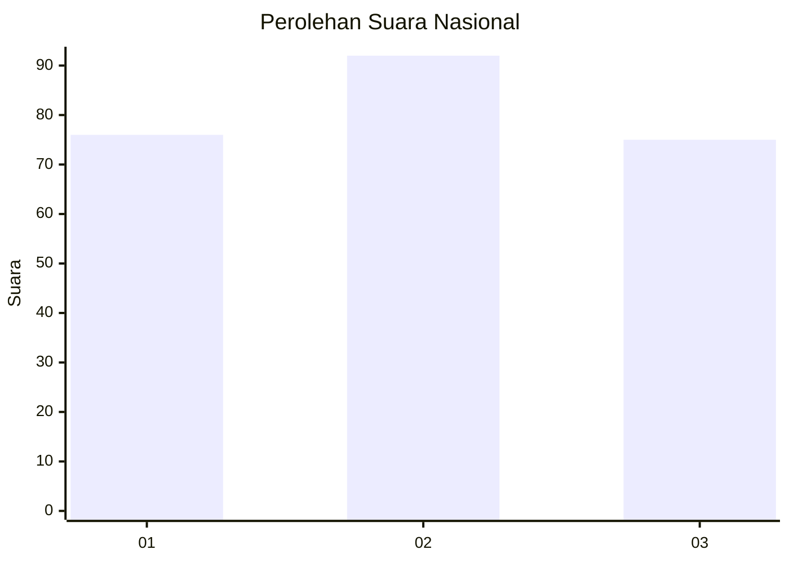
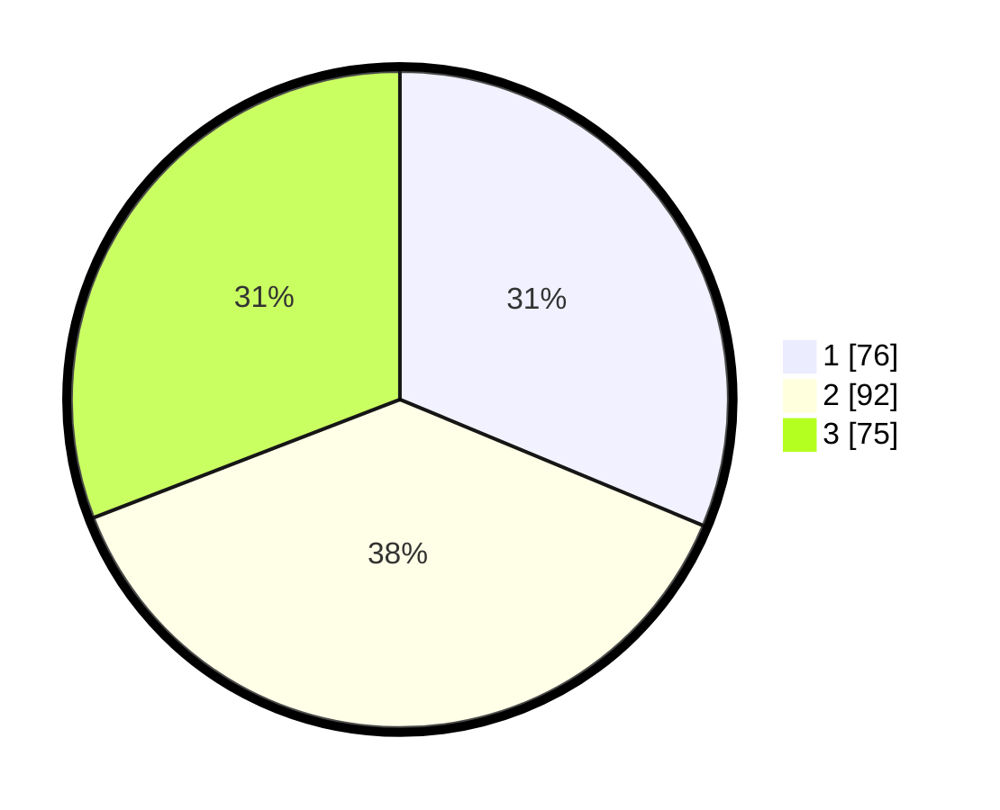

# Hasil

## Grafik

## Tabel

| No. | Nama Paslon    | Suara | Suara (raw) | Persentase |
|:--- |:-------------- | -----:| -----------:| ----------:|
| 1   | ANIES MUHAIMIN | 76    | [76][p-1]   | 31,28      |
| 2   | PRABOWO GIBRAN | 92    | [92][p-2]   | 37,86      |
| 3   | GANJAR MAHFUD  | 75    | [75][p-3]   | 30,86      |

[p-1]: https://github.com/gigit-pemilu/pemilu-2024/blob/main/pilpres/hitung-suara/sub/34-di-yogyakarta/sub/04-sleman/sub/12-ngaglik/sub/2001-sariharjo/sub/031-tps/sub/paslon-1.txt
[p-2]: https://github.com/gigit-pemilu/pemilu-2024/blob/main/pilpres/hitung-suara/sub/34-di-yogyakarta/sub/04-sleman/sub/12-ngaglik/sub/2001-sariharjo/sub/031-tps/sub/paslon-2.txt
[p-3]: https://github.com/gigit-pemilu/pemilu-2024/blob/main/pilpres/hitung-suara/sub/34-di-yogyakarta/sub/04-sleman/sub/12-ngaglik/sub/2001-sariharjo/sub/031-tps/sub/paslon-3.txt

## Foto C Plano

https://sirekap-obj-formc.kpu.go.id/69d2/pemilu/ppwp/34/04/12/20/01/3404122001031-20240214-214552--7edc7ea2-0d43-4f54-a2c1-628f01610ac2.jpg

https://sirekap-obj-formc.kpu.go.id/69d2/pemilu/ppwp/34/04/12/20/01/3404122001031-20240214-203854--25660a2c-038d-468a-bb16-0a14d0e4120c.jpg

https://sirekap-obj-formc.kpu.go.id/69d2/pemilu/ppwp/34/04/12/20/01/3404122001031-20240214-203950--078bd7bb-364f-4b76-bc4d-05fce425196a.jpg

## Metadata

| Key        | Value               |
| ---------- | ------------------- |
| Time Stamp | 2024-02-15 09:00:24 |

