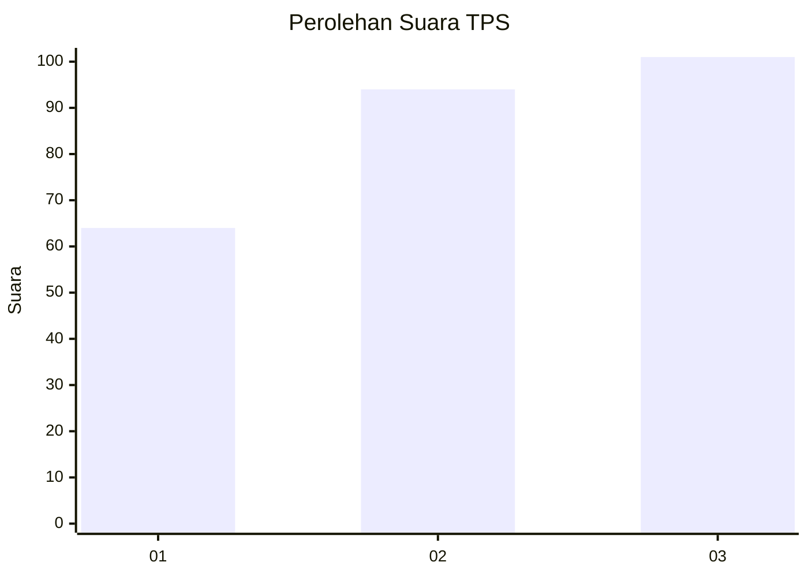
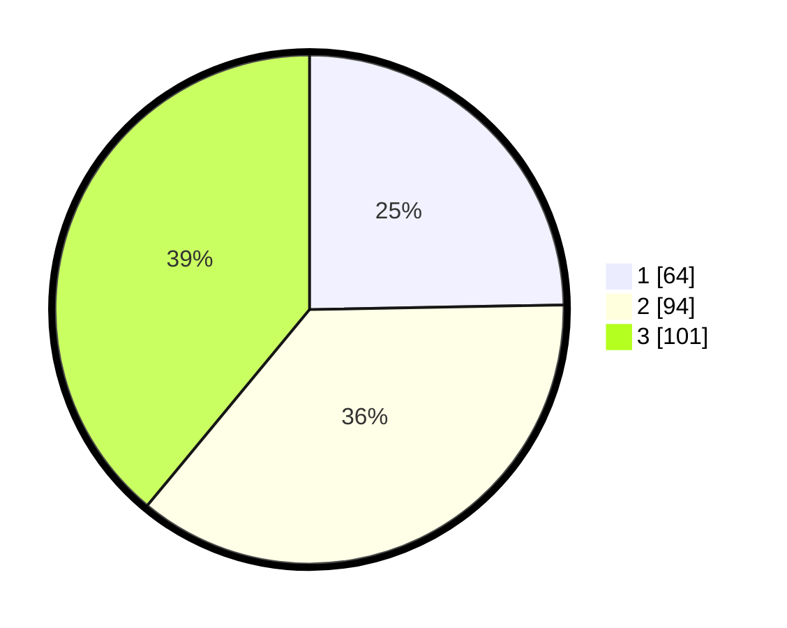

# Hasil

## Grafik

## Tabel

| No. | Nama Paslon    | Suara | Suara (raw) | Persentase |
|:--- |:-------------- | -----:| -----------:| ----------:|
| 1   | ANIES MUHAIMIN | 64    | [64][p-1]   | 24,71      |
| 2   | PRABOWO GIBRAN | 94    | [94][p-2]   | 36,29      |
| 3   | GANJAR MAHFUD  | 101   | [101][p-3]  | 39,00      |

[p-1]: https://github.com/gigit-pemilu/pemilu-2024-34-di-yogyakarta/blob/main/pilpres/hitung-suara/sub/34-di-yogyakarta/sub/04-sleman/sub/12-ngaglik/sub/2001-sariharjo/sub/044-tps/sub/paslon-1.txt
[p-2]: https://github.com/gigit-pemilu/pemilu-2024-34-di-yogyakarta/blob/main/pilpres/hitung-suara/sub/34-di-yogyakarta/sub/04-sleman/sub/12-ngaglik/sub/2001-sariharjo/sub/044-tps/sub/paslon-2.txt
[p-3]: https://github.com/gigit-pemilu/pemilu-2024-34-di-yogyakarta/blob/main/pilpres/hitung-suara/sub/34-di-yogyakarta/sub/04-sleman/sub/12-ngaglik/sub/2001-sariharjo/sub/044-tps/sub/paslon-3.txt

## Foto C Plano

https://sirekap-obj-formc.kpu.go.id/5e04/pemilu/ppwp/34/04/12/20/01/3404122001044-20240215-142733--f5327338-aec8-43a7-b9e6-84c47e300c4e.jpg

https://sirekap-obj-formc.kpu.go.id/5e04/pemilu/ppwp/34/04/12/20/01/3404122001044-20240215-144625--32621eca-4d0c-45a5-83a2-38fd4bc54644.jpg

https://sirekap-obj-formc.kpu.go.id/5e04/pemilu/ppwp/34/04/12/20/01/3404122001044-20240215-164944--c84f7ba1-b4d9-451f-bada-04303b395a80.jpg

## Metadata

| Key        | Value               |
| ---------- | ------------------- |
| Time Stamp | 2024-02-15 18:00:26 |

