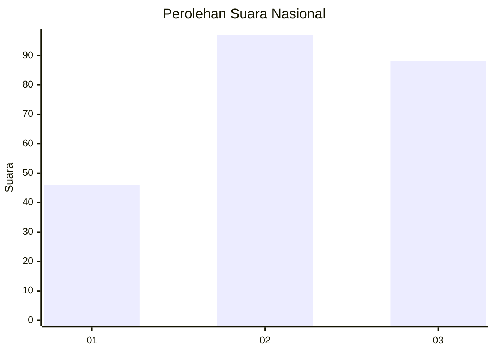
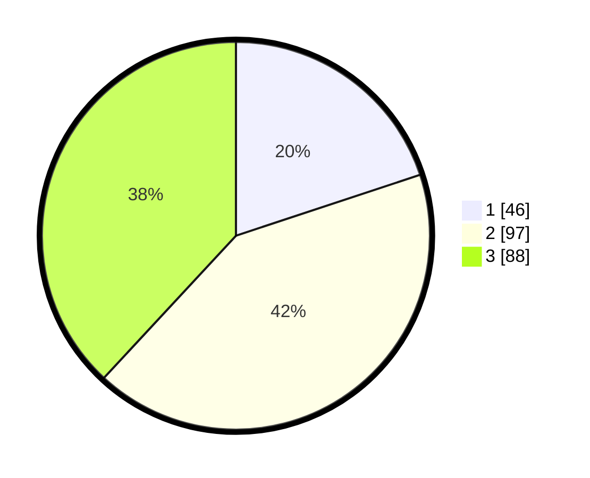

# Hasil

## Grafik

## Tabel

| No. | Nama Paslon    | Suara | Suara (raw) | Persentase |
|:--- |:-------------- | -----:| -----------:| ----------:|
| 1   | ANIES MUHAIMIN | 46    | [46][p-1]   | 19,91      |
| 2   | PRABOWO GIBRAN | 97    | [97][p-2]   | 41,99      |
| 3   | GANJAR MAHFUD  | 88    | [88][p-3]   | 38,10      |

[p-1]: https://github.com/gigit-pemilu/pemilu-2024/blob/main/pilpres/hitung-suara/sub/34-di-yogyakarta/sub/04-sleman/sub/12-ngaglik/sub/2001-sariharjo/sub/046-tps/sub/paslon-1.txt
[p-2]: https://github.com/gigit-pemilu/pemilu-2024/blob/main/pilpres/hitung-suara/sub/34-di-yogyakarta/sub/04-sleman/sub/12-ngaglik/sub/2001-sariharjo/sub/046-tps/sub/paslon-2.txt
[p-3]: https://github.com/gigit-pemilu/pemilu-2024/blob/main/pilpres/hitung-suara/sub/34-di-yogyakarta/sub/04-sleman/sub/12-ngaglik/sub/2001-sariharjo/sub/046-tps/sub/paslon-3.txt

## Foto C Plano

https://sirekap-obj-formc.kpu.go.id/98cb/pemilu/ppwp/34/04/12/20/01/3404122001046-20240216-215414--76f870d9-e213-457a-a18b-03479f198468.jpg

https://sirekap-obj-formc.kpu.go.id/98cb/pemilu/ppwp/34/04/12/20/01/3404122001046-20240216-215418--38055786-5a14-4012-b93b-50af8007e62a.jpg

https://sirekap-obj-formc.kpu.go.id/98cb/pemilu/ppwp/34/04/12/20/01/3404122001046-20240216-215427--5975822b-e65f-42b6-afe6-b3c5d84dba41.jpg

## Metadata

| Key        | Value               |
| ---------- | ------------------- |
| Time Stamp | 2024-02-21 23:00:00 |

