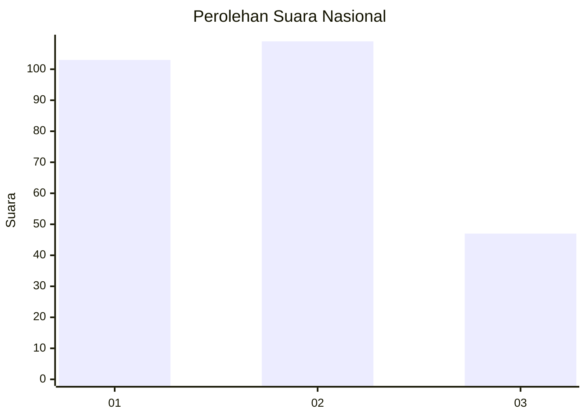
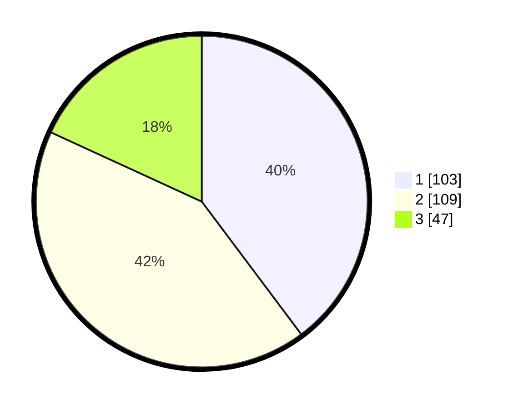

# Hasil

## Grafik

## Tabel

| No. | Nama Paslon    | Suara | Suara (raw) | Persentase |
|:--- |:-------------- | -----:| -----------:| ----------:|
| 1   | ANIES MUHAIMIN | 103   | [103][p-1]  | 39,77      |
| 2   | PRABOWO GIBRAN | 109   | [109][p-2]  | 42,08      |
| 3   | GANJAR MAHFUD  | 47    | [47][p-3]   | 18,15      |

[p-1]: https://github.com/gigit-pemilu/pemilu-2024/blob/main/pilpres/hitung-suara/sub/34-di-yogyakarta/sub/04-sleman/sub/12-ngaglik/sub/2001-sariharjo/sub/056-tps/sub/paslon-1.txt
[p-2]: https://github.com/gigit-pemilu/pemilu-2024/blob/main/pilpres/hitung-suara/sub/34-di-yogyakarta/sub/04-sleman/sub/12-ngaglik/sub/2001-sariharjo/sub/056-tps/sub/paslon-2.txt
[p-3]: https://github.com/gigit-pemilu/pemilu-2024/blob/main/pilpres/hitung-suara/sub/34-di-yogyakarta/sub/04-sleman/sub/12-ngaglik/sub/2001-sariharjo/sub/056-tps/sub/paslon-3.txt

## Foto C Plano

https://sirekap-obj-formc.kpu.go.id/db03/pemilu/ppwp/34/04/12/20/01/3404122001056-20240214-155728--060d0e48-2a1a-450d-bd4b-691348516da7.jpg

https://sirekap-obj-formc.kpu.go.id/db03/pemilu/ppwp/34/04/12/20/01/3404122001056-20240214-160119--fd3a1fa8-a42d-4594-9660-469beac0efc8.jpg

## Metadata

| Key        | Value               |
| ---------- | ------------------- |
| Time Stamp | 2024-02-15 15:30:25 |

