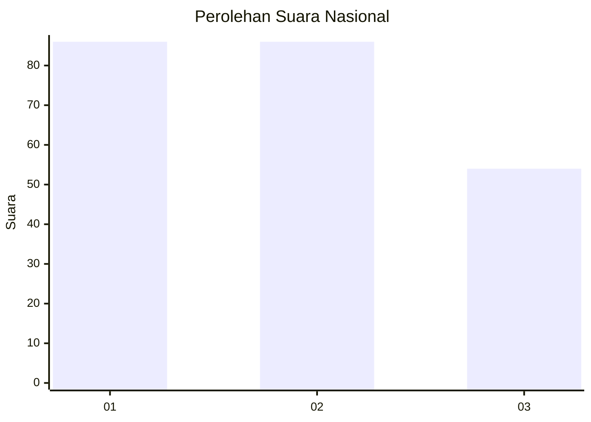
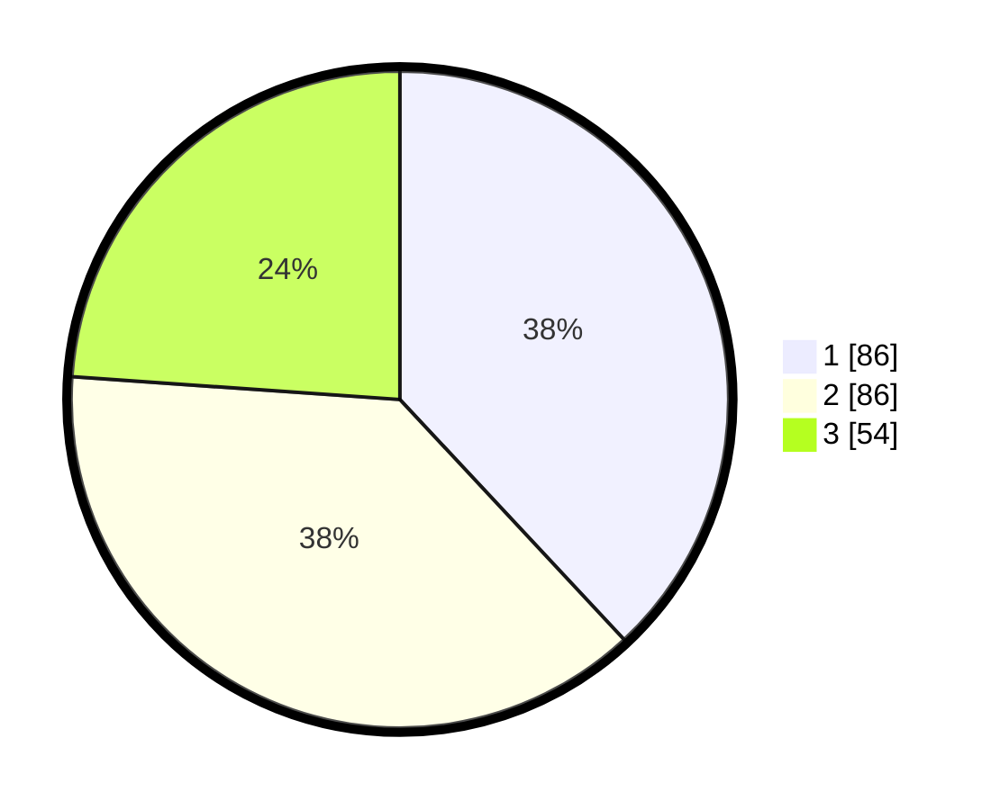

# Hasil

## Grafik

## Tabel

| No. | Nama Paslon    | Suara | Suara (raw) | Persentase |
|:--- |:-------------- | -----:| -----------:| ----------:|
| 1   | ANIES MUHAIMIN | 86    | [86][p-1]   | 38,05      |
| 2   | PRABOWO GIBRAN | 86    | [86][p-2]   | 38,05      |
| 3   | GANJAR MAHFUD  | 54    | [54][p-3]   | 23,89      |

[p-1]: https://github.com/gigit-pemilu/pemilu-2024/blob/main/pilpres/hitung-suara/sub/34-di-yogyakarta/sub/04-sleman/sub/12-ngaglik/sub/2001-sariharjo/sub/061-tps/sub/paslon-1.txt
[p-2]: https://github.com/gigit-pemilu/pemilu-2024/blob/main/pilpres/hitung-suara/sub/34-di-yogyakarta/sub/04-sleman/sub/12-ngaglik/sub/2001-sariharjo/sub/061-tps/sub/paslon-2.txt
[p-3]: https://github.com/gigit-pemilu/pemilu-2024/blob/main/pilpres/hitung-suara/sub/34-di-yogyakarta/sub/04-sleman/sub/12-ngaglik/sub/2001-sariharjo/sub/061-tps/sub/paslon-3.txt

## Foto C Plano

https://sirekap-obj-formc.kpu.go.id/f164/pemilu/ppwp/34/04/12/20/01/3404122001061-20240215-084253--3713c9cc-dc3b-4235-916f-be9ae2d2eedb.jpg

https://sirekap-obj-formc.kpu.go.id/f164/pemilu/ppwp/34/04/12/20/01/3404122001061-20240215-084305--59aaceae-0502-4862-8cc1-3477233aa386.jpg

https://sirekap-obj-formc.kpu.go.id/f164/pemilu/ppwp/34/04/12/20/01/3404122001061-20240215-091405--911cb8c6-49fd-44ea-a5c5-5132d914db63.jpg

## Metadata

| Key        | Value               |
| ---------- | ------------------- |
| Time Stamp | 2024-02-15 21:30:27 |

