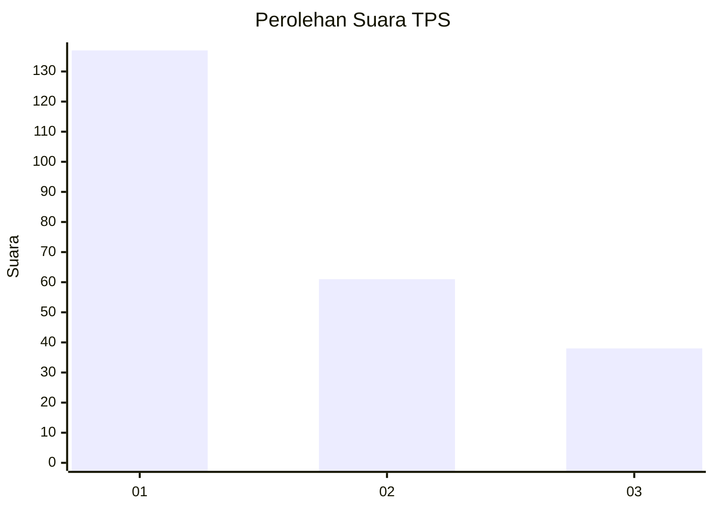
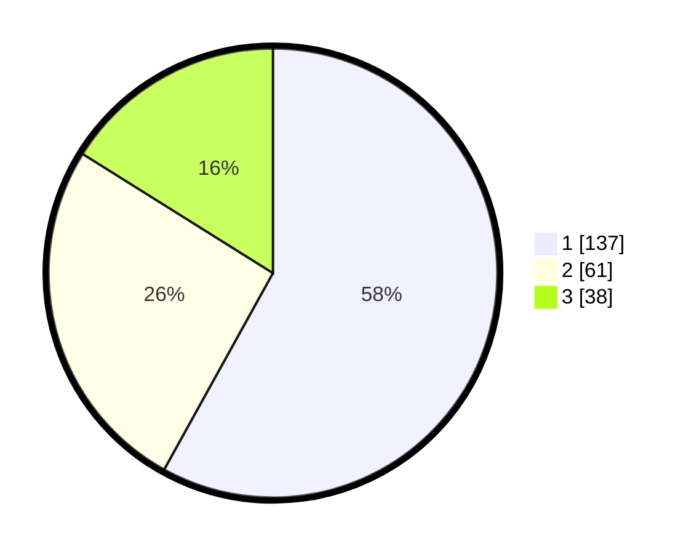

# Hasil

## Grafik

## Tabel

| No. | Nama Paslon    | Suara | Suara (raw) | Persentase |
|:--- |:-------------- | -----:| -----------:| ----------:|
| 1   | ANIES MUHAIMIN | 137   | [137][p-1]  | 58,05      |
| 2   | PRABOWO GIBRAN | 61    | [61][p-2]   | 25,85      |
| 3   | GANJAR MAHFUD  | 38    | [38][p-3]   | 16,10      |

[p-1]: https://github.com/gigit-pemilu/pemilu-2024-34-di-yogyakarta/blob/main/pilpres/hitung-suara/sub/34-di-yogyakarta/sub/04-sleman/sub/12-ngaglik/sub/2001-sariharjo/sub/064-tps/sub/paslon-1.txt
[p-2]: https://github.com/gigit-pemilu/pemilu-2024-34-di-yogyakarta/blob/main/pilpres/hitung-suara/sub/34-di-yogyakarta/sub/04-sleman/sub/12-ngaglik/sub/2001-sariharjo/sub/064-tps/sub/paslon-2.txt
[p-3]: https://github.com/gigit-pemilu/pemilu-2024-34-di-yogyakarta/blob/main/pilpres/hitung-suara/sub/34-di-yogyakarta/sub/04-sleman/sub/12-ngaglik/sub/2001-sariharjo/sub/064-tps/sub/paslon-3.txt

## Foto C Plano

https://sirekap-obj-formc.kpu.go.id/ea10/pemilu/ppwp/34/04/12/20/01/3404122001064-20240214-185125--333810fc-31c8-4462-bc0c-5a1f3ff460b0.jpg

https://sirekap-obj-formc.kpu.go.id/ea10/pemilu/ppwp/34/04/12/20/01/3404122001064-20240214-185214--4f53a8a9-28fc-4f0d-864d-c981dd6648fd.jpg

https://sirekap-obj-formc.kpu.go.id/ea10/pemilu/ppwp/34/04/12/20/01/3404122001064-20240214-185209--a8747fde-a035-4ac3-b696-45a535a5c845.jpg

## Metadata

| Key        | Value               |
| ---------- | ------------------- |
| Time Stamp | 2024-02-15 15:30:25 |

