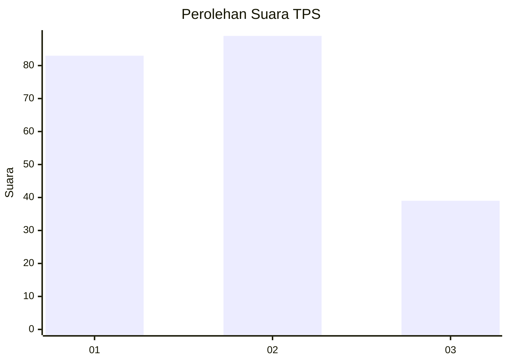
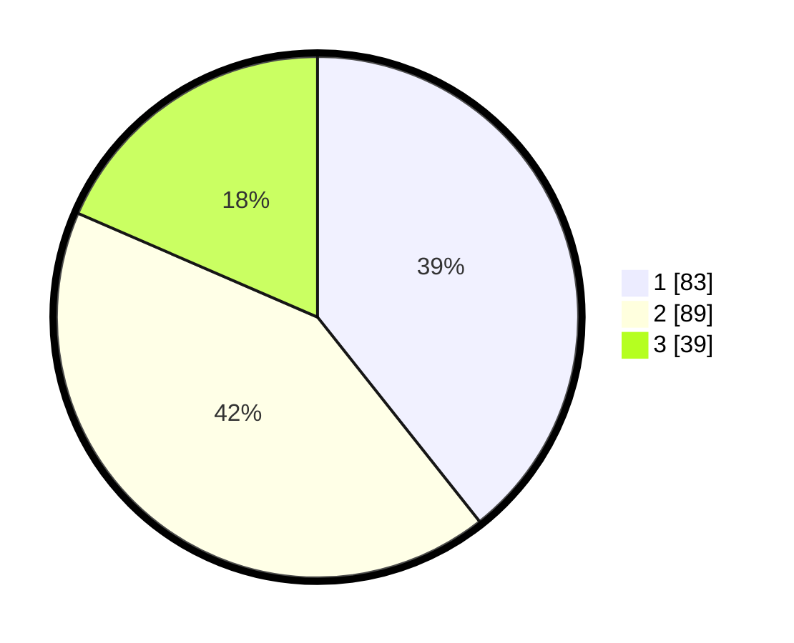

# Hasil

## Grafik

## Tabel

| No. | Nama Paslon    | Suara | Suara (raw) | Persentase |
|:--- |:-------------- | -----:| -----------:| ----------:|
| 1   | ANIES MUHAIMIN | 83    | [83][p-1]   | 39,34      |
| 2   | PRABOWO GIBRAN | 89    | [89][p-2]   | 42,18      |
| 3   | GANJAR MAHFUD  | 39    | [39][p-3]   | 18,48      |

[p-1]: https://github.com/gigit-pemilu/pemilu-2024-34-di-yogyakarta/blob/main/pilpres/hitung-suara/sub/34-di-yogyakarta/sub/04-sleman/sub/12-ngaglik/sub/2002-minomartani/sub/007-tps/sub/paslon-1.txt
[p-2]: https://github.com/gigit-pemilu/pemilu-2024-34-di-yogyakarta/blob/main/pilpres/hitung-suara/sub/34-di-yogyakarta/sub/04-sleman/sub/12-ngaglik/sub/2002-minomartani/sub/007-tps/sub/paslon-2.txt
[p-3]: https://github.com/gigit-pemilu/pemilu-2024-34-di-yogyakarta/blob/main/pilpres/hitung-suara/sub/34-di-yogyakarta/sub/04-sleman/sub/12-ngaglik/sub/2002-minomartani/sub/007-tps/sub/paslon-3.txt

## Foto C Plano

https://sirekap-obj-formc.kpu.go.id/768f/pemilu/ppwp/34/04/12/20/02/3404122002007-20240215-042422--9d9ee121-205b-462e-bec1-24e5d6294cd6.jpg

https://sirekap-obj-formc.kpu.go.id/768f/pemilu/ppwp/34/04/12/20/02/3404122002007-20240215-003440--461ce1bc-6684-4f94-97a4-991102a62bbc.jpg

https://sirekap-obj-formc.kpu.go.id/768f/pemilu/ppwp/34/04/12/20/02/3404122002007-20240215-003605--52ceee5f-bda2-4fd4-b3b2-dd0e1f9851a0.jpg

## Metadata

| Key        | Value               |
| ---------- | ------------------- |
| Time Stamp | 2024-02-15 15:30:25 |

