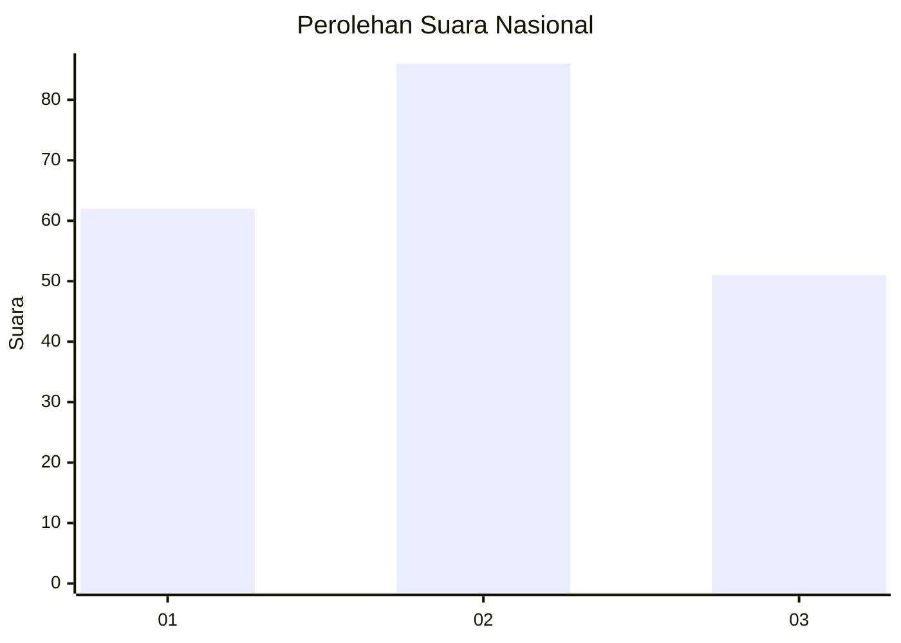
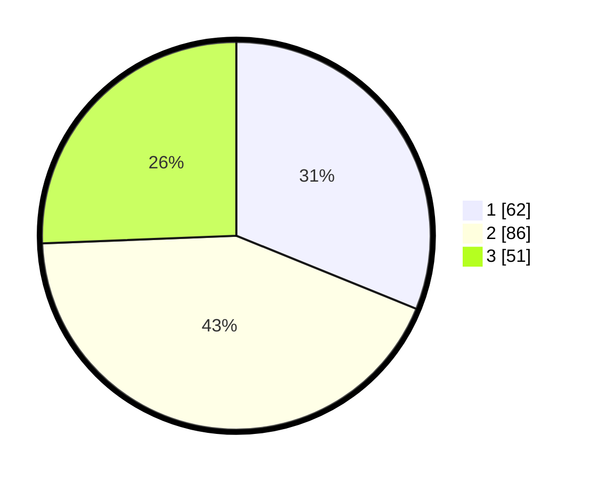

# Hasil

## Grafik

## Tabel

| No. | Nama Paslon    | Suara | Suara (raw) | Persentase |
|:--- |:-------------- | -----:| -----------:| ----------:|
| 1   | ANIES MUHAIMIN | 62    | [62][p-1]   | 31,16      |
| 2   | PRABOWO GIBRAN | 86    | [86][p-2]   | 43,22      |
| 3   | GANJAR MAHFUD  | 51    | [51][p-3]   | 25,63      |

[p-1]: https://github.com/gigit-pemilu/pemilu-2024/blob/main/pilpres/hitung-suara/sub/34-di-yogyakarta/sub/04-sleman/sub/12-ngaglik/sub/2002-minomartani/sub/009-tps/sub/paslon-1.txt
[p-2]: https://github.com/gigit-pemilu/pemilu-2024/blob/main/pilpres/hitung-suara/sub/34-di-yogyakarta/sub/04-sleman/sub/12-ngaglik/sub/2002-minomartani/sub/009-tps/sub/paslon-2.txt
[p-3]: https://github.com/gigit-pemilu/pemilu-2024/blob/main/pilpres/hitung-suara/sub/34-di-yogyakarta/sub/04-sleman/sub/12-ngaglik/sub/2002-minomartani/sub/009-tps/sub/paslon-3.txt

## Foto C Plano

https://sirekap-obj-formc.kpu.go.id/4654/pemilu/ppwp/34/04/12/20/02/3404122002009-20240214-213430--b6671635-12ab-4c38-a7ca-20d4aceee36f.jpg

https://sirekap-obj-formc.kpu.go.id/4654/pemilu/ppwp/34/04/12/20/02/3404122002009-20240214-213436--1fd12c63-3e25-47e7-9040-6ac93e269c6f.jpg

https://sirekap-obj-formc.kpu.go.id/4654/pemilu/ppwp/34/04/12/20/02/3404122002009-20240214-213447--f4cc3a95-0774-4e0d-ac48-610627dbe1bd.jpg

## Metadata

| Key        | Value               |
| ---------- | ------------------- |
| Time Stamp | 2024-02-16 10:30:29 |

