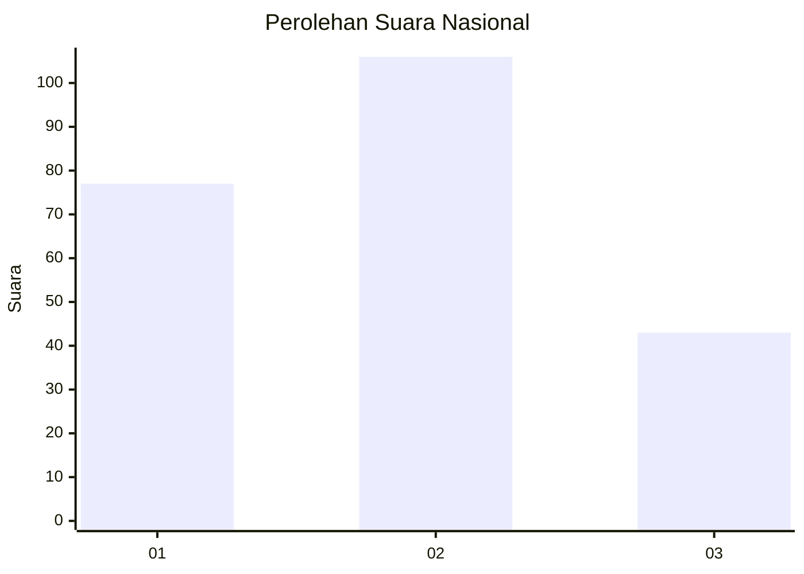
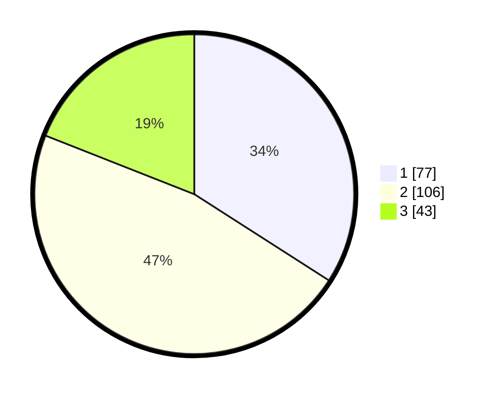

# Hasil

## Grafik

## Tabel

| No. | Nama Paslon    | Suara | Suara (raw) | Persentase |
|:--- |:-------------- | -----:| -----------:| ----------:|
| 1   | ANIES MUHAIMIN | 77    | [77][p-1]   | 34,07      |
| 2   | PRABOWO GIBRAN | 106   | [106][p-2]  | 46,90      |
| 3   | GANJAR MAHFUD  | 43    | [43][p-3]   | 19,03      |

[p-1]: https://github.com/gigit-pemilu/pemilu-2024/blob/main/pilpres/hitung-suara/sub/34-di-yogyakarta/sub/04-sleman/sub/12-ngaglik/sub/2002-minomartani/sub/018-tps/sub/paslon-1.txt
[p-2]: https://github.com/gigit-pemilu/pemilu-2024/blob/main/pilpres/hitung-suara/sub/34-di-yogyakarta/sub/04-sleman/sub/12-ngaglik/sub/2002-minomartani/sub/018-tps/sub/paslon-2.txt
[p-3]: https://github.com/gigit-pemilu/pemilu-2024/blob/main/pilpres/hitung-suara/sub/34-di-yogyakarta/sub/04-sleman/sub/12-ngaglik/sub/2002-minomartani/sub/018-tps/sub/paslon-3.txt

## Foto C Plano

https://sirekap-obj-formc.kpu.go.id/b02b/pemilu/ppwp/34/04/12/20/02/3404122002018-20240214-230536--53405a04-46cd-4114-9e19-2f21cef72a44.jpg

https://sirekap-obj-formc.kpu.go.id/b02b/pemilu/ppwp/34/04/12/20/02/3404122002018-20240214-230616--c4abdc2d-784e-4f28-a174-139a294be369.jpg

https://sirekap-obj-formc.kpu.go.id/b02b/pemilu/ppwp/34/04/12/20/02/3404122002018-20240214-230638--7b70db47-3d6d-42d9-b654-5cdcf59e88e3.jpg

## Metadata

| Key        | Value               |
| ---------- | ------------------- |
| Time Stamp | 2024-02-15 15:30:25 |

