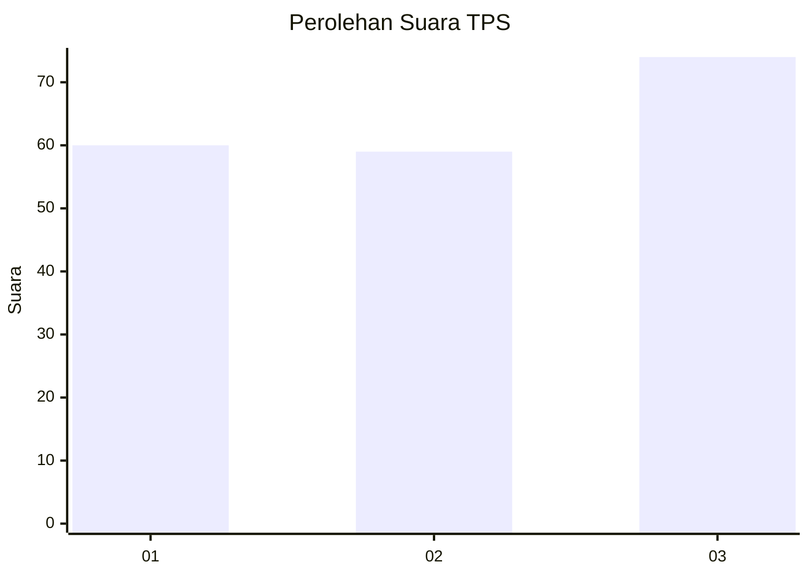
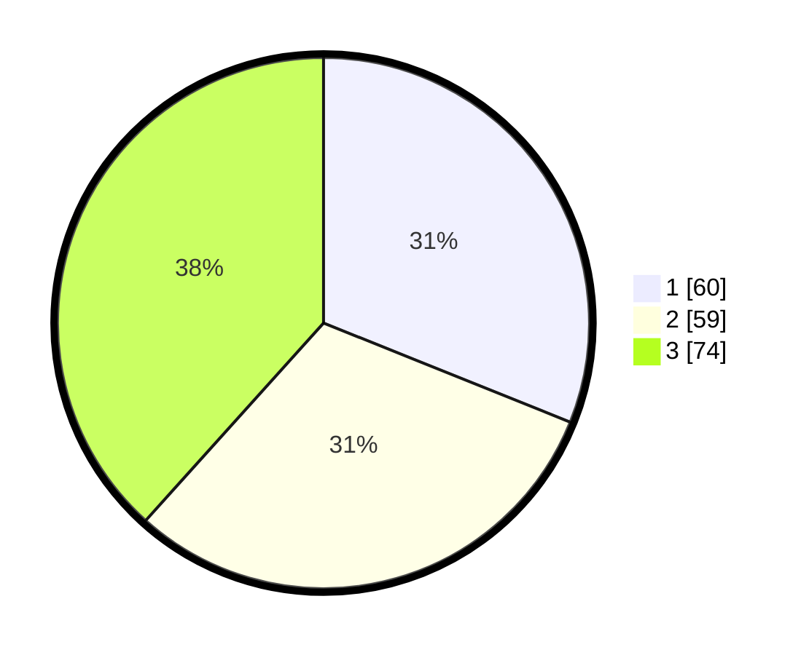

# Hasil

## Grafik

## Tabel

| No. | Nama Paslon    | Suara | Suara (raw) | Persentase |
|:--- |:-------------- | -----:| -----------:| ----------:|
| 1   | ANIES MUHAIMIN | 60    | [60][p-1]   | 31,09      |
| 2   | PRABOWO GIBRAN | 59    | [59][p-2]   | 30,57      |
| 3   | GANJAR MAHFUD  | 74    | [74][p-3]   | 38,34      |

[p-1]: https://github.com/gigit-pemilu/pemilu-2024-34-di-yogyakarta/blob/main/pilpres/hitung-suara/sub/34-di-yogyakarta/sub/04-sleman/sub/12-ngaglik/sub/2002-minomartani/sub/022-tps/sub/paslon-1.txt
[p-2]: https://github.com/gigit-pemilu/pemilu-2024-34-di-yogyakarta/blob/main/pilpres/hitung-suara/sub/34-di-yogyakarta/sub/04-sleman/sub/12-ngaglik/sub/2002-minomartani/sub/022-tps/sub/paslon-2.txt
[p-3]: https://github.com/gigit-pemilu/pemilu-2024-34-di-yogyakarta/blob/main/pilpres/hitung-suara/sub/34-di-yogyakarta/sub/04-sleman/sub/12-ngaglik/sub/2002-minomartani/sub/022-tps/sub/paslon-3.txt

## Foto C Plano

https://sirekap-obj-formc.kpu.go.id/8a64/pemilu/ppwp/34/04/12/20/02/3404122002022-20240214-213318--42e05c5e-5805-4cbc-9ddd-51bac9bbf303.jpg

https://sirekap-obj-formc.kpu.go.id/8a64/pemilu/ppwp/34/04/12/20/02/3404122002022-20240214-213450--8ab67de1-04eb-4b0e-bb8e-93bfde46337b.jpg

https://sirekap-obj-formc.kpu.go.id/8a64/pemilu/ppwp/34/04/12/20/02/3404122002022-20240215-023743--568a8e9c-eecc-4095-9b22-b197cceee9c1.jpg

## Metadata

| Key        | Value               |
| ---------- | ------------------- |
| Time Stamp | 2024-02-15 15:30:25 |

