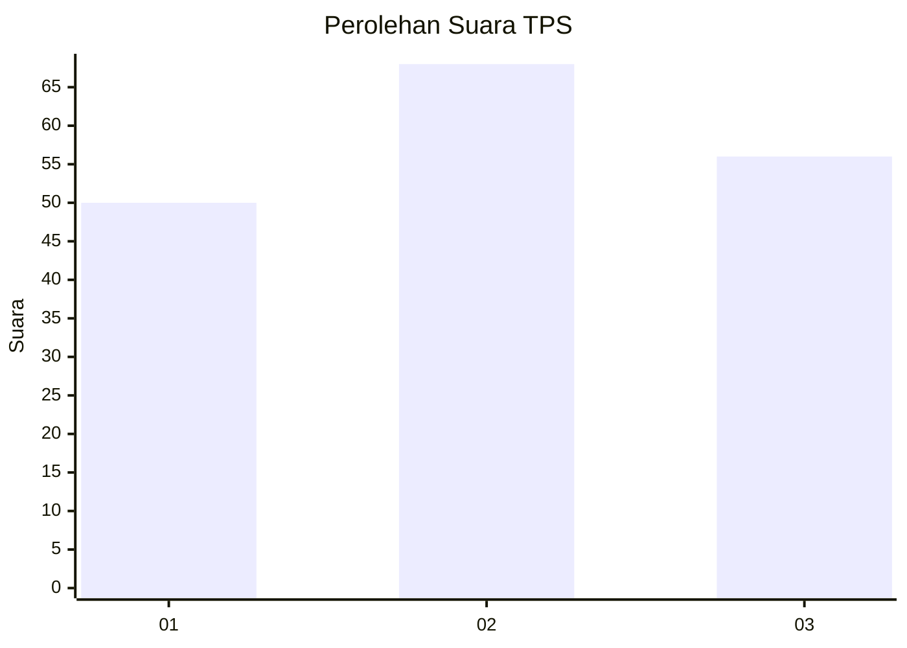
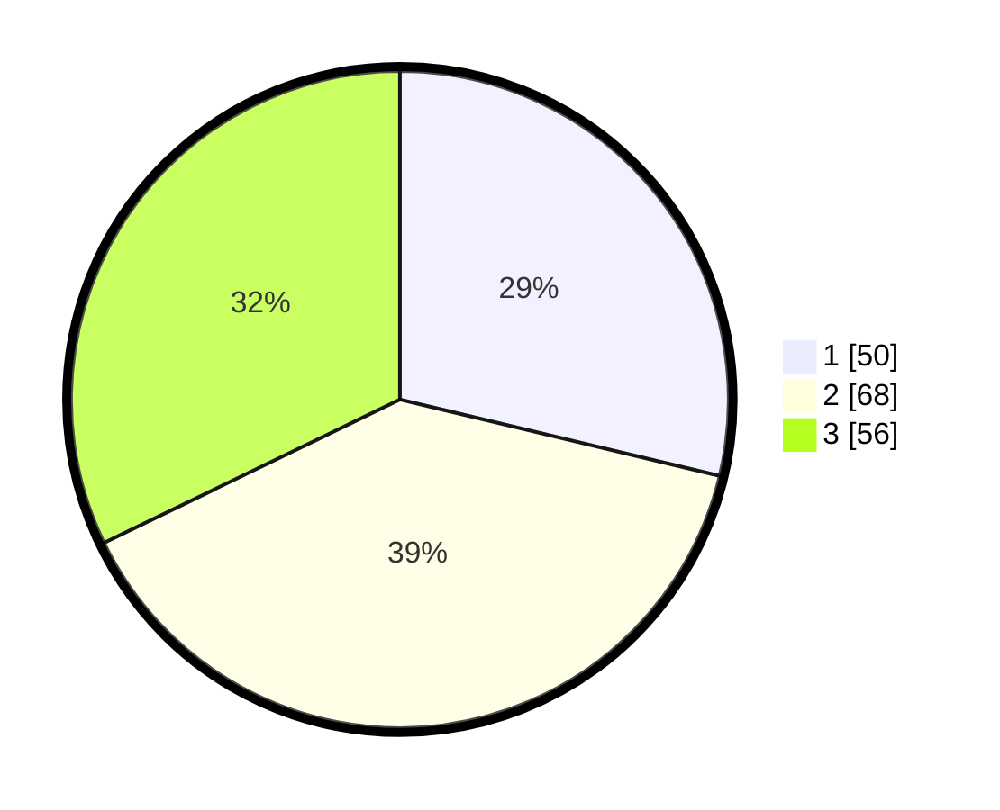

# Hasil

## Grafik

## Tabel

| No. | Nama Paslon    | Suara | Suara (raw) | Persentase |
|:--- |:-------------- | -----:| -----------:| ----------:|
| 1   | ANIES MUHAIMIN | 50    | [50][p-1]   | 28,74      |
| 2   | PRABOWO GIBRAN | 68    | [68][p-2]   | 39,08      |
| 3   | GANJAR MAHFUD  | 56    | [56][p-3]   | 32,18      |

[p-1]: https://github.com/gigit-pemilu/pemilu-2024-34-di-yogyakarta/blob/main/pilpres/hitung-suara/sub/34-di-yogyakarta/sub/04-sleman/sub/12-ngaglik/sub/2002-minomartani/sub/030-tps/sub/paslon-1.txt
[p-2]: https://github.com/gigit-pemilu/pemilu-2024-34-di-yogyakarta/blob/main/pilpres/hitung-suara/sub/34-di-yogyakarta/sub/04-sleman/sub/12-ngaglik/sub/2002-minomartani/sub/030-tps/sub/paslon-2.txt
[p-3]: https://github.com/gigit-pemilu/pemilu-2024-34-di-yogyakarta/blob/main/pilpres/hitung-suara/sub/34-di-yogyakarta/sub/04-sleman/sub/12-ngaglik/sub/2002-minomartani/sub/030-tps/sub/paslon-3.txt

## Foto C Plano

https://sirekap-obj-formc.kpu.go.id/208d/pemilu/ppwp/34/04/12/20/02/3404122002030-20240214-224349--c7e28a00-29d1-4867-9521-0e53b7f856b3.jpg

https://sirekap-obj-formc.kpu.go.id/208d/pemilu/ppwp/34/04/12/20/02/3404122002030-20240214-224303--e71172b4-b5d6-4531-855a-f8e4a0b0344b.jpg

https://sirekap-obj-formc.kpu.go.id/208d/pemilu/ppwp/34/04/12/20/02/3404122002030-20240214-224429--cf3441d0-1fb1-435b-a004-03c2171da2b8.jpg

## Metadata

| Key        | Value               |
| ---------- | ------------------- |
| Time Stamp | 2024-02-15 16:00:26 |

