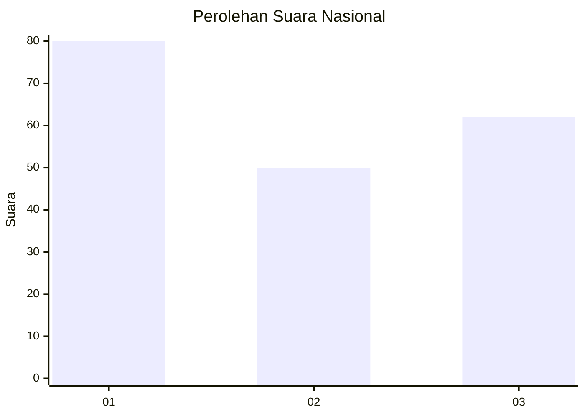
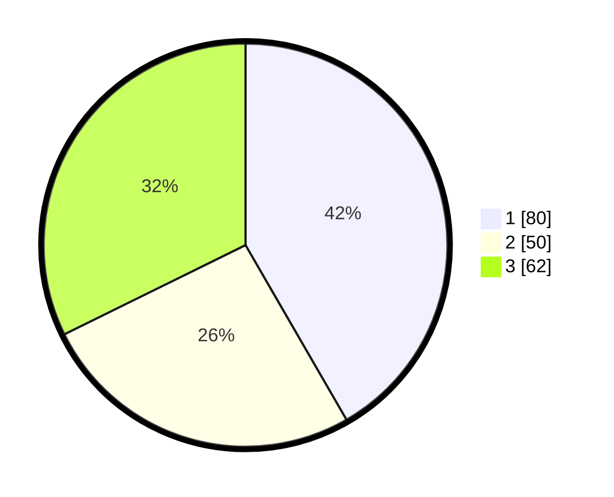

# Hasil

## Grafik

## Tabel

| No. | Nama Paslon    | Suara | Suara (raw) | Persentase |
|:--- |:-------------- | -----:| -----------:| ----------:|
| 1   | ANIES MUHAIMIN | 80    | [80][p-1]   | 41,67      |
| 2   | PRABOWO GIBRAN | 50    | [50][p-2]   | 26,04      |
| 3   | GANJAR MAHFUD  | 62    | [62][p-3]   | 32,29      |

[p-1]: https://github.com/gigit-pemilu/pemilu-2024/blob/main/pilpres/hitung-suara/sub/34-di-yogyakarta/sub/04-sleman/sub/12-ngaglik/sub/2002-minomartani/sub/033-tps/sub/paslon-1.txt
[p-2]: https://github.com/gigit-pemilu/pemilu-2024/blob/main/pilpres/hitung-suara/sub/34-di-yogyakarta/sub/04-sleman/sub/12-ngaglik/sub/2002-minomartani/sub/033-tps/sub/paslon-2.txt
[p-3]: https://github.com/gigit-pemilu/pemilu-2024/blob/main/pilpres/hitung-suara/sub/34-di-yogyakarta/sub/04-sleman/sub/12-ngaglik/sub/2002-minomartani/sub/033-tps/sub/paslon-3.txt

## Foto C Plano

https://sirekap-obj-formc.kpu.go.id/6c37/pemilu/ppwp/34/04/12/20/02/3404122002033-20240214-190853--10782dbc-1e39-446f-8a03-5b1a54de7959.jpg

https://sirekap-obj-formc.kpu.go.id/6c37/pemilu/ppwp/34/04/12/20/02/3404122002033-20240214-190320--8f80bc0e-952c-4752-b4b8-6c03ddc722a6.jpg

https://sirekap-obj-formc.kpu.go.id/6c37/pemilu/ppwp/34/04/12/20/02/3404122002033-20240214-190624--fe75b69c-b34a-4af2-8c67-10b082063a90.jpg

## Metadata

| Key        | Value               |
| ---------- | ------------------- |
| Time Stamp | 2024-02-15 16:00:26 |

