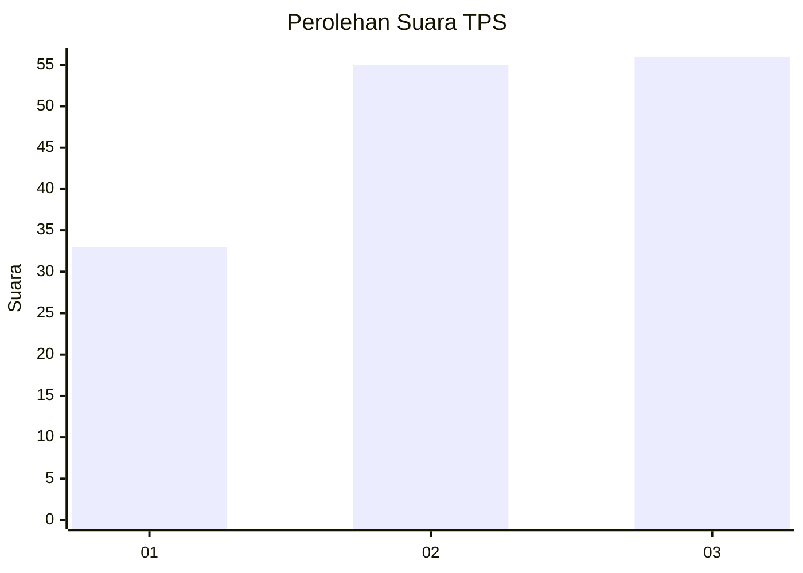
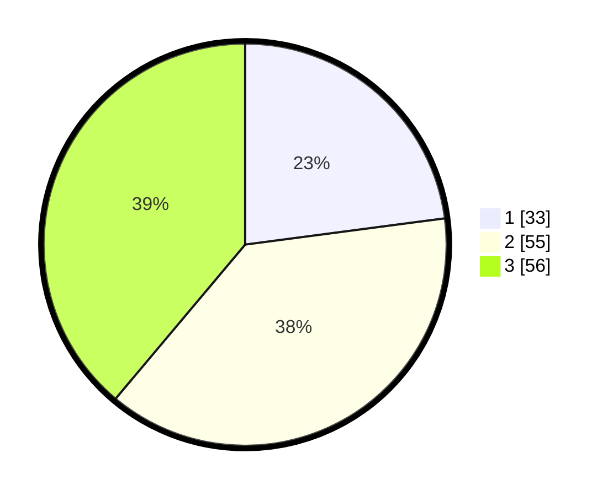

# Hasil

## Grafik

## Tabel

| No. | Nama Paslon    | Suara | Suara (raw) | Persentase |
|:--- |:-------------- | -----:| -----------:| ----------:|
| 1   | ANIES MUHAIMIN | 33    | [33][p-1]   | 22,92      |
| 2   | PRABOWO GIBRAN | 55    | [55][p-2]   | 38,19      |
| 3   | GANJAR MAHFUD  | 56    | [56][p-3]   | 38,89      |

[p-1]: https://github.com/gigit-pemilu/pemilu-2024-34-di-yogyakarta/blob/main/pilpres/hitung-suara/sub/34-di-yogyakarta/sub/04-sleman/sub/12-ngaglik/sub/2002-minomartani/sub/040-tps/sub/paslon-1.txt
[p-2]: https://github.com/gigit-pemilu/pemilu-2024-34-di-yogyakarta/blob/main/pilpres/hitung-suara/sub/34-di-yogyakarta/sub/04-sleman/sub/12-ngaglik/sub/2002-minomartani/sub/040-tps/sub/paslon-2.txt
[p-3]: https://github.com/gigit-pemilu/pemilu-2024-34-di-yogyakarta/blob/main/pilpres/hitung-suara/sub/34-di-yogyakarta/sub/04-sleman/sub/12-ngaglik/sub/2002-minomartani/sub/040-tps/sub/paslon-3.txt

## Foto C Plano

https://sirekap-obj-formc.kpu.go.id/f81f/pemilu/ppwp/34/04/12/20/02/3404122002040-20240215-225154--0fe02050-ebcd-4855-b631-691bc1943587.jpg

https://sirekap-obj-formc.kpu.go.id/f81f/pemilu/ppwp/34/04/12/20/02/3404122002040-20240215-225157--a19f95ba-5725-4a2a-8f35-687267d391f8.jpg

https://sirekap-obj-formc.kpu.go.id/f81f/pemilu/ppwp/34/04/12/20/02/3404122002040-20240215-225155--05f2e1bf-1448-4c62-8779-33edf094ce0b.jpg

## Metadata

| Key        | Value               |
| ---------- | ------------------- |
| Time Stamp | 2024-02-16 21:01:00 |

## DATA PEMILIH TETAP

Jumlah pemilih dalam DPT: **175**.
 * L: **85**.
 * P: **90**.

## DATA PENGGUNA HAK PILIH

Jumlah pengguna hak pilih dalam DPT: **137**.
 * L: **64**.
 * P: **73**.

Jumlah pengguna hak pilih dalam DPTb: **8**.
 * L: **0**.
 * P: **8**.

Jumlah pengguna hak pilih dalam DPK: **1**.
 * L: **1**.
 * P: **0**.

Jumlah pengguna hak pilih: **146**.
 * L: **65**.
 * P: **81**.

## JUMLAH SUARA SAH DAN TIDAK SAH

JUMLAH SELURUH SUARA SAH: **144**.

JUMLAH SUARA TIDAK SAH: **2**.

JUMLAH SELURUH SUARA SAH DAN SUARA TIDAK SAH: **146**.

