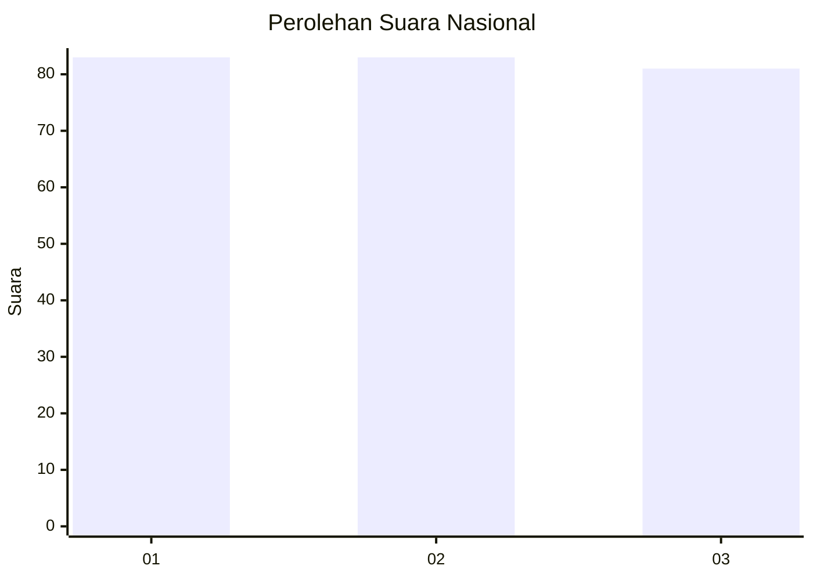
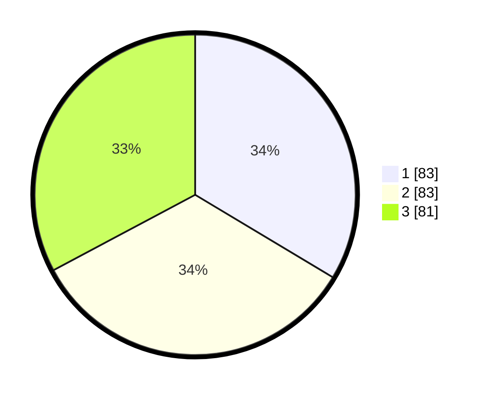

# Hasil

## Grafik

## Tabel

| No. | Nama Paslon    | Suara | Suara (raw) | Persentase |
|:--- |:-------------- | -----:| -----------:| ----------:|
| 1   | ANIES MUHAIMIN | 83    | [83][p-1]   | 33,60      |
| 2   | PRABOWO GIBRAN | 83    | [83][p-2]   | 33,60      |
| 3   | GANJAR MAHFUD  | 81    | [81][p-3]   | 32,79      |

[p-1]: https://github.com/gigit-pemilu/pemilu-2024/blob/main/pilpres/hitung-suara/sub/34-di-yogyakarta/sub/04-sleman/sub/12-ngaglik/sub/2003-sinduharjo/sub/001-tps/sub/paslon-1.txt
[p-2]: https://github.com/gigit-pemilu/pemilu-2024/blob/main/pilpres/hitung-suara/sub/34-di-yogyakarta/sub/04-sleman/sub/12-ngaglik/sub/2003-sinduharjo/sub/001-tps/sub/paslon-2.txt
[p-3]: https://github.com/gigit-pemilu/pemilu-2024/blob/main/pilpres/hitung-suara/sub/34-di-yogyakarta/sub/04-sleman/sub/12-ngaglik/sub/2003-sinduharjo/sub/001-tps/sub/paslon-3.txt

## Foto C Plano

https://sirekap-obj-formc.kpu.go.id/a4d8/pemilu/ppwp/34/04/12/20/03/3404122003001-20240216-134603--ea4544ed-284f-48be-a65f-1c098ea351c6.jpg

https://sirekap-obj-formc.kpu.go.id/a4d8/pemilu/ppwp/34/04/12/20/03/3404122003001-20240216-134727--718e1608-9610-4996-bd7c-09d4abe1f84b.jpg

https://sirekap-obj-formc.kpu.go.id/a4d8/pemilu/ppwp/34/04/12/20/03/3404122003001-20240216-134844--08eeb138-bf15-4894-8c79-413641cd0617.jpg

## Metadata

| Key        | Value               |
| ---------- | ------------------- |
| Time Stamp | 2024-02-21 23:00:00 |

