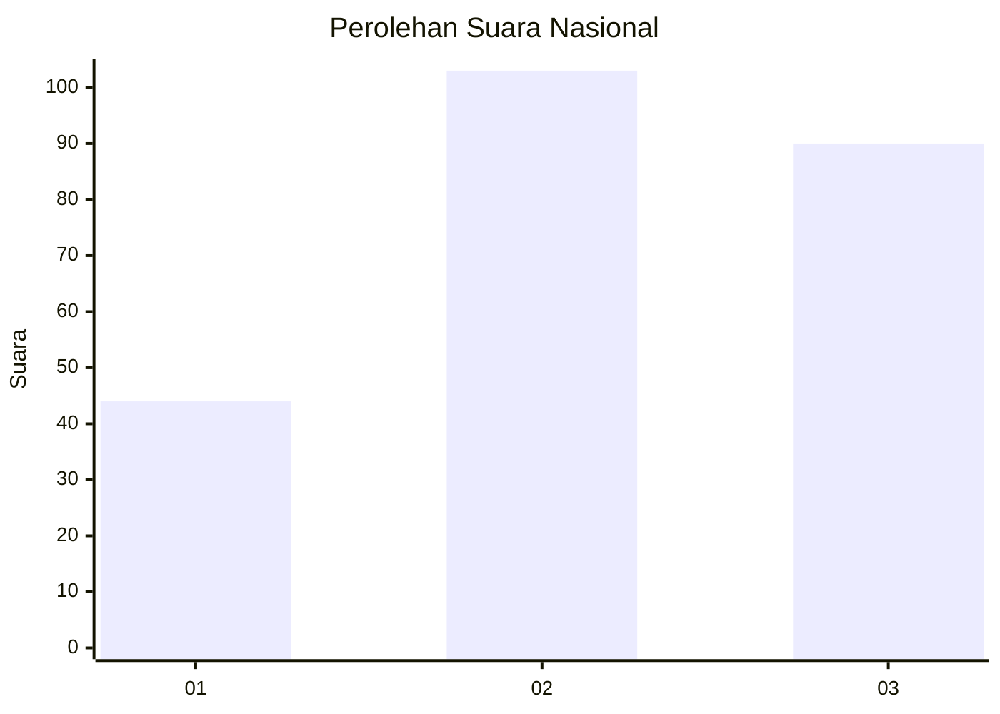
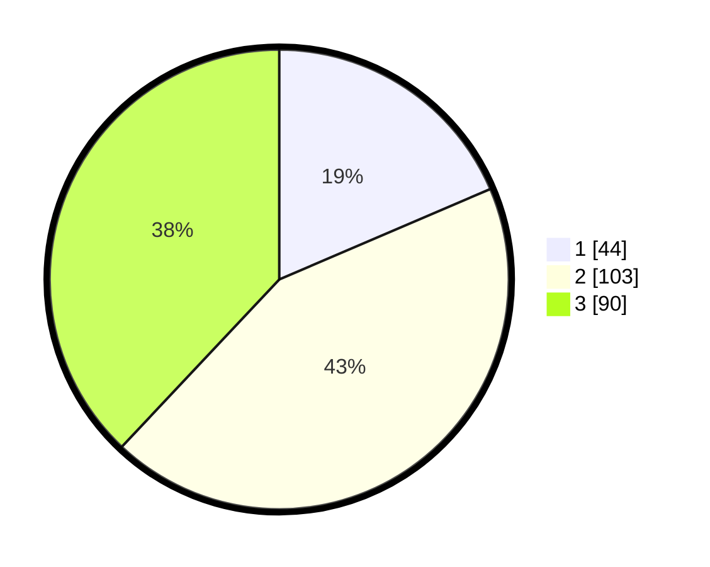

# Hasil

## Grafik

## Tabel

| No. | Nama Paslon    | Suara | Suara (raw) | Persentase |
|:--- |:-------------- | -----:| -----------:| ----------:|
| 1   | ANIES MUHAIMIN | 44    | [44][p-1]   | 18,57      |
| 2   | PRABOWO GIBRAN | 103   | [103][p-2]  | 43,46      |
| 3   | GANJAR MAHFUD  | 90    | [90][p-3]   | 37,97      |

[p-1]: https://github.com/gigit-pemilu/pemilu-2024/blob/main/pilpres/hitung-suara/sub/34-di-yogyakarta/sub/04-sleman/sub/12-ngaglik/sub/2003-sinduharjo/sub/014-tps/sub/paslon-1.txt
[p-2]: https://github.com/gigit-pemilu/pemilu-2024/blob/main/pilpres/hitung-suara/sub/34-di-yogyakarta/sub/04-sleman/sub/12-ngaglik/sub/2003-sinduharjo/sub/014-tps/sub/paslon-2.txt
[p-3]: https://github.com/gigit-pemilu/pemilu-2024/blob/main/pilpres/hitung-suara/sub/34-di-yogyakarta/sub/04-sleman/sub/12-ngaglik/sub/2003-sinduharjo/sub/014-tps/sub/paslon-3.txt

## Foto C Plano

https://sirekap-obj-formc.kpu.go.id/b0b4/pemilu/ppwp/34/04/12/20/03/3404122003014-20240215-000218--5a1fd580-3657-4e40-aaec-e287d3c0845c.jpg

https://sirekap-obj-formc.kpu.go.id/b0b4/pemilu/ppwp/34/04/12/20/03/3404122003014-20240215-000227--fd574eff-a1e2-447e-921b-d71d0f212c11.jpg

https://sirekap-obj-formc.kpu.go.id/b0b4/pemilu/ppwp/34/04/12/20/03/3404122003014-20240215-000324--90e408af-e9d1-4676-a405-fabec55f98d6.jpg

## Metadata

| Key        | Value               |
| ---------- | ------------------- |
| Time Stamp | 2024-02-21 23:00:00 |

