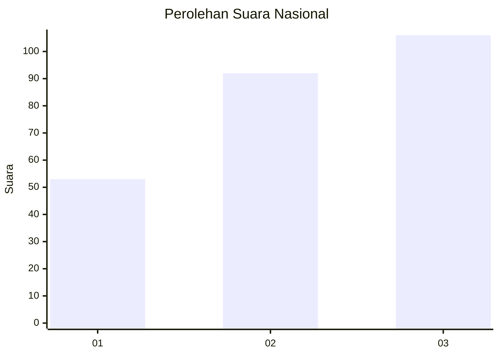
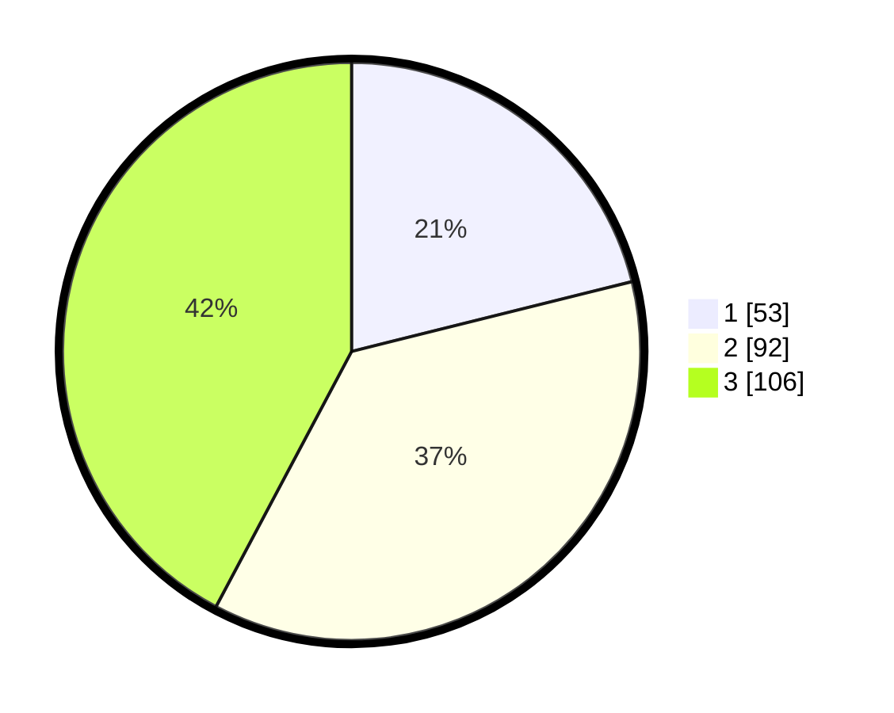

# Hasil

## Grafik

## Tabel

| No. | Nama Paslon    | Suara | Suara (raw) | Persentase |
|:--- |:-------------- | -----:| -----------:| ----------:|
| 1   | ANIES MUHAIMIN | 53    | [53][p-1]   | 21,12      |
| 2   | PRABOWO GIBRAN | 92    | [92][p-2]   | 36,65      |
| 3   | GANJAR MAHFUD  | 106   | [106][p-3]  | 42,23      |

[p-1]: https://github.com/gigit-pemilu/pemilu-2024/blob/main/pilpres/hitung-suara/sub/34-di-yogyakarta/sub/04-sleman/sub/12-ngaglik/sub/2003-sinduharjo/sub/022-tps/sub/paslon-1.txt
[p-2]: https://github.com/gigit-pemilu/pemilu-2024/blob/main/pilpres/hitung-suara/sub/34-di-yogyakarta/sub/04-sleman/sub/12-ngaglik/sub/2003-sinduharjo/sub/022-tps/sub/paslon-2.txt
[p-3]: https://github.com/gigit-pemilu/pemilu-2024/blob/main/pilpres/hitung-suara/sub/34-di-yogyakarta/sub/04-sleman/sub/12-ngaglik/sub/2003-sinduharjo/sub/022-tps/sub/paslon-3.txt

## Foto C Plano

https://sirekap-obj-formc.kpu.go.id/5de0/pemilu/ppwp/34/04/12/20/03/3404122003022-20240214-155524--35ef7f82-c480-4f4f-8daa-f72683126645.jpg

https://sirekap-obj-formc.kpu.go.id/5de0/pemilu/ppwp/34/04/12/20/03/3404122003022-20240214-155644--1c44fc0e-eb8b-4d28-bed6-e6e320c60e11.jpg

https://sirekap-obj-formc.kpu.go.id/5de0/pemilu/ppwp/34/04/12/20/03/3404122003022-20240214-155723--265fbeb0-973c-40a2-8029-d8a8b8d2dad2.jpg

## Metadata

| Key        | Value               |
| ---------- | ------------------- |
| Time Stamp | 2024-02-14 21:46:01 |

## DATA PEMILIH TETAP

Jumlah pemilih dalam DPT: **272**.
 * L: **122**.
 * P: **150**.

## DATA PENGGUNA HAK PILIH

Jumlah pengguna hak pilih dalam DPT: **232**.
 * L: **106**.
 * P: **126**.

Jumlah pengguna hak pilih dalam DPTb: **7**.
 * L: **3**.
 * P: **4**.

Jumlah pengguna hak pilih dalam DPK: **15**.
 * L: **8**.
 * P: **7**.

Jumlah pengguna hak pilih: **254**.
 * L: **117**.
 * P: **137**.

## JUMLAH SUARA SAH DAN TIDAK SAH

JUMLAH SELURUH SUARA SAH: **251**.

JUMLAH SUARA TIDAK SAH: **3**.

JUMLAH SELURUH SUARA SAH DAN SUARA TIDAK SAH: **254**.

