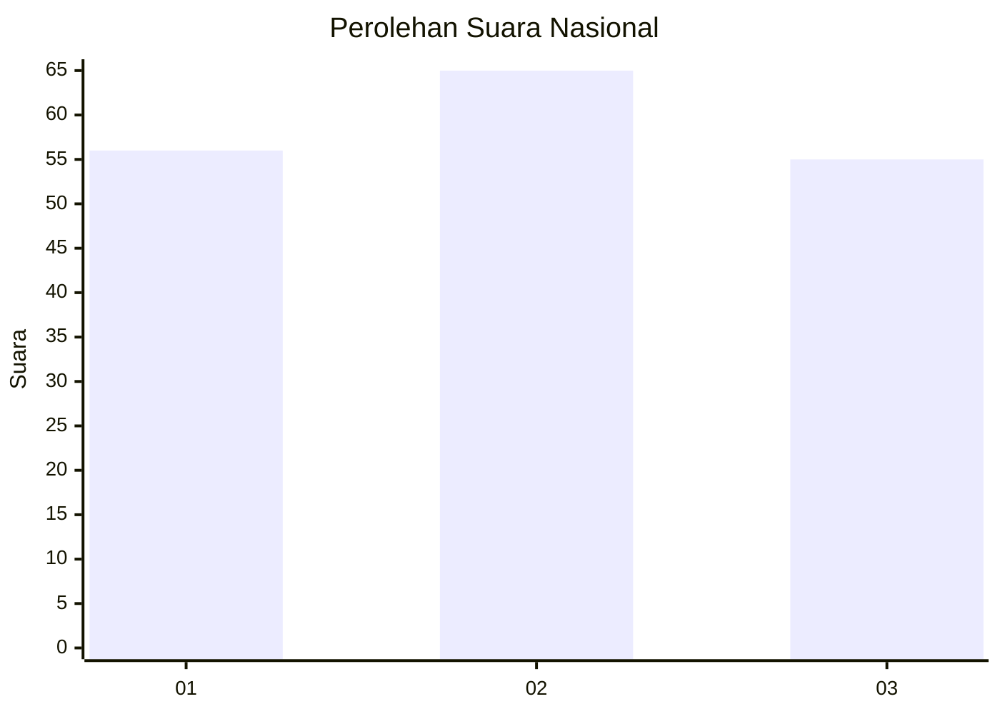
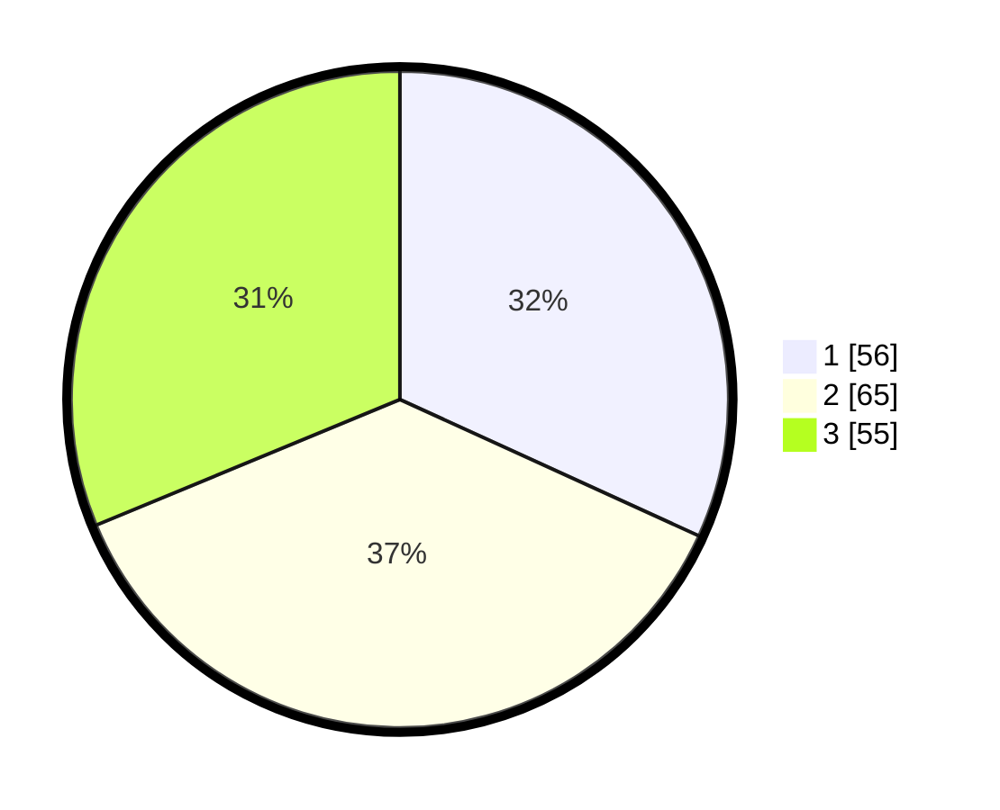

# Hasil

## Grafik

## Tabel

| No. | Nama Paslon    | Suara | Suara (raw) | Persentase |
|:--- |:-------------- | -----:| -----------:| ----------:|
| 1   | ANIES MUHAIMIN | 56    | [56][p-1]   | 31,82      |
| 2   | PRABOWO GIBRAN | 65    | [65][p-2]   | 36,93      |
| 3   | GANJAR MAHFUD  | 55    | [55][p-3]   | 31,25      |

[p-1]: https://github.com/gigit-pemilu/pemilu-2024/blob/main/pilpres/hitung-suara/sub/34-di-yogyakarta/sub/04-sleman/sub/12-ngaglik/sub/2003-sinduharjo/sub/026-tps/sub/paslon-1.txt
[p-2]: https://github.com/gigit-pemilu/pemilu-2024/blob/main/pilpres/hitung-suara/sub/34-di-yogyakarta/sub/04-sleman/sub/12-ngaglik/sub/2003-sinduharjo/sub/026-tps/sub/paslon-2.txt
[p-3]: https://github.com/gigit-pemilu/pemilu-2024/blob/main/pilpres/hitung-suara/sub/34-di-yogyakarta/sub/04-sleman/sub/12-ngaglik/sub/2003-sinduharjo/sub/026-tps/sub/paslon-3.txt

## Foto C Plano

https://sirekap-obj-formc.kpu.go.id/02d4/pemilu/ppwp/34/04/12/20/03/3404122003026-20240214-221336--839287d7-6cb4-4bc8-b41f-e6e52eec25ad.jpg

https://sirekap-obj-formc.kpu.go.id/02d4/pemilu/ppwp/34/04/12/20/03/3404122003026-20240214-214736--53ffa9e6-42fc-433f-9426-5775895cc4cb.jpg

https://sirekap-obj-formc.kpu.go.id/02d4/pemilu/ppwp/34/04/12/20/03/3404122003026-20240214-214806--335bcc3f-d901-47d7-9ec8-ed45161b0136.jpg

## Metadata

| Key        | Value               |
| ---------- | ------------------- |
| Time Stamp | 2024-02-21 23:00:00 |

