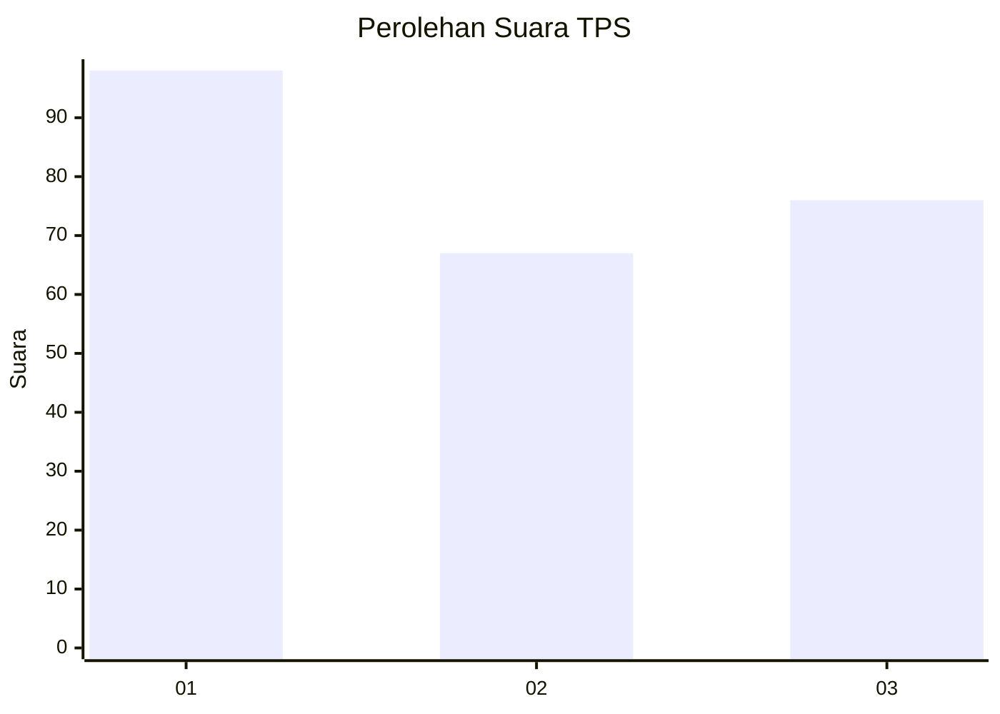
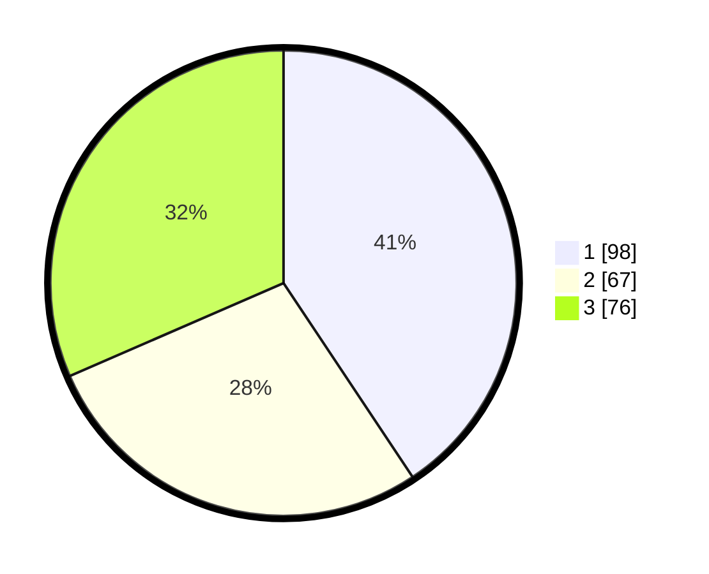

# Hasil

## Grafik

## Tabel

| No. | Nama Paslon    | Suara | Suara (raw) | Persentase |
|:--- |:-------------- | -----:| -----------:| ----------:|
| 1   | ANIES MUHAIMIN | 98    | [98][p-1]   | 40,66      |
| 2   | PRABOWO GIBRAN | 67    | [67][p-2]   | 27,80      |
| 3   | GANJAR MAHFUD  | 76    | [76][p-3]   | 31,54      |

[p-1]: https://github.com/gigit-pemilu/pemilu-2024-34-di-yogyakarta/blob/main/pilpres/hitung-suara/sub/34-di-yogyakarta/sub/04-sleman/sub/12-ngaglik/sub/2003-sinduharjo/sub/031-tps/sub/paslon-1.txt
[p-2]: https://github.com/gigit-pemilu/pemilu-2024-34-di-yogyakarta/blob/main/pilpres/hitung-suara/sub/34-di-yogyakarta/sub/04-sleman/sub/12-ngaglik/sub/2003-sinduharjo/sub/031-tps/sub/paslon-2.txt
[p-3]: https://github.com/gigit-pemilu/pemilu-2024-34-di-yogyakarta/blob/main/pilpres/hitung-suara/sub/34-di-yogyakarta/sub/04-sleman/sub/12-ngaglik/sub/2003-sinduharjo/sub/031-tps/sub/paslon-3.txt

## Foto C Plano

https://sirekap-obj-formc.kpu.go.id/f0eb/pemilu/ppwp/34/04/12/20/03/3404122003031-20240214-225418--d9e239f4-d7c5-40b5-991e-4cd27bdf5bce.jpg

https://sirekap-obj-formc.kpu.go.id/f0eb/pemilu/ppwp/34/04/12/20/03/3404122003031-20240214-225532--ba7d9a1a-9da3-4c02-9fb6-6934be09c9aa.jpg

https://sirekap-obj-formc.kpu.go.id/f0eb/pemilu/ppwp/34/04/12/20/03/3404122003031-20240214-225627--337c4a62-a74f-44df-a63c-04a3e6c168a8.jpg

## Metadata

| Key        | Value               |
| ---------- | ------------------- |
| Time Stamp | 2024-02-15 16:00:26 |

