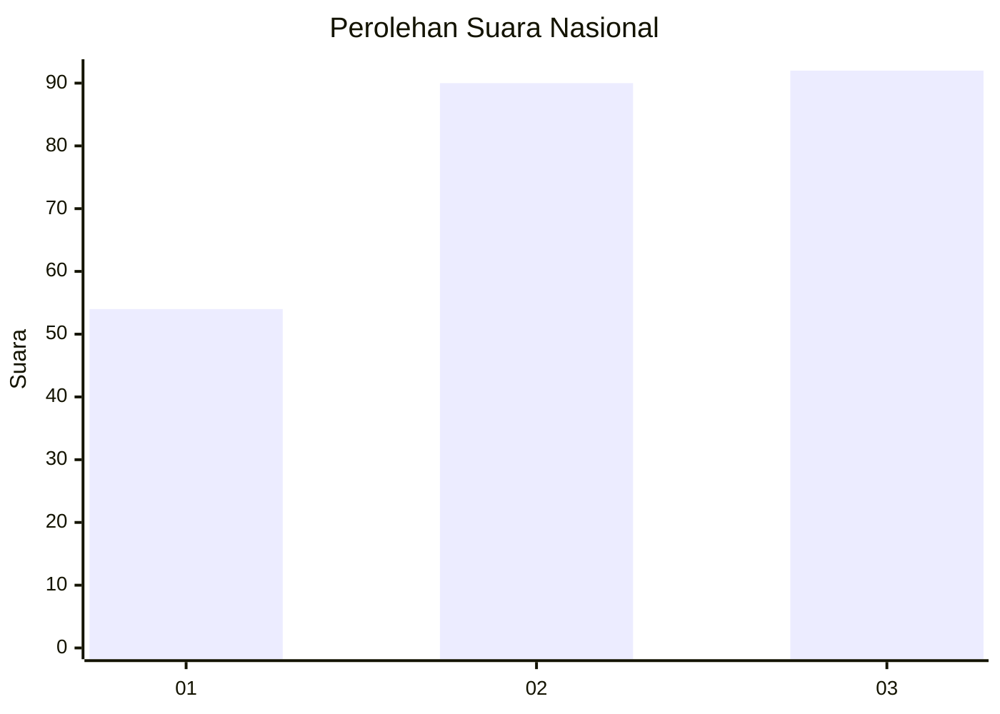
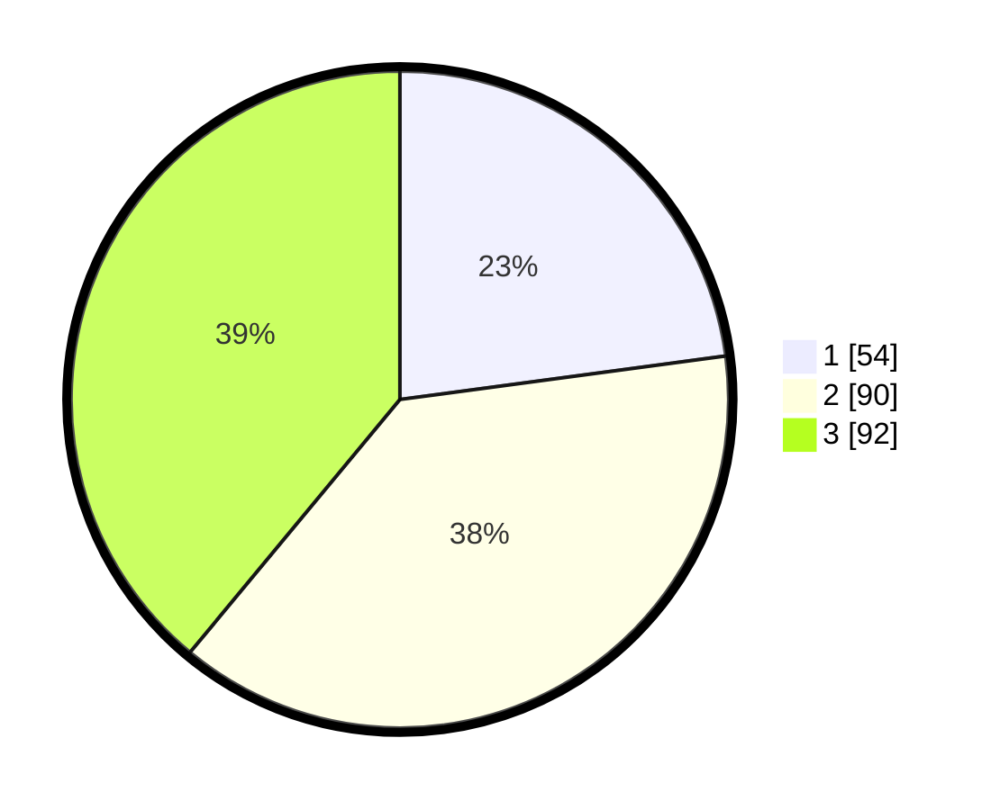

# Hasil

## Grafik

## Tabel

| No. | Nama Paslon    | Suara | Suara (raw) | Persentase |
|:--- |:-------------- | -----:| -----------:| ----------:|
| 1   | ANIES MUHAIMIN | 54    | [54][p-1]   | 22,88      |
| 2   | PRABOWO GIBRAN | 90    | [90][p-2]   | 38,14      |
| 3   | GANJAR MAHFUD  | 92    | [92][p-3]   | 38,98      |

[p-1]: https://github.com/gigit-pemilu/pemilu-2024/blob/main/pilpres/hitung-suara/sub/34-di-yogyakarta/sub/04-sleman/sub/12-ngaglik/sub/2003-sinduharjo/sub/037-tps/sub/paslon-1.txt
[p-2]: https://github.com/gigit-pemilu/pemilu-2024/blob/main/pilpres/hitung-suara/sub/34-di-yogyakarta/sub/04-sleman/sub/12-ngaglik/sub/2003-sinduharjo/sub/037-tps/sub/paslon-2.txt
[p-3]: https://github.com/gigit-pemilu/pemilu-2024/blob/main/pilpres/hitung-suara/sub/34-di-yogyakarta/sub/04-sleman/sub/12-ngaglik/sub/2003-sinduharjo/sub/037-tps/sub/paslon-3.txt

## Foto C Plano

https://sirekap-obj-formc.kpu.go.id/2840/pemilu/ppwp/34/04/12/20/03/3404122003037-20240214-221215--ab2efef8-11cf-4de5-883b-3a54562195e8.jpg

https://sirekap-obj-formc.kpu.go.id/2840/pemilu/ppwp/34/04/12/20/03/3404122003037-20240214-220931--dace2048-8f96-4fe6-9555-942c653d0b12.jpg

https://sirekap-obj-formc.kpu.go.id/2840/pemilu/ppwp/34/04/12/20/03/3404122003037-20240214-220605--014bf7d4-80cd-4657-843a-8e6577c73520.jpg

## Metadata

| Key        | Value               |
| ---------- | ------------------- |
| Time Stamp | 2024-02-16 05:30:26 |

## DATA PEMILIH TETAP

Jumlah pemilih dalam DPT: **292**.
 * L: **165**.
 * P: **127**.

## DATA PENGGUNA HAK PILIH

Jumlah pengguna hak pilih dalam DPT: **224**.
 * L: **118**.
 * P: **106**.

Jumlah pengguna hak pilih dalam DPTb: **13**.
 * L: **9**.
 * P: **4**.

Jumlah pengguna hak pilih dalam DPK: **1**.
 * L: **0**.
 * P: **1**.

Jumlah pengguna hak pilih: **238**.
 * L: **127**.
 * P: **111**.

## JUMLAH SUARA SAH DAN TIDAK SAH

JUMLAH SELURUH SUARA SAH: **236**.

JUMLAH SUARA TIDAK SAH: **2**.

JUMLAH SELURUH SUARA SAH DAN SUARA TIDAK SAH: **238**.

