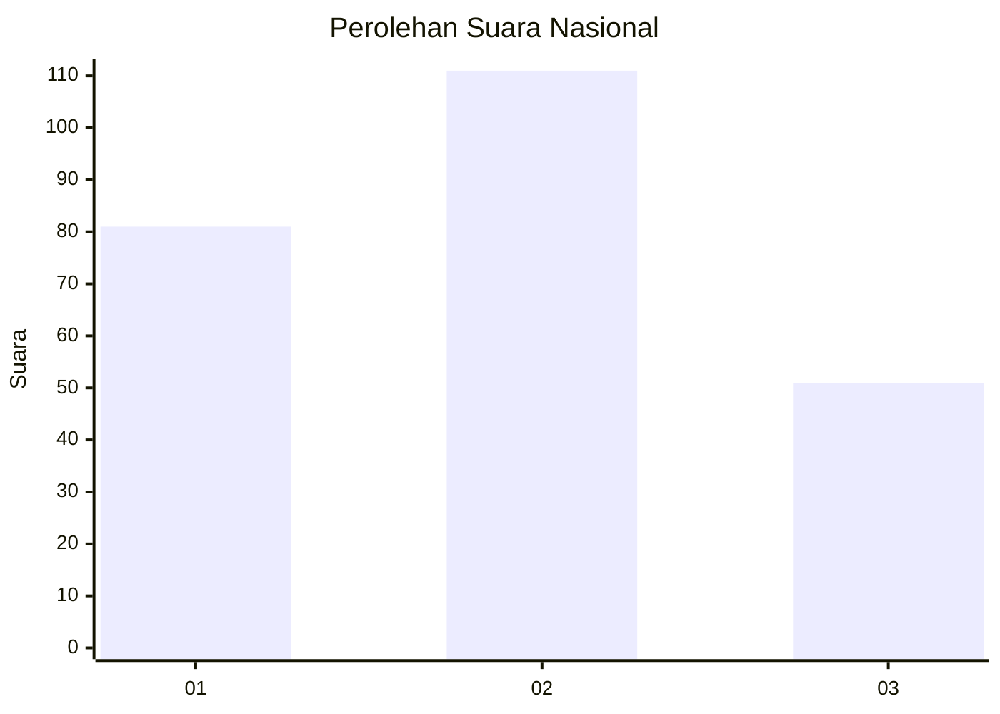
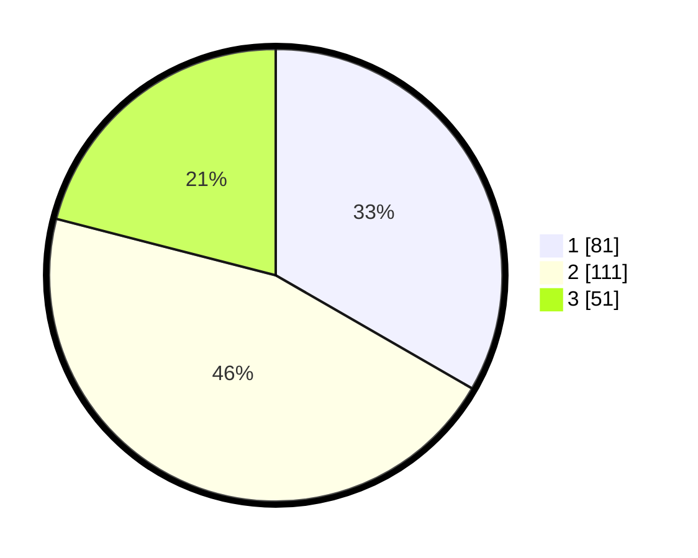

# Hasil

## Grafik

## Tabel

| No. | Nama Paslon    | Suara | Suara (raw) | Persentase |
|:--- |:-------------- | -----:| -----------:| ----------:|
| 1   | ANIES MUHAIMIN | 81    | [81][p-1]   | 33,33      |
| 2   | PRABOWO GIBRAN | 111   | [111][p-2]  | 45,68      |
| 3   | GANJAR MAHFUD  | 51    | [51][p-3]   | 20,99      |

[p-1]: https://github.com/gigit-pemilu/pemilu-2024/blob/main/pilpres/hitung-suara/sub/34-di-yogyakarta/sub/04-sleman/sub/12-ngaglik/sub/2003-sinduharjo/sub/051-tps/sub/paslon-1.txt
[p-2]: https://github.com/gigit-pemilu/pemilu-2024/blob/main/pilpres/hitung-suara/sub/34-di-yogyakarta/sub/04-sleman/sub/12-ngaglik/sub/2003-sinduharjo/sub/051-tps/sub/paslon-2.txt
[p-3]: https://github.com/gigit-pemilu/pemilu-2024/blob/main/pilpres/hitung-suara/sub/34-di-yogyakarta/sub/04-sleman/sub/12-ngaglik/sub/2003-sinduharjo/sub/051-tps/sub/paslon-3.txt

## Foto C Plano

https://sirekap-obj-formc.kpu.go.id/c6b7/pemilu/ppwp/34/04/12/20/03/3404122003051-20240214-231213--92c4f28b-455f-48a3-989a-39d73d9fa5bb.jpg

https://sirekap-obj-formc.kpu.go.id/c6b7/pemilu/ppwp/34/04/12/20/03/3404122003051-20240214-231637--3879a56d-4fbb-4f97-a43e-e187abe8052d.jpg

https://sirekap-obj-formc.kpu.go.id/c6b7/pemilu/ppwp/34/04/12/20/03/3404122003051-20240214-231709--c9ba4291-555c-4352-b491-297945a8522a.jpg

## Metadata

| Key        | Value               |
| ---------- | ------------------- |
| Time Stamp | 2024-02-15 16:00:26 |

