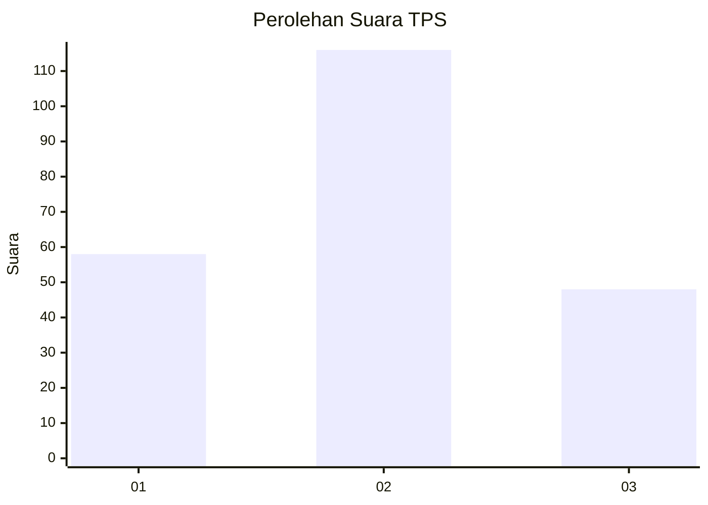
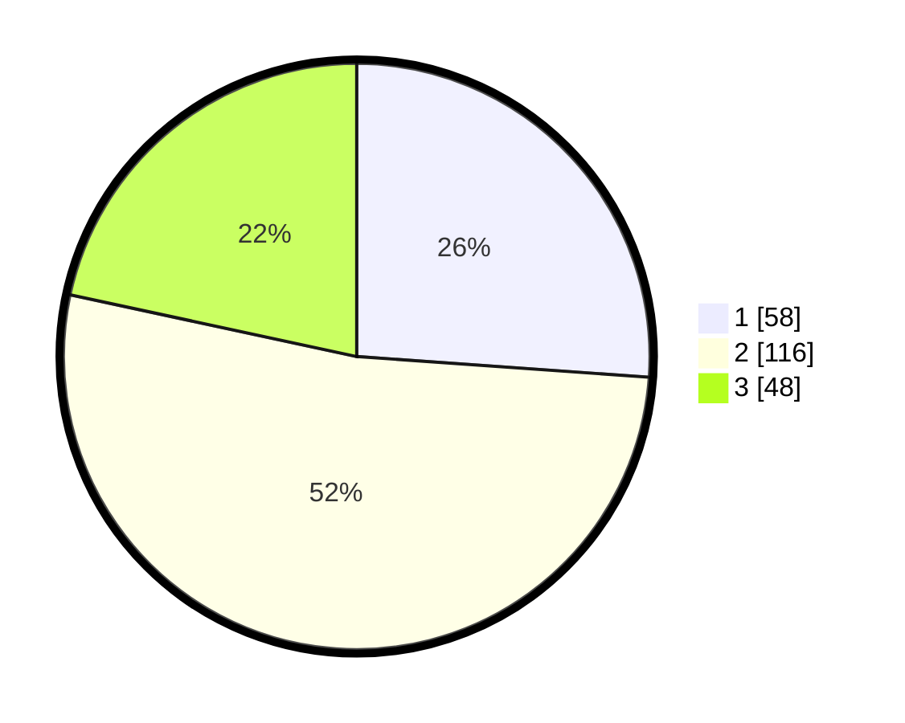

# Hasil

## Grafik

## Tabel

| No. | Nama Paslon    | Suara | Suara (raw) | Persentase |
|:--- |:-------------- | -----:| -----------:| ----------:|
| 1   | ANIES MUHAIMIN | 58    | [58][p-1]   | 26,13      |
| 2   | PRABOWO GIBRAN | 116   | [116][p-2]  | 52,25      |
| 3   | GANJAR MAHFUD  | 48    | [48][p-3]   | 21,62      |

[p-1]: https://github.com/gigit-pemilu/pemilu-2024-34-di-yogyakarta/blob/main/pilpres/hitung-suara/sub/34-di-yogyakarta/sub/04-sleman/sub/12-ngaglik/sub/2003-sinduharjo/sub/054-tps/sub/paslon-1.txt
[p-2]: https://github.com/gigit-pemilu/pemilu-2024-34-di-yogyakarta/blob/main/pilpres/hitung-suara/sub/34-di-yogyakarta/sub/04-sleman/sub/12-ngaglik/sub/2003-sinduharjo/sub/054-tps/sub/paslon-2.txt
[p-3]: https://github.com/gigit-pemilu/pemilu-2024-34-di-yogyakarta/blob/main/pilpres/hitung-suara/sub/34-di-yogyakarta/sub/04-sleman/sub/12-ngaglik/sub/2003-sinduharjo/sub/054-tps/sub/paslon-3.txt

## Foto C Plano

https://sirekap-obj-formc.kpu.go.id/5014/pemilu/ppwp/34/04/12/20/03/3404122003054-20240215-022009--1c7973aa-0ba2-4c8d-8711-d7b18fe94b9d.jpg

https://sirekap-obj-formc.kpu.go.id/5014/pemilu/ppwp/34/04/12/20/03/3404122003054-20240214-192657--0706566b-b55c-422a-b0da-77fec969a07e.jpg

https://sirekap-obj-formc.kpu.go.id/5014/pemilu/ppwp/34/04/12/20/03/3404122003054-20240214-202806--13d5bf62-448d-4e55-83d6-6d2ba27cf24c.jpg

## Metadata

| Key        | Value               |
| ---------- | ------------------- |
| Time Stamp | 2024-02-15 18:00:26 |

