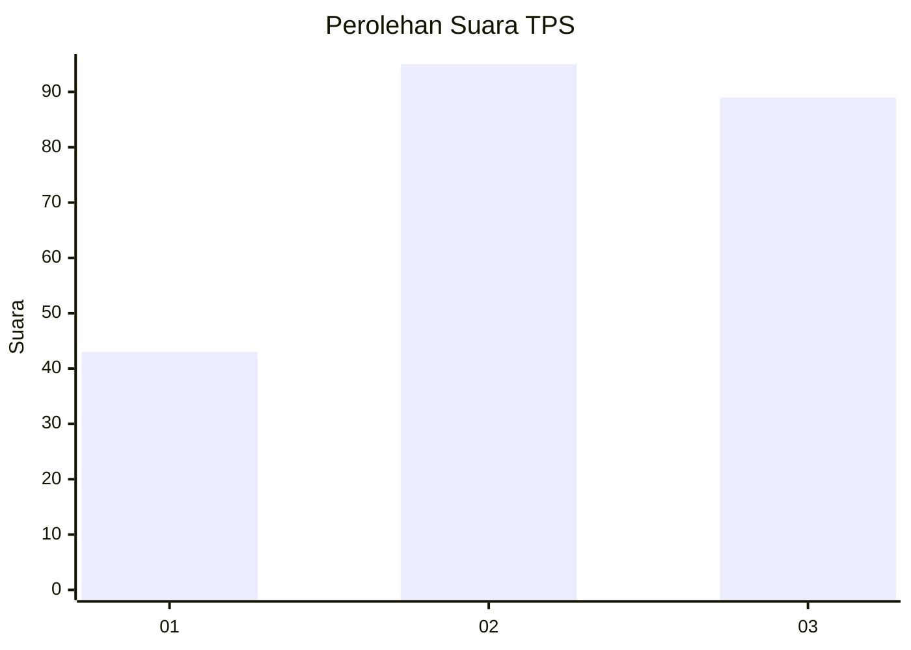
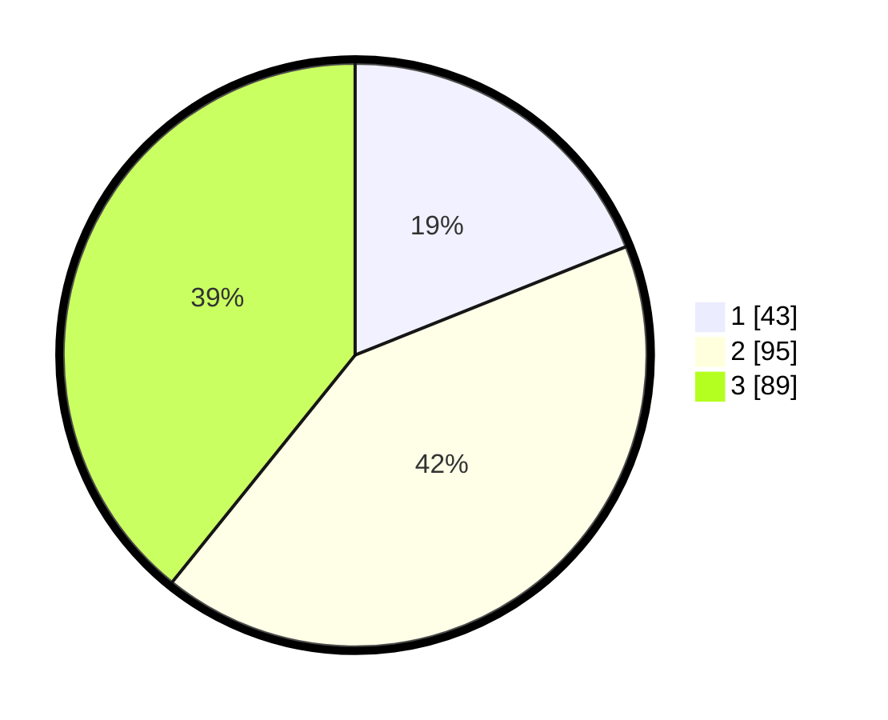

# Hasil

## Grafik

## Tabel

| No. | Nama Paslon    | Suara | Suara (raw) | Persentase |
|:--- |:-------------- | -----:| -----------:| ----------:|
| 1   | ANIES MUHAIMIN | 43    | [43][p-1]   | 18,94      |
| 2   | PRABOWO GIBRAN | 95    | [95][p-2]   | 41,85      |
| 3   | GANJAR MAHFUD  | 89    | [89][p-3]   | 39,21      |

[p-1]: https://github.com/gigit-pemilu/pemilu-2024-34-di-yogyakarta/blob/main/pilpres/hitung-suara/sub/34-di-yogyakarta/sub/04-sleman/sub/12-ngaglik/sub/2004-sukoharjo/sub/005-tps/sub/paslon-1.txt
[p-2]: https://github.com/gigit-pemilu/pemilu-2024-34-di-yogyakarta/blob/main/pilpres/hitung-suara/sub/34-di-yogyakarta/sub/04-sleman/sub/12-ngaglik/sub/2004-sukoharjo/sub/005-tps/sub/paslon-2.txt
[p-3]: https://github.com/gigit-pemilu/pemilu-2024-34-di-yogyakarta/blob/main/pilpres/hitung-suara/sub/34-di-yogyakarta/sub/04-sleman/sub/12-ngaglik/sub/2004-sukoharjo/sub/005-tps/sub/paslon-3.txt

## Foto C Plano

https://sirekap-obj-formc.kpu.go.id/6f42/pemilu/ppwp/34/04/12/20/04/3404122004005-20240214-141335--d3fb4733-0a5c-403d-a745-c5899ed53dc4.jpg

https://sirekap-obj-formc.kpu.go.id/6f42/pemilu/ppwp/34/04/12/20/04/3404122004005-20240214-141524--51335d2a-5e16-42de-aed3-a63977ce6ee1.jpg

https://sirekap-obj-formc.kpu.go.id/6f42/pemilu/ppwp/34/04/12/20/04/3404122004005-20240214-141645--ac89c768-b309-44df-a887-290b66a74c15.jpg

## Metadata

| Key        | Value               |
| ---------- | ------------------- |
| Time Stamp | 2024-02-24 22:31:28 |

