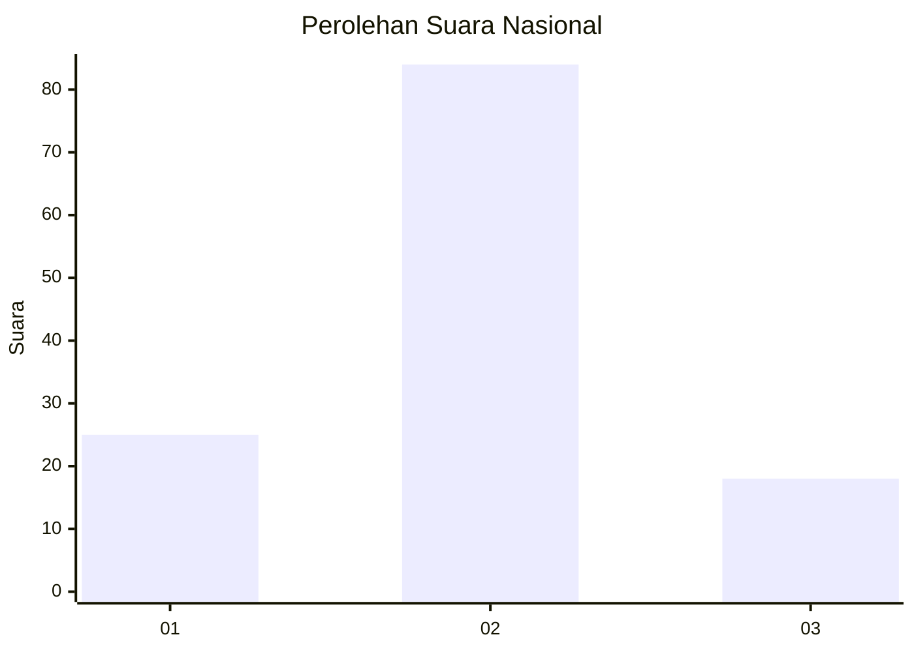
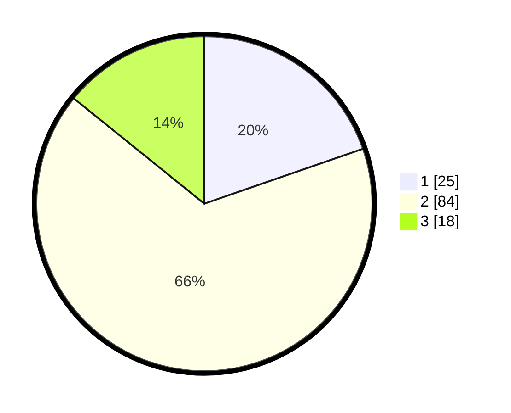

# Hasil

## Grafik

## Tabel

| No. | Nama Paslon    | Suara | Suara (raw) | Persentase |
|:--- |:-------------- | -----:| -----------:| ----------:|
| 1   | ANIES MUHAIMIN | 25    | [25][p-1]   | 19,69      |
| 2   | PRABOWO GIBRAN | 84    | [84][p-2]   | 66,14      |
| 3   | GANJAR MAHFUD  | 18    | [18][p-3]   | 14,17      |

[p-1]: https://github.com/gigit-pemilu/pemilu-2024/blob/main/pilpres/hitung-suara/sub/34-di-yogyakarta/sub/04-sleman/sub/12-ngaglik/sub/2004-sukoharjo/sub/011-tps/sub/paslon-1.txt
[p-2]: https://github.com/gigit-pemilu/pemilu-2024/blob/main/pilpres/hitung-suara/sub/34-di-yogyakarta/sub/04-sleman/sub/12-ngaglik/sub/2004-sukoharjo/sub/011-tps/sub/paslon-2.txt
[p-3]: https://github.com/gigit-pemilu/pemilu-2024/blob/main/pilpres/hitung-suara/sub/34-di-yogyakarta/sub/04-sleman/sub/12-ngaglik/sub/2004-sukoharjo/sub/011-tps/sub/paslon-3.txt

## Foto C Plano

https://sirekap-obj-formc.kpu.go.id/004d/pemilu/ppwp/34/04/12/20/04/3404122004011-20240214-205645--7e6203af-a843-4c7b-b996-94d0179de6ea.jpg

https://sirekap-obj-formc.kpu.go.id/004d/pemilu/ppwp/34/04/12/20/04/3404122004011-20240214-205703--50c4c7b4-742e-46f7-af1e-020a978cb9dd.jpg

https://sirekap-obj-formc.kpu.go.id/004d/pemilu/ppwp/34/04/12/20/04/3404122004011-20240214-205707--af71368b-5189-4610-a38d-b4a8cd453739.jpg

## Metadata

| Key        | Value               |
| ---------- | ------------------- |
| Time Stamp | 2024-02-15 16:00:26 |

