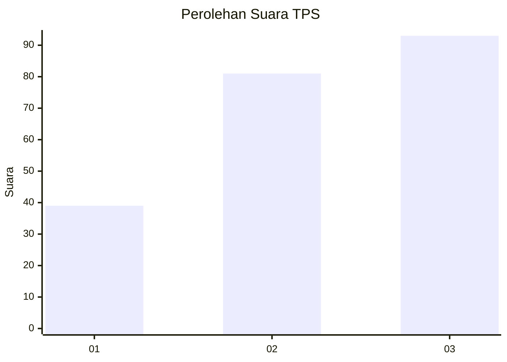
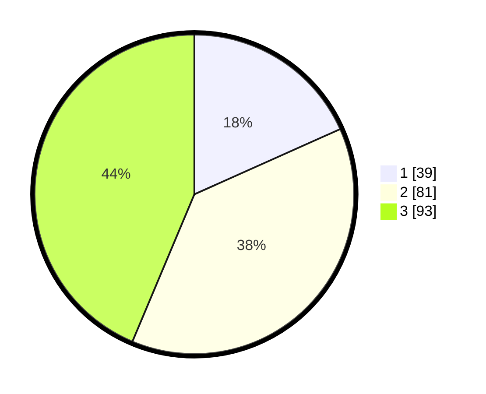

# Hasil

## Grafik

## Tabel

| No. | Nama Paslon    | Suara | Suara (raw) | Persentase |
|:--- |:-------------- | -----:| -----------:| ----------:|
| 1   | ANIES MUHAIMIN | 39    | [39][p-1]   | 18,31      |
| 2   | PRABOWO GIBRAN | 81    | [81][p-2]   | 38,03      |
| 3   | GANJAR MAHFUD  | 93    | [93][p-3]   | 43,66      |

[p-1]: https://github.com/gigit-pemilu/pemilu-2024-34-di-yogyakarta/blob/main/pilpres/hitung-suara/sub/34-di-yogyakarta/sub/04-sleman/sub/12-ngaglik/sub/2004-sukoharjo/sub/014-tps/sub/paslon-1.txt
[p-2]: https://github.com/gigit-pemilu/pemilu-2024-34-di-yogyakarta/blob/main/pilpres/hitung-suara/sub/34-di-yogyakarta/sub/04-sleman/sub/12-ngaglik/sub/2004-sukoharjo/sub/014-tps/sub/paslon-2.txt
[p-3]: https://github.com/gigit-pemilu/pemilu-2024-34-di-yogyakarta/blob/main/pilpres/hitung-suara/sub/34-di-yogyakarta/sub/04-sleman/sub/12-ngaglik/sub/2004-sukoharjo/sub/014-tps/sub/paslon-3.txt

## Foto C Plano

https://sirekap-obj-formc.kpu.go.id/b049/pemilu/ppwp/34/04/12/20/04/3404122004014-20240214-235816--ff84f25e-3f1f-4c54-aca5-5badd61bfacf.jpg

https://sirekap-obj-formc.kpu.go.id/b049/pemilu/ppwp/34/04/12/20/04/3404122004014-20240214-235853--36e20407-7394-4be8-8930-73e16fd278bb.jpg

https://sirekap-obj-formc.kpu.go.id/b049/pemilu/ppwp/34/04/12/20/04/3404122004014-20240214-235935--210ce7dc-f48e-4c5d-a0b4-17a9b3122cf4.jpg

## Metadata

| Key        | Value               |
| ---------- | ------------------- |
| Time Stamp | 2024-02-21 12:00:00 |

