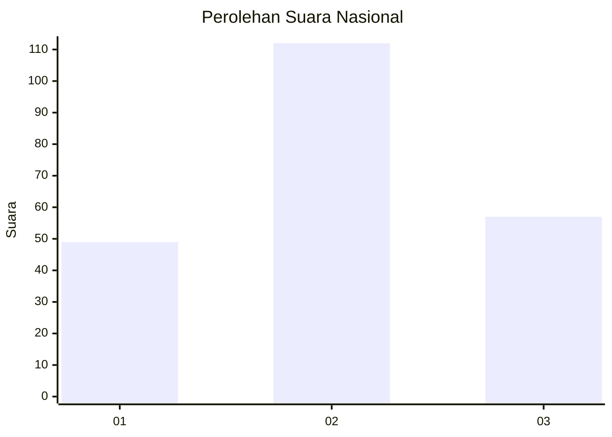
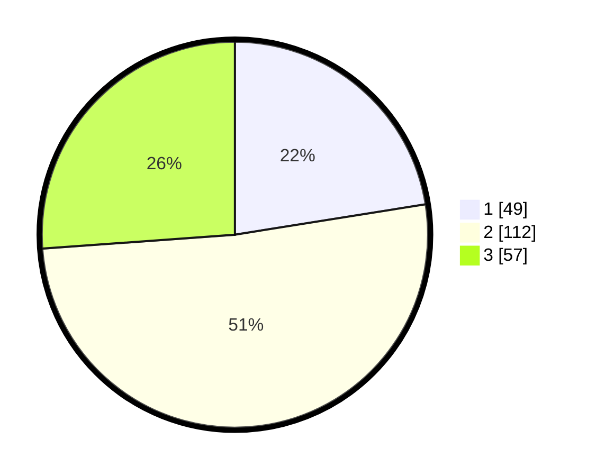

# Hasil

## Grafik

## Tabel

| No. | Nama Paslon    | Suara | Suara (raw) | Persentase |
|:--- |:-------------- | -----:| -----------:| ----------:|
| 1   | ANIES MUHAIMIN | 49    | [49][p-1]   | 22,48      |
| 2   | PRABOWO GIBRAN | 112   | [112][p-2]  | 51,38      |
| 3   | GANJAR MAHFUD  | 57    | [57][p-3]   | 26,15      |

[p-1]: https://github.com/gigit-pemilu/pemilu-2024/blob/main/pilpres/hitung-suara/sub/34-di-yogyakarta/sub/04-sleman/sub/12-ngaglik/sub/2004-sukoharjo/sub/019-tps/sub/paslon-1.txt
[p-2]: https://github.com/gigit-pemilu/pemilu-2024/blob/main/pilpres/hitung-suara/sub/34-di-yogyakarta/sub/04-sleman/sub/12-ngaglik/sub/2004-sukoharjo/sub/019-tps/sub/paslon-2.txt
[p-3]: https://github.com/gigit-pemilu/pemilu-2024/blob/main/pilpres/hitung-suara/sub/34-di-yogyakarta/sub/04-sleman/sub/12-ngaglik/sub/2004-sukoharjo/sub/019-tps/sub/paslon-3.txt

## Foto C Plano

https://sirekap-obj-formc.kpu.go.id/e244/pemilu/ppwp/34/04/12/20/04/3404122004019-20240214-230537--74e3c79e-af52-4e26-8f72-c4ecadebe5f2.jpg

https://sirekap-obj-formc.kpu.go.id/e244/pemilu/ppwp/34/04/12/20/04/3404122004019-20240214-230637--de8535ed-f090-4014-a71d-c5d4efce0d9c.jpg

https://sirekap-obj-formc.kpu.go.id/e244/pemilu/ppwp/34/04/12/20/04/3404122004019-20240214-230738--b1ad2807-f1e7-409a-b0ce-2a615b7359d9.jpg

## Metadata

| Key        | Value               |
| ---------- | ------------------- |
| Time Stamp | 2024-02-15 16:00:26 |

## DATA PEMILIH TETAP

Jumlah pemilih dalam DPT: **245**.
 * L: **107**.
 * P: **138**.

## DATA PENGGUNA HAK PILIH

Jumlah pengguna hak pilih dalam DPT: **201**.
 * L: **85**.
 * P: **116**.

Jumlah pengguna hak pilih dalam DPTb: **11**.
 * L: **2**.
 * P: **9**.

Jumlah pengguna hak pilih dalam DPK: **8**.
 * L: **2**.
 * P: **6**.

Jumlah pengguna hak pilih: **220**.
 * L: **89**.
 * P: **130**.

## JUMLAH SUARA SAH DAN TIDAK SAH

JUMLAH SELURUH SUARA SAH: **218**.

JUMLAH SUARA TIDAK SAH: **2**.

JUMLAH SELURUH SUARA SAH DAN SUARA TIDAK SAH: **220**.

