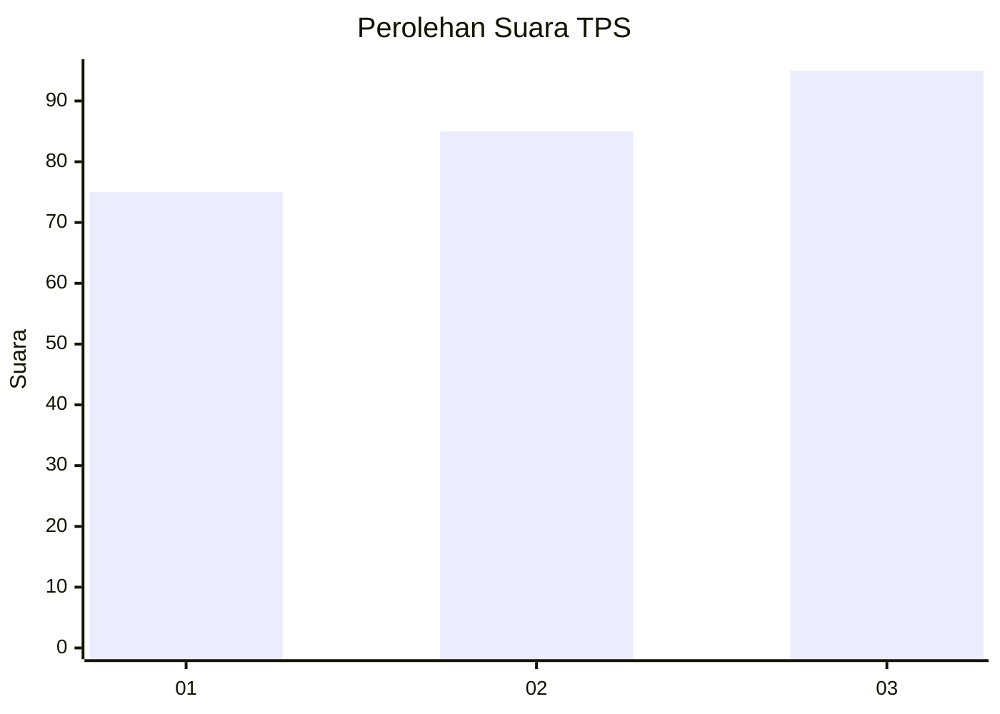
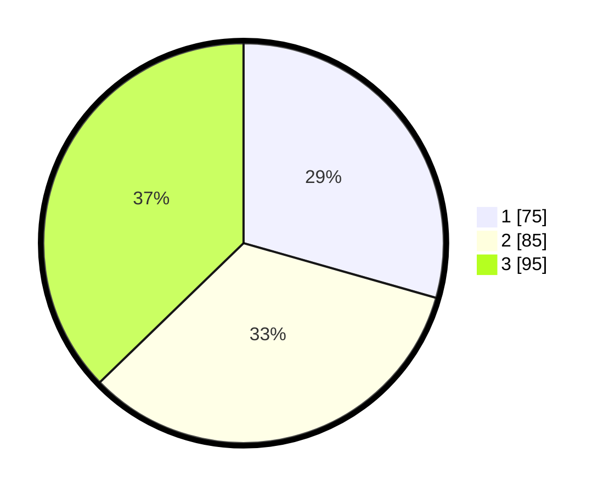

# Hasil

## Grafik

## Tabel

| No. | Nama Paslon    | Suara | Suara (raw) | Persentase |
|:--- |:-------------- | -----:| -----------:| ----------:|
| 1   | ANIES MUHAIMIN | 75    | [75][p-1]   | 29,41      |
| 2   | PRABOWO GIBRAN | 85    | [85][p-2]   | 33,33      |
| 3   | GANJAR MAHFUD  | 95    | [95][p-3]   | 37,25      |

[p-1]: https://github.com/gigit-pemilu/pemilu-2024-34-di-yogyakarta/blob/main/pilpres/hitung-suara/sub/34-di-yogyakarta/sub/04-sleman/sub/12-ngaglik/sub/2004-sukoharjo/sub/028-tps/sub/paslon-1.txt
[p-2]: https://github.com/gigit-pemilu/pemilu-2024-34-di-yogyakarta/blob/main/pilpres/hitung-suara/sub/34-di-yogyakarta/sub/04-sleman/sub/12-ngaglik/sub/2004-sukoharjo/sub/028-tps/sub/paslon-2.txt
[p-3]: https://github.com/gigit-pemilu/pemilu-2024-34-di-yogyakarta/blob/main/pilpres/hitung-suara/sub/34-di-yogyakarta/sub/04-sleman/sub/12-ngaglik/sub/2004-sukoharjo/sub/028-tps/sub/paslon-3.txt

## Foto C Plano

https://sirekap-obj-formc.kpu.go.id/de2a/pemilu/ppwp/34/04/12/20/04/3404122004028-20240214-190439--a181f1e0-566b-4eca-a00f-2db4244255ca.jpg

https://sirekap-obj-formc.kpu.go.id/de2a/pemilu/ppwp/34/04/12/20/04/3404122004028-20240214-190446--6dd874d6-15d1-4543-acce-c4e7d86af523.jpg

https://sirekap-obj-formc.kpu.go.id/de2a/pemilu/ppwp/34/04/12/20/04/3404122004028-20240214-190451--dc9ec573-9a78-4af3-bb4a-701a177d7ac4.jpg

## Metadata

| Key        | Value               |
| ---------- | ------------------- |
| Time Stamp | 2024-02-14 21:46:01 |

## DATA PEMILIH TETAP

Jumlah pemilih dalam DPT: **296**.
 * L: **134**.
 * P: **162**.

## DATA PENGGUNA HAK PILIH

Jumlah pengguna hak pilih dalam DPT: **244**.
 * L: **109**.
 * P: **135**.

Jumlah pengguna hak pilih dalam DPTb: **14**.
 * L: **2**.
 * P: **12**.

Jumlah pengguna hak pilih dalam DPK: **3**.
 * L: **1**.
 * P: **2**.

Jumlah pengguna hak pilih: **261**.
 * L: **112**.
 * P: **149**.

## JUMLAH SUARA SAH DAN TIDAK SAH

JUMLAH SELURUH SUARA SAH: **255**.

JUMLAH SUARA TIDAK SAH: **6**.

JUMLAH SELURUH SUARA SAH DAN SUARA TIDAK SAH: **261**.

