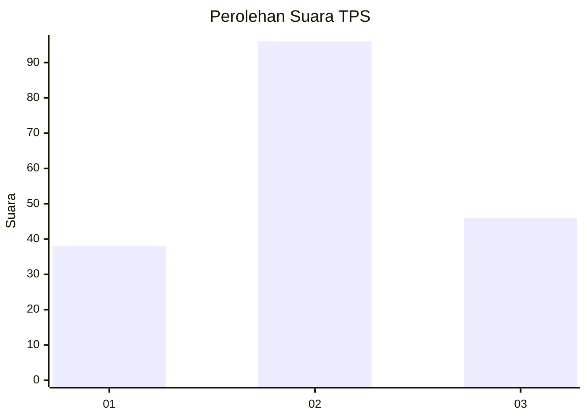
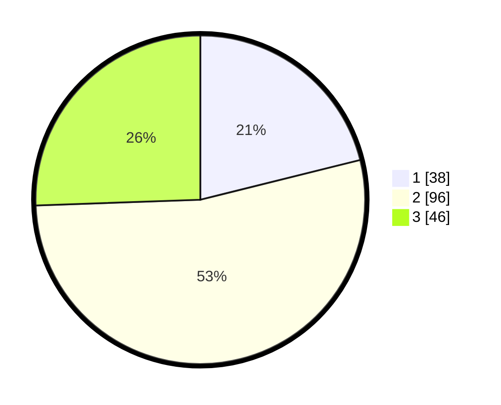

# Hasil

## Grafik

## Tabel

| No. | Nama Paslon    | Suara | Suara (raw) | Persentase |
|:--- |:-------------- | -----:| -----------:| ----------:|
| 1   | ANIES MUHAIMIN | 38    | [38][p-1]   | 21,11      |
| 2   | PRABOWO GIBRAN | 96    | [96][p-2]   | 53,33      |
| 3   | GANJAR MAHFUD  | 46    | [46][p-3]   | 25,56      |

[p-1]: https://github.com/gigit-pemilu/pemilu-2024-34-di-yogyakarta/blob/main/pilpres/hitung-suara/sub/34-di-yogyakarta/sub/04-sleman/sub/12-ngaglik/sub/2004-sukoharjo/sub/041-tps/sub/paslon-1.txt
[p-2]: https://github.com/gigit-pemilu/pemilu-2024-34-di-yogyakarta/blob/main/pilpres/hitung-suara/sub/34-di-yogyakarta/sub/04-sleman/sub/12-ngaglik/sub/2004-sukoharjo/sub/041-tps/sub/paslon-2.txt
[p-3]: https://github.com/gigit-pemilu/pemilu-2024-34-di-yogyakarta/blob/main/pilpres/hitung-suara/sub/34-di-yogyakarta/sub/04-sleman/sub/12-ngaglik/sub/2004-sukoharjo/sub/041-tps/sub/paslon-3.txt

## Foto C Plano

https://sirekap-obj-formc.kpu.go.id/28fa/pemilu/ppwp/34/04/12/20/04/3404122004041-20240214-141831--d8aa75c9-17c1-45bb-bc72-ea9044366c5a.jpg

https://sirekap-obj-formc.kpu.go.id/28fa/pemilu/ppwp/34/04/12/20/04/3404122004041-20240214-141556--6b935a09-58cf-4360-8a91-5ebb4eca187d.jpg

https://sirekap-obj-formc.kpu.go.id/28fa/pemilu/ppwp/34/04/12/20/04/3404122004041-20240214-141704--8abe6f0c-33c0-4448-afe4-1db50f50985b.jpg

## Metadata

| Key        | Value               |
| ---------- | ------------------- |
| Time Stamp | 2024-02-15 16:30:25 |

