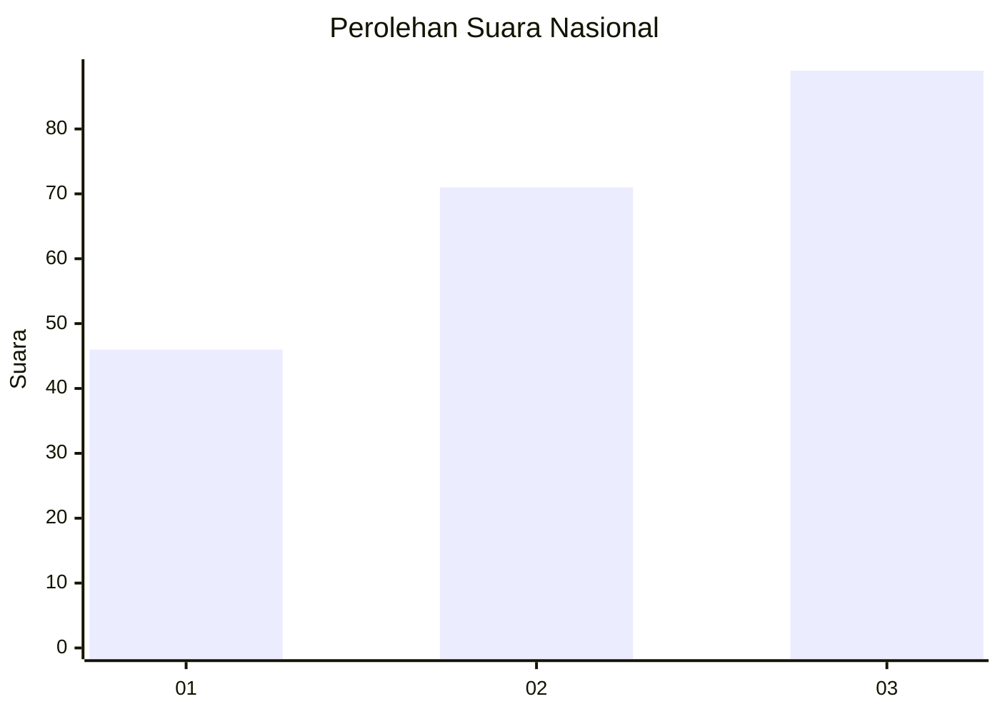
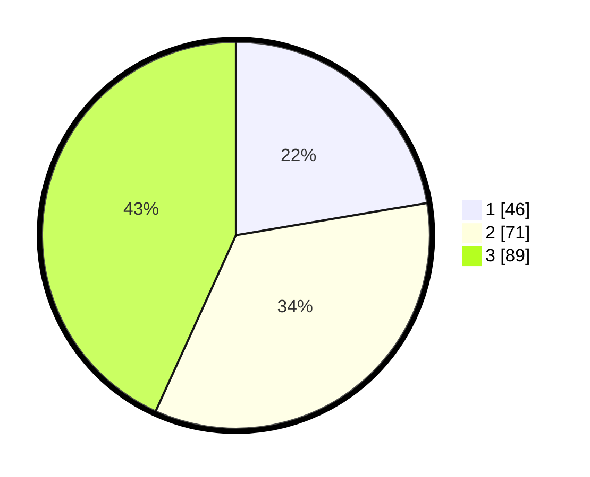

# Hasil

## Grafik

## Tabel

| No. | Nama Paslon    | Suara | Suara (raw) | Persentase |
|:--- |:-------------- | -----:| -----------:| ----------:|
| 1   | ANIES MUHAIMIN | 46    | [46][p-1]   | 22,33      |
| 2   | PRABOWO GIBRAN | 71    | [71][p-2]   | 34,47      |
| 3   | GANJAR MAHFUD  | 89    | [89][p-3]   | 43,20      |

[p-1]: https://github.com/gigit-pemilu/pemilu-2024/blob/main/pilpres/hitung-suara/sub/34-di-yogyakarta/sub/04-sleman/sub/12-ngaglik/sub/2004-sukoharjo/sub/045-tps/sub/paslon-1.txt
[p-2]: https://github.com/gigit-pemilu/pemilu-2024/blob/main/pilpres/hitung-suara/sub/34-di-yogyakarta/sub/04-sleman/sub/12-ngaglik/sub/2004-sukoharjo/sub/045-tps/sub/paslon-2.txt
[p-3]: https://github.com/gigit-pemilu/pemilu-2024/blob/main/pilpres/hitung-suara/sub/34-di-yogyakarta/sub/04-sleman/sub/12-ngaglik/sub/2004-sukoharjo/sub/045-tps/sub/paslon-3.txt

## Foto C Plano

https://sirekap-obj-formc.kpu.go.id/26c2/pemilu/ppwp/34/04/12/20/04/3404122004045-20240214-215503--0f3b8369-29dd-4769-857c-d84f6af493d3.jpg

https://sirekap-obj-formc.kpu.go.id/26c2/pemilu/ppwp/34/04/12/20/04/3404122004045-20240215-022934--5be4ab34-1538-438a-9d3e-2c7d3290e189.jpg

https://sirekap-obj-formc.kpu.go.id/26c2/pemilu/ppwp/34/04/12/20/04/3404122004045-20240214-215800--45147b87-858f-4bc1-ab75-88b1aae78fea.jpg

## Metadata

| Key        | Value               |
| ---------- | ------------------- |
| Time Stamp | 2024-02-15 18:00:26 |

