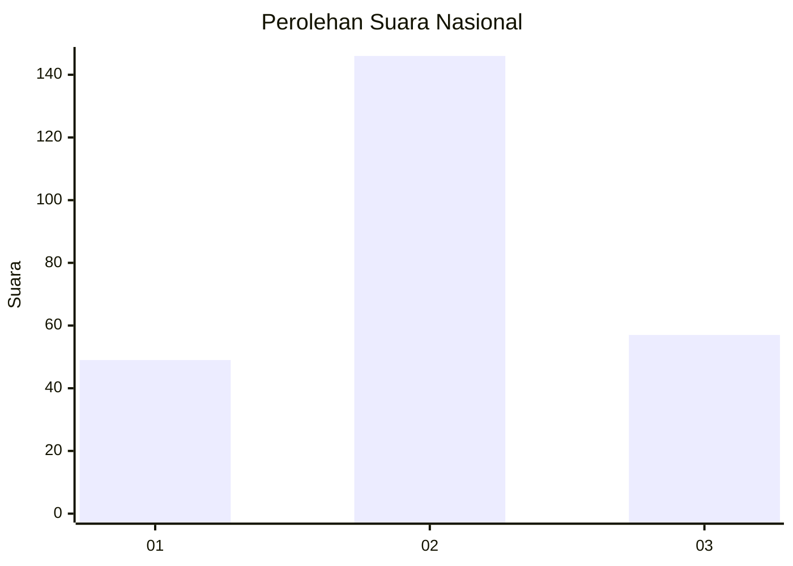
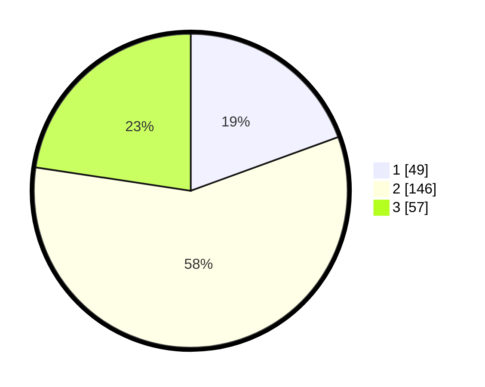

# Hasil

## Grafik

## Tabel

| No. | Nama Paslon    | Suara | Suara (raw) | Persentase |
|:--- |:-------------- | -----:| -----------:| ----------:|
| 1   | ANIES MUHAIMIN | 49    | [49][p-1]   | 19,44      |
| 2   | PRABOWO GIBRAN | 146   | [146][p-2]  | 57,94      |
| 3   | GANJAR MAHFUD  | 57    | [57][p-3]   | 22,62      |

[p-1]: https://github.com/gigit-pemilu/pemilu-2024/blob/main/pilpres/hitung-suara/sub/34-di-yogyakarta/sub/04-sleman/sub/12-ngaglik/sub/2005-sardonoharjo/sub/023-tps/sub/paslon-1.txt
[p-2]: https://github.com/gigit-pemilu/pemilu-2024/blob/main/pilpres/hitung-suara/sub/34-di-yogyakarta/sub/04-sleman/sub/12-ngaglik/sub/2005-sardonoharjo/sub/023-tps/sub/paslon-2.txt
[p-3]: https://github.com/gigit-pemilu/pemilu-2024/blob/main/pilpres/hitung-suara/sub/34-di-yogyakarta/sub/04-sleman/sub/12-ngaglik/sub/2005-sardonoharjo/sub/023-tps/sub/paslon-3.txt

## Foto C Plano

https://sirekap-obj-formc.kpu.go.id/d2b5/pemilu/ppwp/34/04/12/20/05/3404122005023-20240214-212926--01938fba-e1af-4c7a-839e-dfc5a1516f6c.jpg

https://sirekap-obj-formc.kpu.go.id/d2b5/pemilu/ppwp/34/04/12/20/05/3404122005023-20240215-004842--5dfcaf80-39e5-40f5-b5a5-2bf0b221b1b9.jpg

https://sirekap-obj-formc.kpu.go.id/d2b5/pemilu/ppwp/34/04/12/20/05/3404122005023-20240214-213224--7c8f16da-1c63-4d4d-9503-66dd92b4dd91.jpg

## Metadata

| Key        | Value               |
| ---------- | ------------------- |
| Time Stamp | 2024-02-21 23:00:00 |

