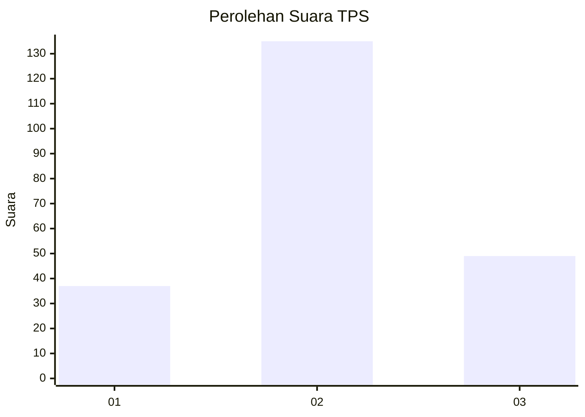
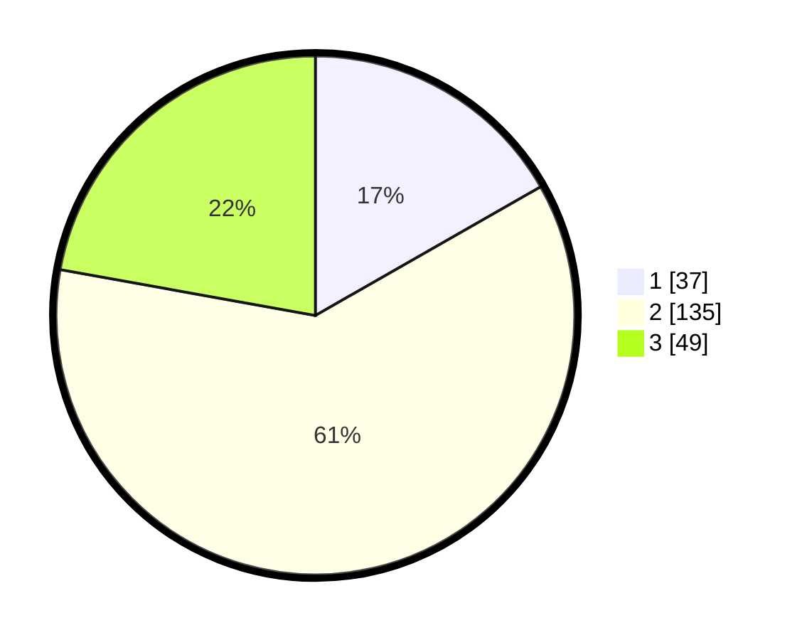

# Hasil

## Grafik

## Tabel

| No. | Nama Paslon    | Suara | Suara (raw) | Persentase |
|:--- |:-------------- | -----:| -----------:| ----------:|
| 1   | ANIES MUHAIMIN | 37    | [37][p-1]   | 16,74      |
| 2   | PRABOWO GIBRAN | 135   | [135][p-2]  | 61,09      |
| 3   | GANJAR MAHFUD  | 49    | [49][p-3]   | 22,17      |

[p-1]: https://github.com/gigit-pemilu/pemilu-2024-34-di-yogyakarta/blob/main/pilpres/hitung-suara/sub/34-di-yogyakarta/sub/04-sleman/sub/12-ngaglik/sub/2005-sardonoharjo/sub/030-tps/sub/paslon-1.txt
[p-2]: https://github.com/gigit-pemilu/pemilu-2024-34-di-yogyakarta/blob/main/pilpres/hitung-suara/sub/34-di-yogyakarta/sub/04-sleman/sub/12-ngaglik/sub/2005-sardonoharjo/sub/030-tps/sub/paslon-2.txt
[p-3]: https://github.com/gigit-pemilu/pemilu-2024-34-di-yogyakarta/blob/main/pilpres/hitung-suara/sub/34-di-yogyakarta/sub/04-sleman/sub/12-ngaglik/sub/2005-sardonoharjo/sub/030-tps/sub/paslon-3.txt

## Foto C Plano

https://sirekap-obj-formc.kpu.go.id/8a00/pemilu/ppwp/34/04/12/20/05/3404122005030-20240214-195959--00632c35-0b1f-4e34-a6e2-0b4c6f58ce76.jpg

https://sirekap-obj-formc.kpu.go.id/8a00/pemilu/ppwp/34/04/12/20/05/3404122005030-20240214-200022--d886d197-3085-477f-bedd-7f54a6c7e71e.jpg

https://sirekap-obj-formc.kpu.go.id/8a00/pemilu/ppwp/34/04/12/20/05/3404122005030-20240214-213504--985d4c11-c0ad-4696-8075-0be872219151.jpg

## Metadata

| Key        | Value               |
| ---------- | ------------------- |
| Time Stamp | 2024-02-15 00:41:44 |

