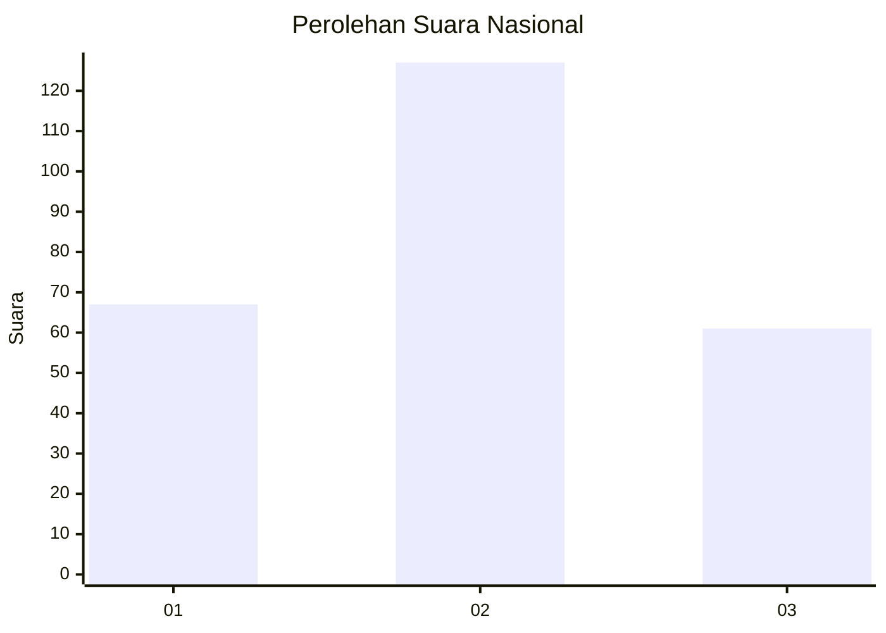
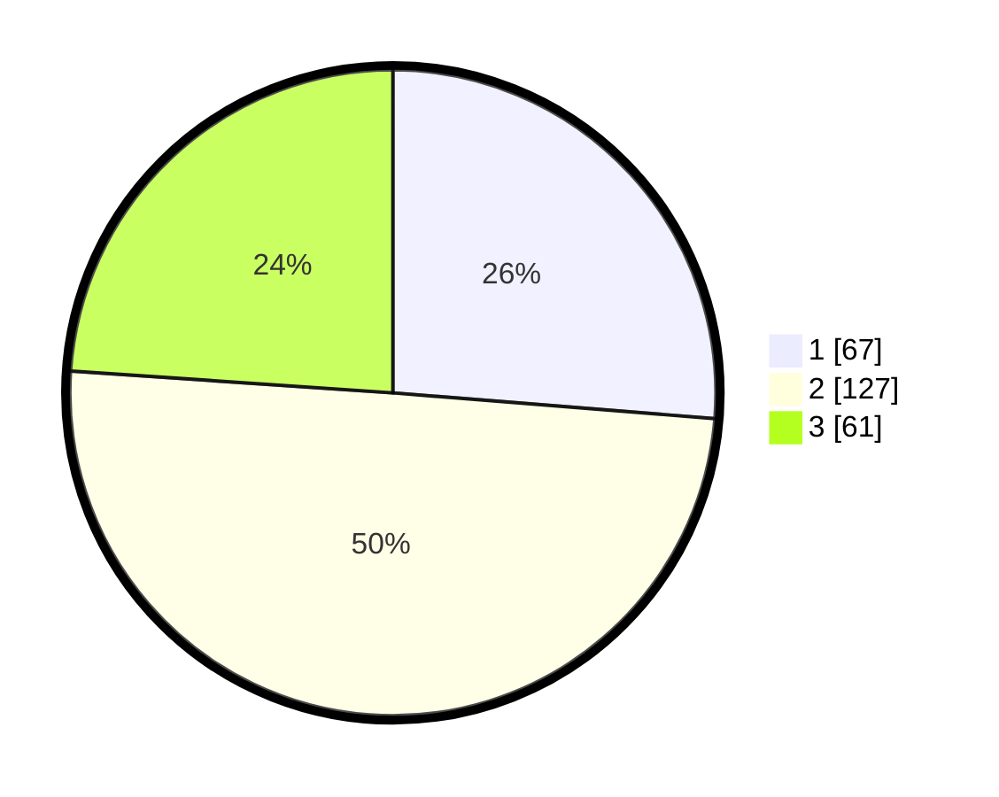

# Hasil

## Grafik

## Tabel

| No. | Nama Paslon    | Suara | Suara (raw) | Persentase |
|:--- |:-------------- | -----:| -----------:| ----------:|
| 1   | ANIES MUHAIMIN | 67    | [67][p-1]   | 26,27      |
| 2   | PRABOWO GIBRAN | 127   | [127][p-2]  | 49,80      |
| 3   | GANJAR MAHFUD  | 61    | [61][p-3]   | 23,92      |

[p-1]: https://github.com/gigit-pemilu/pemilu-2024/blob/main/pilpres/hitung-suara/sub/34-di-yogyakarta/sub/04-sleman/sub/12-ngaglik/sub/2005-sardonoharjo/sub/035-tps/sub/paslon-1.txt
[p-2]: https://github.com/gigit-pemilu/pemilu-2024/blob/main/pilpres/hitung-suara/sub/34-di-yogyakarta/sub/04-sleman/sub/12-ngaglik/sub/2005-sardonoharjo/sub/035-tps/sub/paslon-2.txt
[p-3]: https://github.com/gigit-pemilu/pemilu-2024/blob/main/pilpres/hitung-suara/sub/34-di-yogyakarta/sub/04-sleman/sub/12-ngaglik/sub/2005-sardonoharjo/sub/035-tps/sub/paslon-3.txt

## Foto C Plano

https://sirekap-obj-formc.kpu.go.id/db4e/pemilu/ppwp/34/04/12/20/05/3404122005035-20240214-205726--21be6687-5c65-4d7c-a063-431f72185701.jpg

https://sirekap-obj-formc.kpu.go.id/db4e/pemilu/ppwp/34/04/12/20/05/3404122005035-20240214-205737--ff31f758-d69a-4a1f-b69d-e9c97d49e9c9.jpg

https://sirekap-obj-formc.kpu.go.id/db4e/pemilu/ppwp/34/04/12/20/05/3404122005035-20240214-205742--a507b178-2d59-47cd-bb05-d3976cd73977.jpg

## Metadata

| Key        | Value               |
| ---------- | ------------------- |
| Time Stamp | 2024-02-15 02:10:27 |

