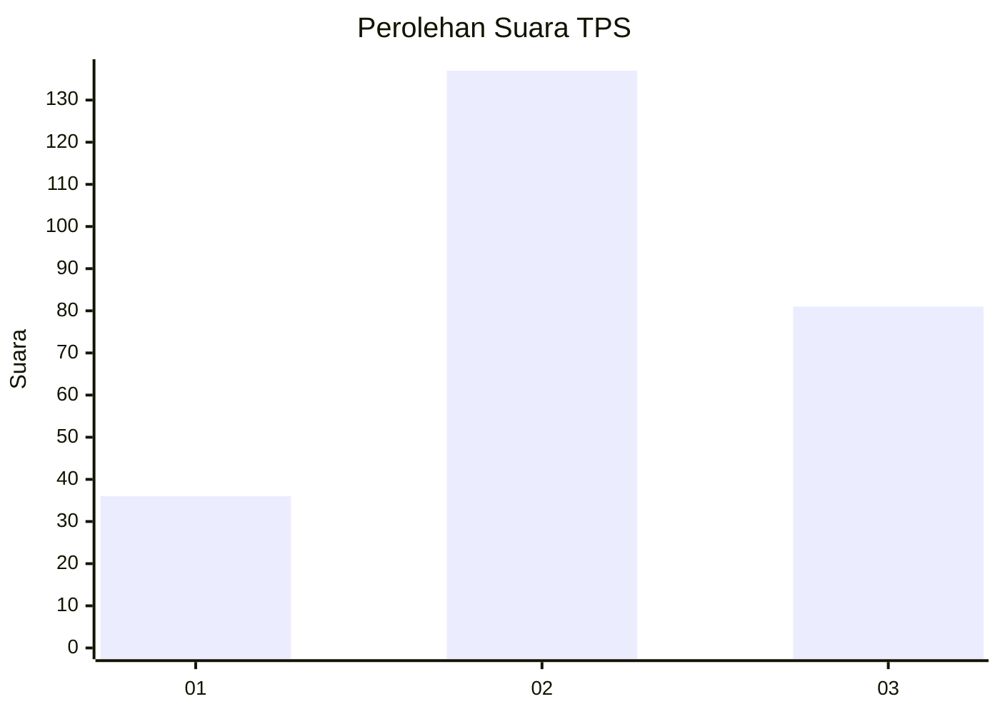
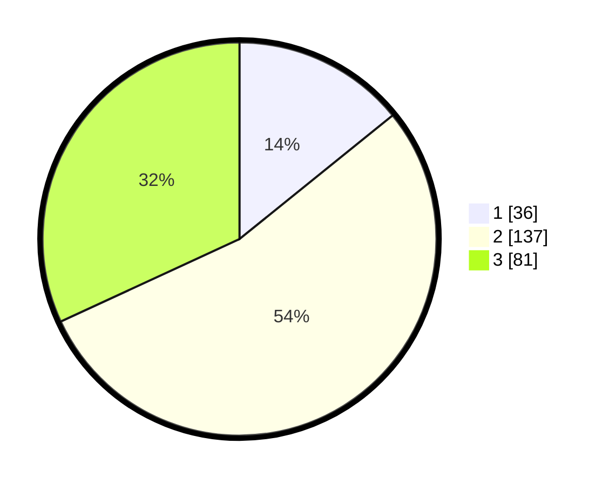

# Hasil

## Grafik

## Tabel

| No. | Nama Paslon    | Suara | Suara (raw) | Persentase |
|:--- |:-------------- | -----:| -----------:| ----------:|
| 1   | ANIES MUHAIMIN | 36    | [36][p-1]   | 14,17      |
| 2   | PRABOWO GIBRAN | 137   | [137][p-2]  | 53,94      |
| 3   | GANJAR MAHFUD  | 81    | [81][p-3]   | 31,89      |

[p-1]: https://github.com/gigit-pemilu/pemilu-2024-34-di-yogyakarta/blob/main/pilpres/hitung-suara/sub/34-di-yogyakarta/sub/04-sleman/sub/12-ngaglik/sub/2005-sardonoharjo/sub/042-tps/sub/paslon-1.txt
[p-2]: https://github.com/gigit-pemilu/pemilu-2024-34-di-yogyakarta/blob/main/pilpres/hitung-suara/sub/34-di-yogyakarta/sub/04-sleman/sub/12-ngaglik/sub/2005-sardonoharjo/sub/042-tps/sub/paslon-2.txt
[p-3]: https://github.com/gigit-pemilu/pemilu-2024-34-di-yogyakarta/blob/main/pilpres/hitung-suara/sub/34-di-yogyakarta/sub/04-sleman/sub/12-ngaglik/sub/2005-sardonoharjo/sub/042-tps/sub/paslon-3.txt

## Foto C Plano

https://sirekap-obj-formc.kpu.go.id/a6dd/pemilu/ppwp/34/04/12/20/05/3404122005042-20240215-000203--d35bc934-350a-4c63-9189-959cf3e8e187.jpg

https://sirekap-obj-formc.kpu.go.id/a6dd/pemilu/ppwp/34/04/12/20/05/3404122005042-20240215-000329--d3a145d3-6da6-450c-b37c-2f45593ac174.jpg

https://sirekap-obj-formc.kpu.go.id/a6dd/pemilu/ppwp/34/04/12/20/05/3404122005042-20240215-000456--78fcf597-31f3-4880-b643-2ca2dd4f918c.jpg

## Metadata

| Key        | Value               |
| ---------- | ------------------- |
| Time Stamp | 2024-02-15 16:30:25 |

