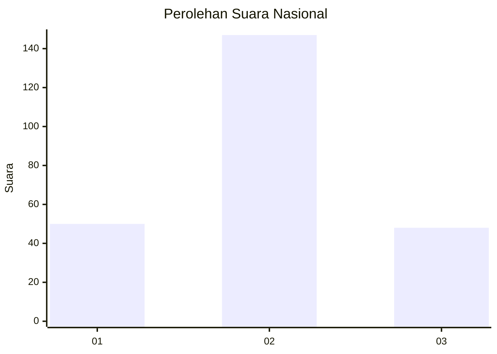
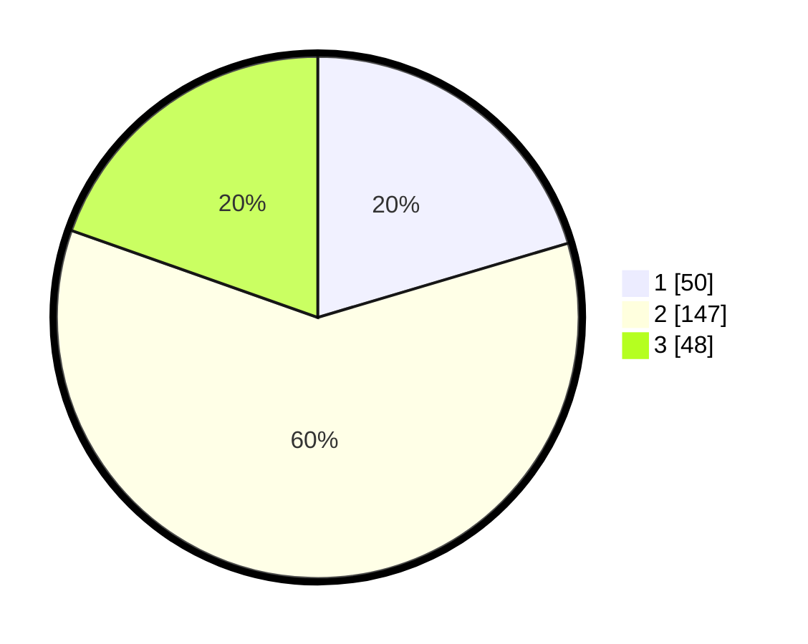

# Hasil

## Grafik

## Tabel

| No. | Nama Paslon    | Suara | Suara (raw) | Persentase |
|:--- |:-------------- | -----:| -----------:| ----------:|
| 1   | ANIES MUHAIMIN | 50    | [50][p-1]   | 20,41      |
| 2   | PRABOWO GIBRAN | 147   | [147][p-2]  | 60,00      |
| 3   | GANJAR MAHFUD  | 48    | [48][p-3]   | 19,59      |

[p-1]: https://github.com/gigit-pemilu/pemilu-2024/blob/main/pilpres/hitung-suara/sub/34-di-yogyakarta/sub/04-sleman/sub/12-ngaglik/sub/2005-sardonoharjo/sub/043-tps/sub/paslon-1.txt
[p-2]: https://github.com/gigit-pemilu/pemilu-2024/blob/main/pilpres/hitung-suara/sub/34-di-yogyakarta/sub/04-sleman/sub/12-ngaglik/sub/2005-sardonoharjo/sub/043-tps/sub/paslon-2.txt
[p-3]: https://github.com/gigit-pemilu/pemilu-2024/blob/main/pilpres/hitung-suara/sub/34-di-yogyakarta/sub/04-sleman/sub/12-ngaglik/sub/2005-sardonoharjo/sub/043-tps/sub/paslon-3.txt

## Foto C Plano

https://sirekap-obj-formc.kpu.go.id/730d/pemilu/ppwp/34/04/12/20/05/3404122005043-20240214-214041--f363f85a-5272-4160-bfa2-bbab3d699926.jpg

https://sirekap-obj-formc.kpu.go.id/730d/pemilu/ppwp/34/04/12/20/05/3404122005043-20240214-204109--19867f36-ef8e-433c-98ae-c00825dfff97.jpg

https://sirekap-obj-formc.kpu.go.id/730d/pemilu/ppwp/34/04/12/20/05/3404122005043-20240214-213813--689a6c29-d78c-4814-bf39-c5b102ef3abb.jpg

## Metadata

| Key        | Value               |
| ---------- | ------------------- |
| Time Stamp | 2024-02-24 22:31:28 |

