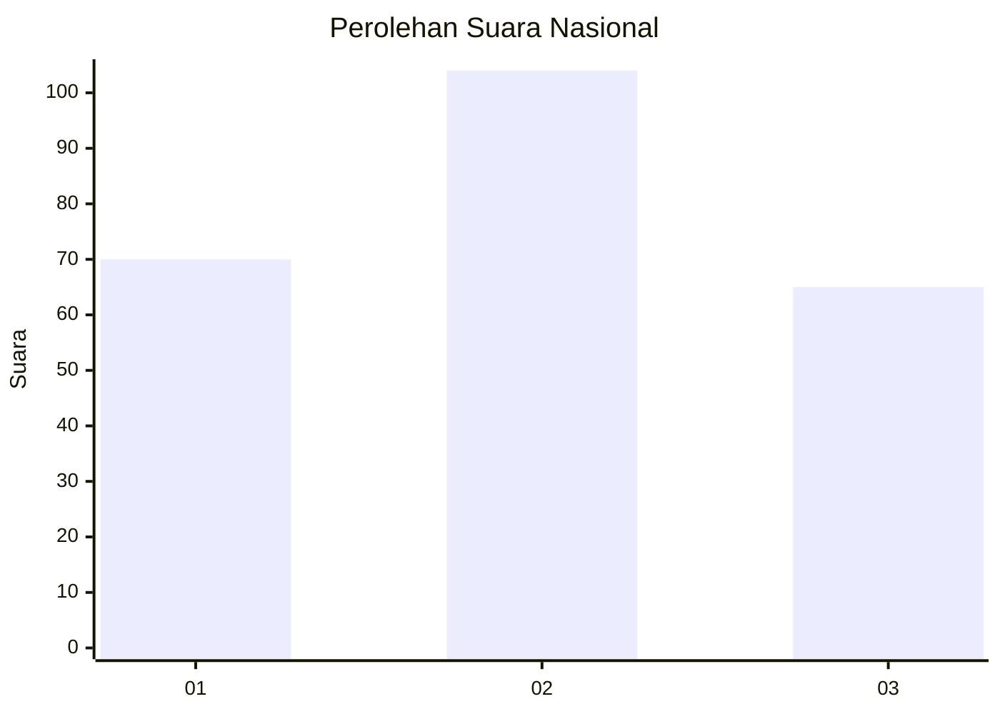
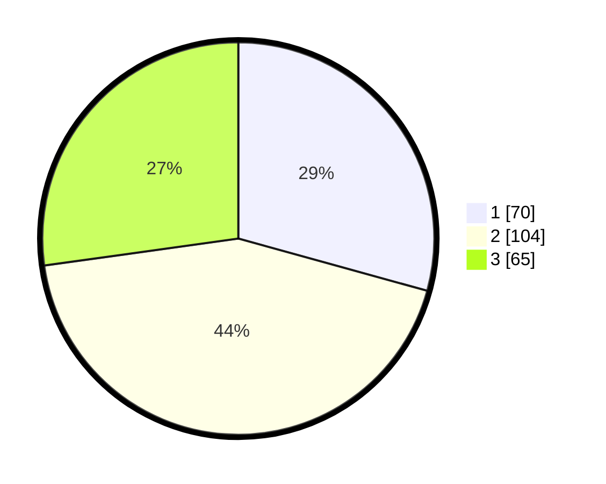

# Hasil

## Grafik

## Tabel

| No. | Nama Paslon    | Suara | Suara (raw) | Persentase |
|:--- |:-------------- | -----:| -----------:| ----------:|
| 1   | ANIES MUHAIMIN | 70    | [70][p-1]   | 29,29      |
| 2   | PRABOWO GIBRAN | 104   | [104][p-2]  | 43,51      |
| 3   | GANJAR MAHFUD  | 65    | [65][p-3]   | 27,20      |

[p-1]: https://github.com/gigit-pemilu/pemilu-2024/blob/main/pilpres/hitung-suara/sub/34-di-yogyakarta/sub/04-sleman/sub/12-ngaglik/sub/2005-sardonoharjo/sub/049-tps/sub/paslon-1.txt
[p-2]: https://github.com/gigit-pemilu/pemilu-2024/blob/main/pilpres/hitung-suara/sub/34-di-yogyakarta/sub/04-sleman/sub/12-ngaglik/sub/2005-sardonoharjo/sub/049-tps/sub/paslon-2.txt
[p-3]: https://github.com/gigit-pemilu/pemilu-2024/blob/main/pilpres/hitung-suara/sub/34-di-yogyakarta/sub/04-sleman/sub/12-ngaglik/sub/2005-sardonoharjo/sub/049-tps/sub/paslon-3.txt

## Foto C Plano

https://sirekap-obj-formc.kpu.go.id/9775/pemilu/ppwp/34/04/12/20/05/3404122005049-20240214-222858--cbcf7e14-4a65-490a-b291-8f1ce78c1241.jpg

https://sirekap-obj-formc.kpu.go.id/9775/pemilu/ppwp/34/04/12/20/05/3404122005049-20240214-211841--845df642-5128-4a7d-8315-3b3f5d51816f.jpg

https://sirekap-obj-formc.kpu.go.id/9775/pemilu/ppwp/34/04/12/20/05/3404122005049-20240214-213204--7378fcc2-e5ad-4036-a4b7-bb69a570be8b.jpg

## Metadata

| Key        | Value               |
| ---------- | ------------------- |
| Time Stamp | 2024-02-15 21:30:27 |

