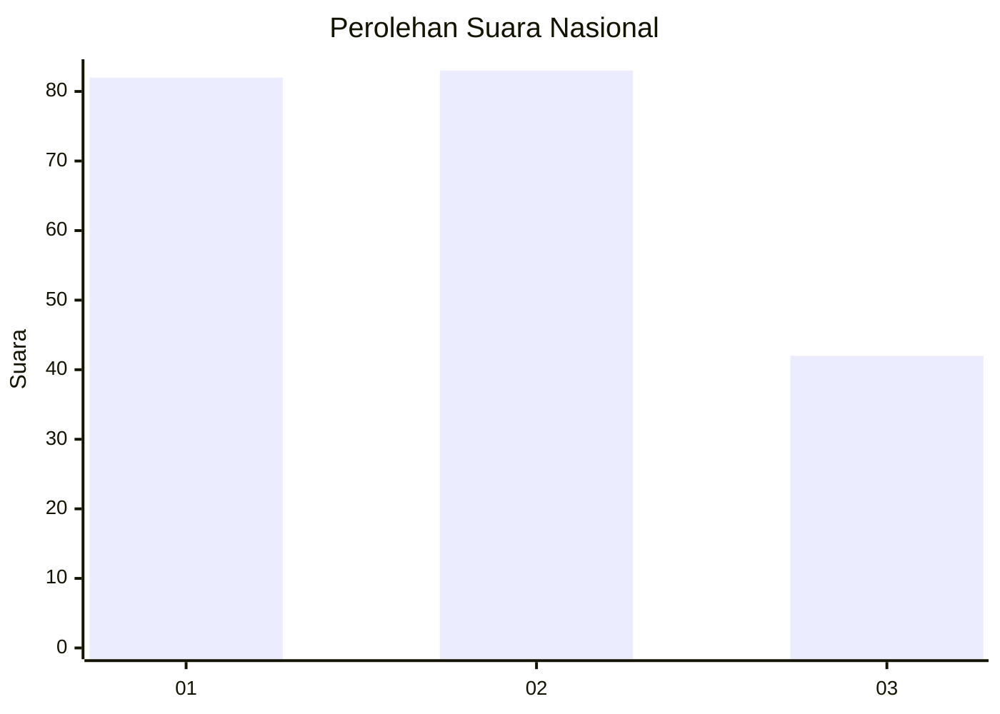
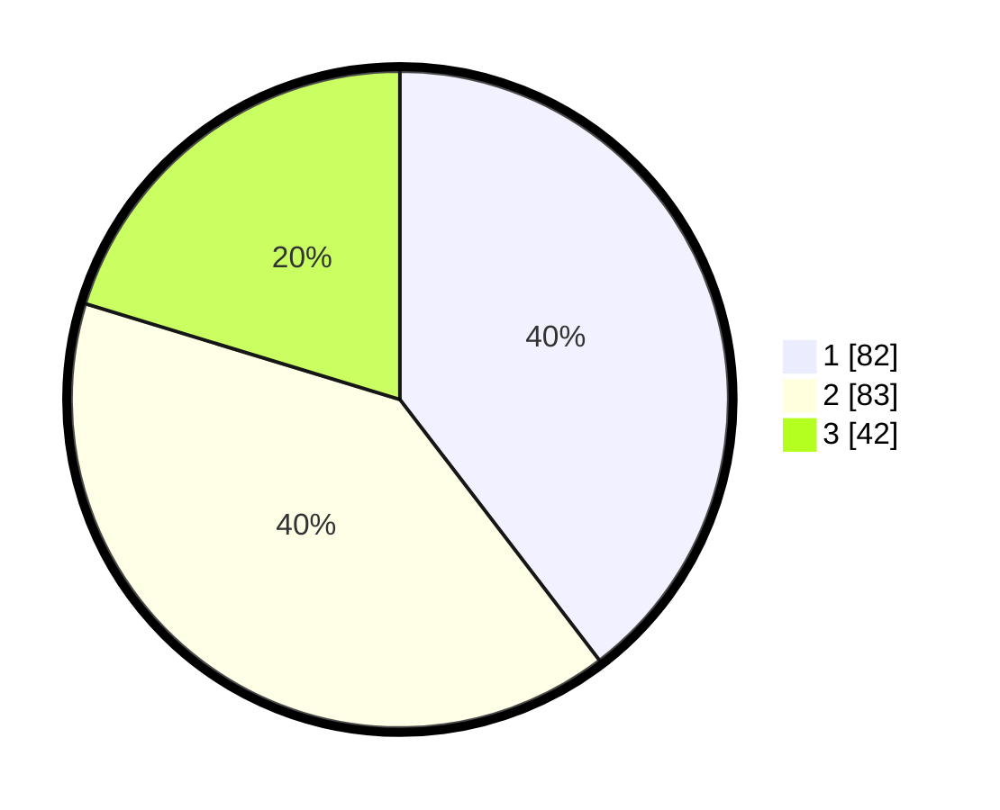

# Hasil

## Grafik

## Tabel

| No. | Nama Paslon    | Suara | Suara (raw) | Persentase |
|:--- |:-------------- | -----:| -----------:| ----------:|
| 1   | ANIES MUHAIMIN | 82    | [82][p-1]   | 39,61      |
| 2   | PRABOWO GIBRAN | 83    | [83][p-2]   | 40,10      |
| 3   | GANJAR MAHFUD  | 42    | [42][p-3]   | 20,29      |

[p-1]: https://github.com/gigit-pemilu/pemilu-2024/blob/main/pilpres/hitung-suara/sub/34-di-yogyakarta/sub/04-sleman/sub/12-ngaglik/sub/2005-sardonoharjo/sub/060-tps/sub/paslon-1.txt
[p-2]: https://github.com/gigit-pemilu/pemilu-2024/blob/main/pilpres/hitung-suara/sub/34-di-yogyakarta/sub/04-sleman/sub/12-ngaglik/sub/2005-sardonoharjo/sub/060-tps/sub/paslon-2.txt
[p-3]: https://github.com/gigit-pemilu/pemilu-2024/blob/main/pilpres/hitung-suara/sub/34-di-yogyakarta/sub/04-sleman/sub/12-ngaglik/sub/2005-sardonoharjo/sub/060-tps/sub/paslon-3.txt

## Foto C Plano

https://sirekap-obj-formc.kpu.go.id/3370/pemilu/ppwp/34/04/12/20/05/3404122005060-20240214-222418--b4cfda28-f379-4d01-a94f-7d140d187b0f.jpg

https://sirekap-obj-formc.kpu.go.id/3370/pemilu/ppwp/34/04/12/20/05/3404122005060-20240214-222557--a7772cee-a6e3-4aed-8c8c-f2624edf6563.jpg

https://sirekap-obj-formc.kpu.go.id/3370/pemilu/ppwp/34/04/12/20/05/3404122005060-20240214-222706--60e465fe-7e65-4b1c-a183-f9847c5d8f1c.jpg

## Metadata

| Key        | Value               |
| ---------- | ------------------- |
| Time Stamp | 2024-02-15 21:30:27 |

