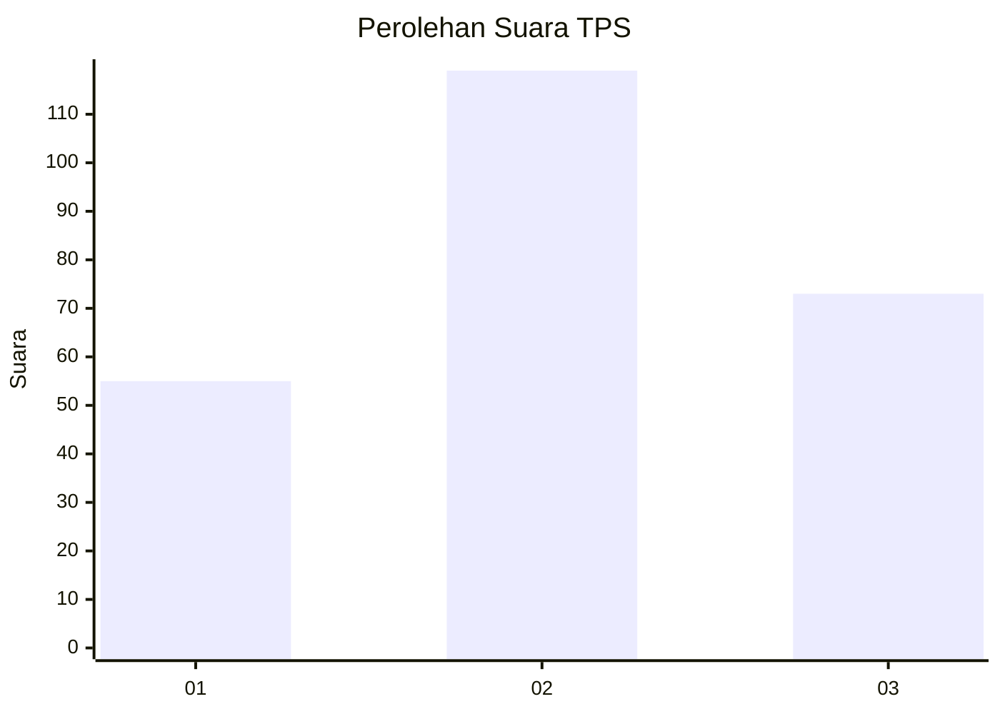
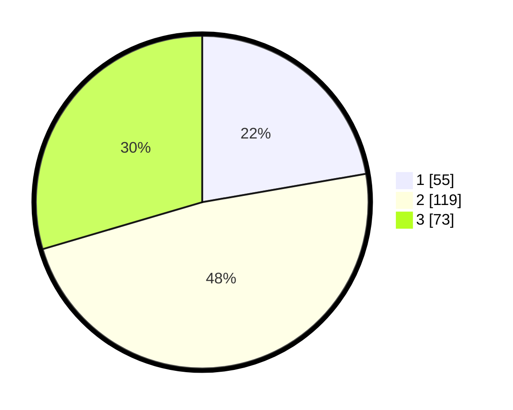

# Hasil

## Grafik

## Tabel

| No. | Nama Paslon    | Suara | Suara (raw) | Persentase |
|:--- |:-------------- | -----:| -----------:| ----------:|
| 1   | ANIES MUHAIMIN | 55    | [55][p-1]   | 22,27      |
| 2   | PRABOWO GIBRAN | 119   | [119][p-2]  | 48,18      |
| 3   | GANJAR MAHFUD  | 73    | [73][p-3]   | 29,55      |

[p-1]: https://github.com/gigit-pemilu/pemilu-2024-34-di-yogyakarta/blob/main/pilpres/hitung-suara/sub/34-di-yogyakarta/sub/04-sleman/sub/12-ngaglik/sub/2006-donoharjo/sub/002-tps/sub/paslon-1.txt
[p-2]: https://github.com/gigit-pemilu/pemilu-2024-34-di-yogyakarta/blob/main/pilpres/hitung-suara/sub/34-di-yogyakarta/sub/04-sleman/sub/12-ngaglik/sub/2006-donoharjo/sub/002-tps/sub/paslon-2.txt
[p-3]: https://github.com/gigit-pemilu/pemilu-2024-34-di-yogyakarta/blob/main/pilpres/hitung-suara/sub/34-di-yogyakarta/sub/04-sleman/sub/12-ngaglik/sub/2006-donoharjo/sub/002-tps/sub/paslon-3.txt

## Foto C Plano

https://sirekap-obj-formc.kpu.go.id/9aea/pemilu/ppwp/34/04/12/20/06/3404122006002-20240214-214451--91c39ac4-7121-48e6-b629-ddfb26f672c7.jpg

https://sirekap-obj-formc.kpu.go.id/9aea/pemilu/ppwp/34/04/12/20/06/3404122006002-20240214-214724--14582e4d-2c6c-4ab8-aff8-a5133031630f.jpg

https://sirekap-obj-formc.kpu.go.id/9aea/pemilu/ppwp/34/04/12/20/06/3404122006002-20240214-214910--02a57ce8-9247-41bf-8186-ff1ce64f6826.jpg

## Metadata

| Key        | Value               |
| ---------- | ------------------- |
| Time Stamp | 2024-02-15 21:30:27 |

